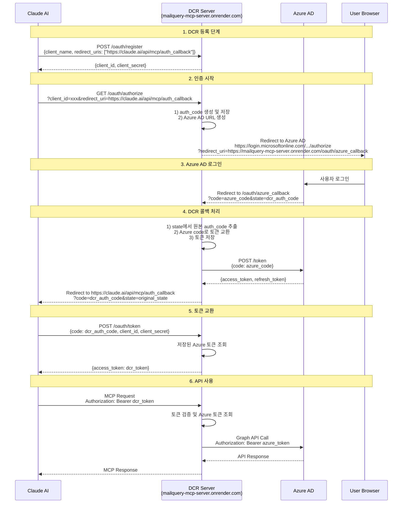
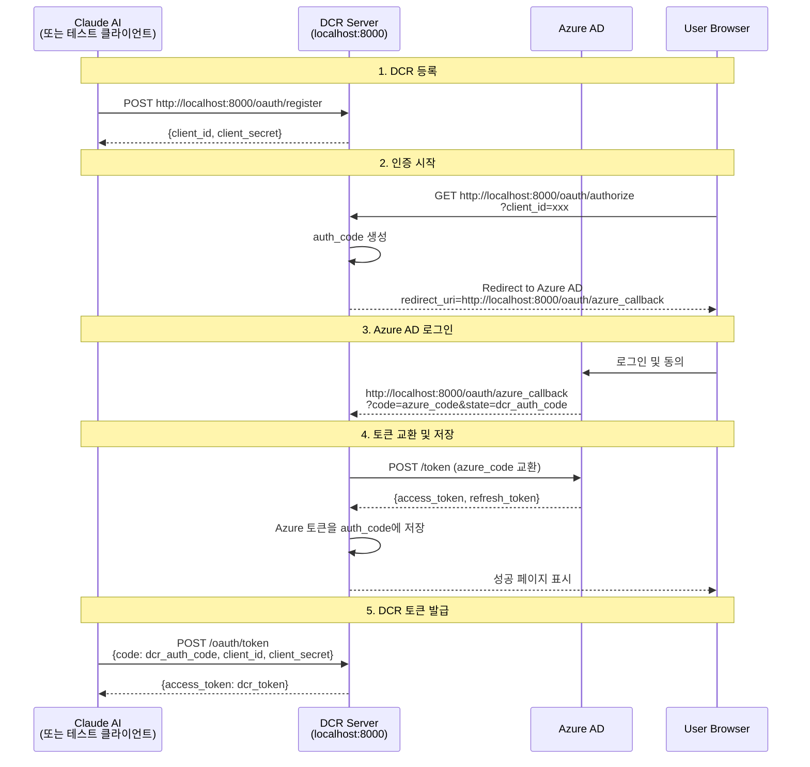
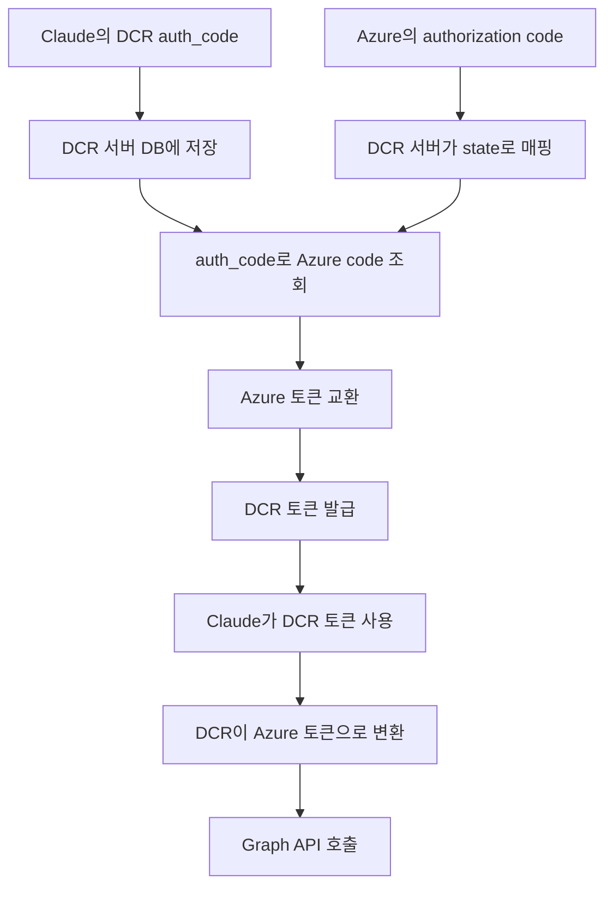

# Claude MCP OAuth 인증 플로우 다이어그램

## 전체 OAuth 플로우 (Production - Render 배포)



## 로컬 테스트 플로우 (localhost:8000)



## 중요 URL 설정

### Production 환경 (Render 배포)

#### 1. Azure AD 앱 등록에서 설정해야 할 Redirect URI
```
https://mailquery-mcp-server.onrender.com/oauth/azure_callback
```
**중요**: Azure AD에 DCR 서버의 콜백 URL을 등록해야 합니다! (Claude URL 아님)

#### 2. Claude Connector에서 사용하는 Redirect URI
```
https://claude.ai/api/mcp/auth_callback
```

#### 3. DCR 서버 엔드포인트
- DCR 메타데이터: `https://mailquery-mcp-server.onrender.com/.well-known/oauth-authorization-server`
- 클라이언트 등록: `https://mailquery-mcp-server.onrender.com/oauth/register`
- 인증: `https://mailquery-mcp-server.onrender.com/oauth/authorize`
- 토큰: `https://mailquery-mcp-server.onrender.com/oauth/token`
- Azure 콜백: `https://mailquery-mcp-server.onrender.com/oauth/azure_callback`

### 로컬 테스트 환경 (localhost:8000)

#### 1. Azure AD 앱 등록에 추가할 Redirect URI
```
http://localhost:8000/oauth/azure_callback
```
**참고**: 로컬 테스트를 위해 Azure Portal에 이 URL을 추가로 등록해야 합니다.

#### 2. DCR 서버 엔드포인트
- DCR 메타데이터: `http://localhost:8000/.well-known/oauth-authorization-server`
- 클라이언트 등록: `http://localhost:8000/oauth/register`
- 인증: `http://localhost:8000/oauth/authorize`
- 토큰: `http://localhost:8000/oauth/token`
- Azure 콜백: `http://localhost:8000/oauth/azure_callback`

#### 3. 로컬 테스트 시작 방법
```bash
# .env 파일에 Azure 설정 추가
AZURE_CLIENT_ID=88f1daa2-a6cc-4c7b-b575-b76bf0a6435b
AZURE_CLIENT_SECRET=your_client_secret
AZURE_TENANT_ID=your_tenant_id

# 서버 실행
python entrypoints/production/unified_http_server.py

# 브라우저에서 테스트
# 1. DCR 등록: curl -X POST http://localhost:8000/oauth/register -H "Content-Type: application/json" -d '{"client_name":"Test"}'
# 2. 브라우저 열기: http://localhost:8000/oauth/authorize?client_id=<등록된_client_id>&redirect_uri=http://localhost:8000/&response_type=code&scope=Mail.Read
```

## 토큰 플로우 상세



## 데이터베이스 스키마

DCR 서비스는 SQLite 데이터베이스(`data/database.db`)에 다음 테이블을 사용합니다:

### dcr_clients 테이블
**용도**: DCR로 등록된 클라이언트 정보 저장

주요 컬럼:
- `client_id`: DCR이 발급한 클라이언트 ID (예: `dcr_xxx`)
- `client_secret`: 클라이언트 시크릿 (암호화 저장)
- `client_name`: 클라이언트 이름 (예: "Claude Connector")
- `redirect_uris`: 허용된 리다이렉트 URI 목록 (JSON 배열)
- `azure_client_id`: 매핑된 Azure AD 앱 클라이언트 ID
- `azure_client_secret`: Azure AD 클라이언트 시크릿 (암호화 저장)
- `azure_tenant_id`: Azure AD 테넌트 ID
- `grant_types`: 지원하는 grant type (JSON 배열)
- `scope`: 요청 가능한 스코프

### dcr_auth_codes 테이블
**용도**: Authorization code와 Azure 토큰 매핑

주요 컬럼:
- `code`: DCR이 발급한 authorization code
- `client_id`: 클라이언트 ID (외래키)
- `redirect_uri`: 클라이언트의 콜백 URL
- `scope`: 요청된 스코프
- `state`: Claude가 전달한 원본 state 값
- `azure_access_token`: Azure AD 액세스 토큰 (콜백 시 저장)
- `azure_refresh_token`: Azure AD 리프레시 토큰 (콜백 시 저장)
- `expires_at`: Authorization code 만료 시간 (10분)
- `used_at`: 토큰 교환에 사용된 시간 (일회용)

### dcr_tokens 테이블
**용도**: DCR 토큰과 Azure 토큰 매핑

주요 컬럼:
- `access_token`: DCR이 발급한 액세스 토큰 (암호화 저장)
- `refresh_token`: DCR이 발급한 리프레시 토큰 (암호화 저장)
- `client_id`: 클라이언트 ID (외래키)
- `token_type`: 토큰 타입 (기본값: "Bearer")
- `expires_at`: 토큰 만료 시간
- `scope`: 토큰이 허용하는 스코프
- `azure_access_token`: 매핑된 Azure AD 액세스 토큰 (암호화 저장)
- `azure_refresh_token`: 매핑된 Azure AD 리프레시 토큰 (암호화 저장)
- `azure_token_expiry`: Azure 토큰 만료 시간
- `revoked_at`: 토큰 무효화 시간

## 문제 해결

### AADSTS50011 에러 (Redirect URI 불일치)
**원인**: Azure AD 앱 등록의 redirect URI가 요청한 URL과 일치하지 않음

**해결방법**:
1. Azure Portal > App registrations > 해당 앱 선택
2. Authentication > Platform configurations > Web
3. Redirect URIs에 다음 URL들을 **모두** 추가:
   ```
   Production 환경:
   https://mailquery-mcp-server.onrender.com/oauth/azure_callback

   로컬 테스트 환경:
   http://localhost:8000/oauth/azure_callback
   ```
4. Save 클릭

**참고**: 현재 코드는 로컬 테스트 시 `http://localhost:8000/oauth/azure_callback`을 하드코딩하고 있습니다.
Production 배포 시 환경변수 기반으로 동적 변경이 필요합니다.

### 토큰 검증 실패
**원인**: DCR 토큰과 Azure 토큰 매핑 실패

**해결방법**:
1. 데이터베이스에서 토큰 매핑 확인:
   ```bash
   sqlite3 data/database.db "SELECT client_id, expires_at, revoked_at FROM dcr_tokens ORDER BY created_at DESC LIMIT 5;"
   ```
2. Authorization code 상태 확인:
   ```bash
   sqlite3 data/database.db "SELECT code, used_at, expires_at FROM dcr_auth_codes ORDER BY created_at DESC LIMIT 5;"
   ```
3. Azure 토큰이 저장되었는지 확인:
   ```bash
   sqlite3 data/database.db "SELECT code, azure_access_token IS NOT NULL as has_token FROM dcr_auth_codes WHERE azure_access_token IS NOT NULL LIMIT 5;"
   ```

### Azure 콜백에서 토큰 교환 실패
**원인**: Azure AD로부터 받은 authorization code를 토큰으로 교환하는 과정에서 실패

**해결방법**:
1. 서버 로그에서 오류 확인:
   ```bash
   # Render 로그에서 "❌ Token exchange failed" 검색
   ```
2. Azure AD 앱의 Client Secret이 만료되지 않았는지 확인
3. OAuthClient 클래스가 올바르게 초기화되었는지 확인
4. 네트워크 연결 및 Azure AD 엔드포인트 접근 가능 여부 확인

### DCR 클라이언트 등록 실패
**원인**: Azure AD 설정이 없거나 데이터베이스 스키마가 초기화되지 않음

**해결방법**:
1. 환경변수 또는 데이터베이스에 Azure AD 설정이 있는지 확인:
   ```bash
   # .env 파일 확인
   cat .env | grep AZURE

   # 데이터베이스 accounts 테이블 확인
   sqlite3 data/database.db "SELECT oauth_client_id, oauth_tenant_id FROM accounts WHERE is_active = 1 LIMIT 1;"
   ```
2. DCR 스키마 초기화는 첫 등록 시 자동으로 실행됩니다.

## 보안 고려사항

1. **HTTPS 필수**: Production 환경에서는 모든 엔드포인트가 HTTPS를 사용해야 함
   - Render 배포 시 자동으로 HTTPS 제공
   - 로컬 테스트는 HTTP 허용 (Azure AD 앱 설정에서 허용 필요)

2. **토큰 암호화**: 모든 민감한 데이터는 데이터베이스에 암호화되어 저장됨
   - `dcr_clients.client_secret` - DCR 클라이언트 시크릿
   - `dcr_clients.azure_client_secret` - Azure AD 클라이언트 시크릿
   - `dcr_tokens.access_token` - DCR 액세스 토큰
   - `dcr_tokens.refresh_token` - DCR 리프레시 토큰
   - `dcr_tokens.azure_access_token` - Azure AD 액세스 토큰
   - `dcr_tokens.azure_refresh_token` - Azure AD 리프레시 토큰
   - 암호화는 `AccountCryptoHelpers` 클래스 사용 (Fernet 기반)

3. **토큰 만료**:
   - Authorization code: 10분 (일회용)
   - DCR 액세스 토큰: Azure 토큰 만료 시간과 동일 (기본 1시간)
   - Azure AD 토큰: Azure 정책에 따라 관리

4. **스코프 제한**: 필요한 최소한의 권한만 요청
   - 기본 스코프: `Mail.Read User.Read`
   - 추가 스코프: `Mail.ReadWrite`, `Notes.ReadWrite` 등

5. **CORS 설정**:
   - 현재 모든 origin 허용 (`Access-Control-Allow-Origin: *`)
   - Production 환경에서는 특정 origin으로 제한 권장

6. **클라이언트 인증**:
   - Authorization code 교환 시 client_id + client_secret 필수
   - Redirect URI 검증으로 CSRF 방지
   - State 파라미터를 통한 추가 CSRF 보호

## 테스트 방법

### 로컬 환경 전체 플로우 테스트

#### 1. DCR 등록
```bash
curl -X POST http://localhost:8000/oauth/register \
  -H "Content-Type: application/json" \
  -d '{
    "client_name": "Test Client",
    "redirect_uris": ["http://localhost:8000/"]
  }'
```

**응답 예시**:
```json
{
  "client_id": "dcr_xxx...",
  "client_secret": "yyy...",
  "client_id_issued_at": 1234567890,
  ...
}
```

#### 2. 브라우저에서 인증 시작
```
http://localhost:8000/oauth/authorize?client_id=dcr_xxx...&redirect_uri=http://localhost:8000/&response_type=code&scope=Mail.Read
```

**플로우**:
1. Azure AD 로그인 페이지로 리다이렉트
2. 로그인 및 권한 동의
3. `http://localhost:8000/oauth/azure_callback`으로 리다이렉트 (Azure가 호출)
4. DCR 서버가 토큰 교환 및 저장
5. 성공 페이지 표시 (URL에 `code=xxx` 파라미터 포함)

#### 3. 토큰 교환 (Claude가 수행하는 단계)
```bash
# 브라우저에서 받은 code 값 사용
curl -X POST http://localhost:8000/oauth/token \
  -H "Content-Type: application/x-www-form-urlencoded" \
  -d "grant_type=authorization_code&code=<받은_code>&client_id=<client_id>&client_secret=<client_secret>&redirect_uri=http://localhost:8000/"
```

**응답 예시**:
```json
{
  "access_token": "zzz...",
  "token_type": "Bearer",
  "expires_in": 3600,
  "refresh_token": "aaa...",
  "scope": "Mail.Read"
}
```

#### 4. MCP API 호출 테스트
```bash
curl http://localhost:8000/mail-query/ \
  -H "Authorization: Bearer <access_token>" \
  -H "Content-Type: application/json" \
  -d '{
    "jsonrpc": "2.0",
    "id": 1,
    "method": "tools/list"
  }'
```

### Production 환경 테스트

#### 1. DCR 메타데이터 확인
```bash
curl https://mailquery-mcp-server.onrender.com/.well-known/oauth-authorization-server
```

#### 2. Claude Custom Connector 설정
1. Claude.ai > Settings > Connectors > Add custom connector
2. Server URL: `https://mailquery-mcp-server.onrender.com`
3. 자동으로 `/oauth/register` 호출하여 client_id/secret 발급
4. Advanced settings에서 확인 가능

#### 3. 인증 테스트
Claude에서 MCP 도구 사용 시:
- 자동으로 `/oauth/authorize` 호출
- 브라우저에서 Azure AD 로그인
- Claude가 자동으로 토큰 교환 및 API 호출

### 디버깅 팁

#### 서버 로그 확인
```bash
# Render 로그
# Dashboard > Logs 탭에서 실시간 확인

# 주요 로그 메시지:
# ✅ DCR client registered: dcr_xxx
# 🔍 Verifying authorization code: xxx...
# ✅ Authorization code verified
# 🔍 Looking for Azure tokens with auth_code: xxx...
# ✅ Azure token found
```

#### 데이터베이스 직접 확인
```bash
# DCR 클라이언트 목록
sqlite3 data/database.db "SELECT client_id, client_name, created_at FROM dcr_clients;"

# Authorization code 목록 (최근 5개)
sqlite3 data/database.db "SELECT code, client_id, used_at, expires_at FROM dcr_auth_codes ORDER BY created_at DESC LIMIT 5;"

# 토큰 목록 (최근 5개)
sqlite3 data/database.db "SELECT client_id, expires_at, revoked_at, created_at FROM dcr_tokens ORDER BY created_at DESC LIMIT 5;"
```