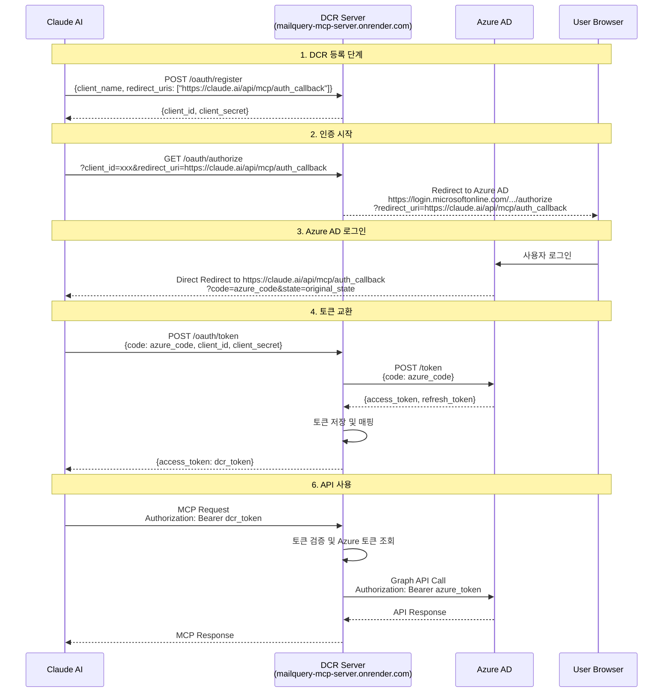
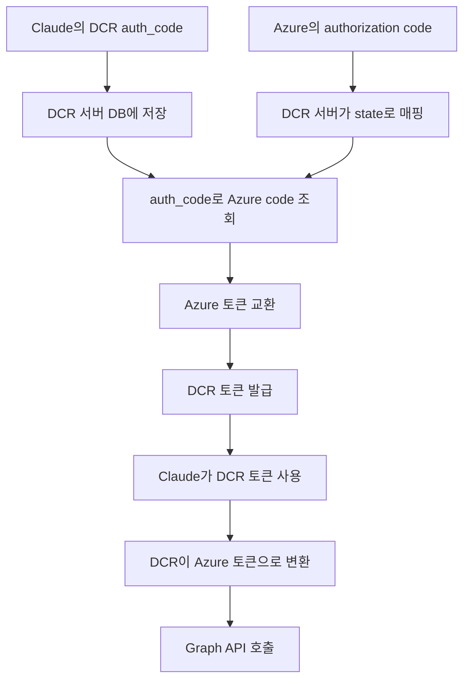

# Claude MCP OAuth 인증 플로우 다이어그램

## 전체 OAuth 플로우 (간소화된 버전)



## 중요 URL 설정

### 1. Azure AD 앱 등록에서 설정해야 할 Redirect URI
```
https://claude.ai/api/mcp/auth_callback
```
**중요**: Azure AD에 Claude의 콜백 URL을 직접 등록해야 합니다!

### 2. Claude Connector에서 사용하는 Redirect URI
```
https://claude.ai/api/mcp/auth_callback
```

### 3. DCR 서버 엔드포인트
- DCR 메타데이터: `https://mailquery-mcp-server.onrender.com/.well-known/oauth-authorization-server`
- 클라이언트 등록: `https://mailquery-mcp-server.onrender.com/oauth/register`
- 인증: `https://mailquery-mcp-server.onrender.com/oauth/authorize`
- 토큰: `https://mailquery-mcp-server.onrender.com/oauth/token`
- Azure 콜백: `https://mailquery-mcp-server.onrender.com/oauth/azure_callback`

## 토큰 플로우 상세



## 데이터베이스 스키마

### dcr_clients 테이블
- client_id: DCR 클라이언트 ID
- azure_client_id: Azure AD 앱 클라이언트 ID
- azure_tenant_id: Azure AD 테넌트 ID
- redirect_uris: Claude의 콜백 URL 포함

### dcr_auth_codes 테이블
- code: DCR이 발급한 authorization code
- azure_code: Azure AD가 발급한 authorization code (콜백 시 저장)
- redirect_uri: Claude의 콜백 URL

### dcr_tokens 테이블
- access_token: DCR이 발급한 토큰
- azure_access_token: Azure AD의 실제 액세스 토큰
- azure_refresh_token: Azure AD의 리프레시 토큰

## 문제 해결

### AADSTS50011 에러 (Redirect URI 불일치)
**원인**: Azure AD 앱 등록의 redirect URI가 Claude의 콜백 URL과 일치하지 않음

**해결방법**:
1. Azure Portal > App registrations > 해당 앱 선택 (Client ID: 88f1daa2-a6cc-4c7b-b575-b76bf0a6435b)
2. Authentication > Platform configurations > Web
3. Redirect URIs에 다음 URL 추가:
   ```
   https://claude.ai/api/mcp/auth_callback
   ```
4. Save 클릭

### 토큰 검증 실패
**원인**: DCR 토큰과 Azure 토큰 매핑 실패

**해결방법**:
1. 데이터베이스에서 토큰 매핑 확인
2. 토큰 만료 시간 확인
3. 리프레시 토큰으로 갱신 시도

## 보안 고려사항

1. **HTTPS 필수**: 모든 엔드포인트는 HTTPS를 사용해야 함
2. **토큰 암호화**: 데이터베이스에 저장되는 토큰은 암호화 필요
3. **토큰 만료**: DCR 토큰과 Azure 토큰의 만료 시간 동기화
4. **스코프 제한**: 필요한 최소한의 권한만 요청

## 테스트 방법

### 1. DCR 등록 테스트
```bash
curl -X POST https://mailquery-mcp-server.onrender.com/oauth/register \
  -H "Content-Type: application/json" \
  -d '{
    "client_name": "Test Client",
    "redirect_uris": ["https://claude.ai/api/mcp/auth_callback"]
  }'
```

### 2. 인증 플로우 테스트
브라우저에서:
```
https://mailquery-mcp-server.onrender.com/oauth/authorize?client_id=YOUR_CLIENT_ID&redirect_uri=https://claude.ai/api/mcp/auth_callback&response_type=code&scope=User.Read%20Mail.Read
```

### 3. 토큰 교환 테스트
```bash
curl -X POST https://mailquery-mcp-server.onrender.com/oauth/token \
  -H "Content-Type: application/x-www-form-urlencoded" \
  -d "grant_type=authorization_code&code=YOUR_AUTH_CODE&client_id=YOUR_CLIENT_ID&client_secret=YOUR_CLIENT_SECRET&redirect_uri=https://claude.ai/api/mcp/auth_callback"
```