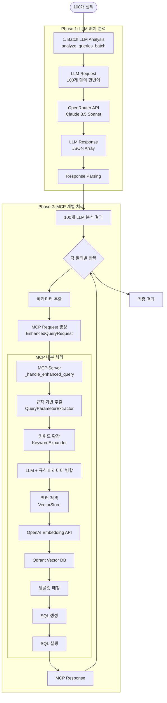

# Mock Claude Desktop 데이터 플로우 분석

## 1. 전체 데이터 플로우 다이어그램



## 2. 데이터 포맷 상세 분석

### 2.1 초기 입력 데이터
```python
# 100개 질의 리스트
test_cases = [
    {"query": "최근 아젠다 목록 보여줘", "expected_category": "agenda"},
    {"query": "한국선급 응답 현황", "expected_category": "response"},
    # ... 98개 더
]
queries = [tc['query'] for tc in test_cases]  # 문자열 리스트
```

### 2.2 LLM 배치 요청 (Phase 1)
```python
# LLM에 보내는 프롬프트 (mcp_system_prompt.txt 사용)
batch_prompt = f"""다음 100개의 질의를 각각 분석하여 JSON 배열 형식으로 응답하세요.

오늘 날짜: 2025-08-01

질의 목록:
1. 최근 아젠다 목록 보여줘
2. 한국선급 응답 현황
...
100. 업데이트 알림

각 질의에 대해 다음 형식의 JSON 객체를 포함하는 배열을 반환하세요:
[
  {
    "query_index": 1,
    "keywords": ["keyword1", "keyword2", ...],
    "organization": "ORG_CODE" or null,
    "extracted_period": {"start": "YYYY-MM-DD", "end": "YYYY-MM-DD"} or null,
    "query_scope": "all|one|more"
  },
  ...
]
"""

# OpenRouter API 요청
payload = {
    "model": "anthropic/claude-3.5-sonnet-20241022",
    "messages": [
        {"role": "system", "content": self.system_prompt},  # mcp_system_prompt.txt 내용
        {"role": "user", "content": batch_prompt}
    ],
    "response_format": {"type": "json_object"},
    "temperature": 0.3,
    "max_tokens": 4000
}
```

### 2.3 LLM 응답 데이터
```python
# LLM이 반환하는 JSON (100개 배열) - 실제 MCP 프롬프트 형식
[
  {
    "query_index": 1,
    "keywords": ["최근", "아젠다", "목록"],
    "organization": null,
    "extracted_period": {"start": "2025-07-02", "end": "2025-08-01"},
    "intent": "list",
    "query_scope": "one"
  },
  {
    "query_index": 2,
    "keywords": ["한국선급", "응답", "현황"],
    "organization": "KR",
    "extracted_period": {"start": "2025-05-03", "end": "2025-08-01"},
    "intent": "search",
    "query_scope": "one"
  },
  // ... 98개 더
]
```

### 2.4 MCP Request 생성 (Phase 2 - 각 질의별)
```python
# Phase 2에서 LLM 결과를 기반으로 MCP Request 생성
for idx, (query, llm_result) in enumerate(zip(queries, all_llm_results)):
    # LLM 결과에서 직접 추출
    extracted_period = llm_result.get('extracted_period')
    extracted_keywords = llm_result.get('keywords', [])
    extracted_organization = llm_result.get('organization')  # parameters 객체 없이 직접 접근
    intent = llm_result.get('intent', 'search')             # LLM이 추출한 의도
    query_scope = llm_result.get('query_scope', 'one')      # LLM이 결정한 scope 사용
    
    # EnhancedQueryRequest 객체 생성
    mcp_request = EnhancedQueryRequest(
        query=query,
        extracted_period=extracted_period,
        extracted_keywords=extracted_keywords,
        extracted_organization=extracted_organization,
        intent=intent,      # 쿼리 의도 추가
        query_scope=query_scope,
        category=None,      # 자동 탐지
        execute=True,       # SQL 실행 여부
        limit=10,          # 결과 제한
        use_defaults=True   # 기본값 사용
    )
```

### 2.5 MCP 서버 내부 처리

#### 2.5.1 규칙 기반 파라미터 추출
```python
# QueryParameterExtractor가 추출 가능한 모든 파라미터
rule_based_params = {
    'original_query': '원본 쿼리',
    'normalized_query': '동의어 처리된 쿼리',
    
    # 아젠다 관련 (agenda_parser.py)
    'agenda_code': 'PL25016a',         # 전체 아젠다 코드
    'agenda_base': 'PL25016',          # 패널+년도+번호
    'agenda_base_version': 'PL25016a', # DB PRIMARY KEY (전체 코드)
    'agenda_panel': 'PL',              # 패널 (PL, PS, JWG-CS 등)
    'agenda_year': '25',               # 년도
    'agenda_number': '016',            # 번호
    'agenda_version': 'a',             # 버전 문자
    
    # 조직 관련 (agenda_parser.py + synonym_service.py)
    'organization_code': 'KR',         # 조직 코드
    'organization': 'KR',              # 정규화된 조직명
    'sender_organization': 'KR',       # 발신 조직
    'response_org': 'NK',              # 응답 조직 (PL25016aIRa에서 IR 부분)
    
    # 날짜 관련 (agenda_parser.py)
    'date_range': {                    # 날짜 범위
        'start': datetime,
        'end': datetime
    },
    'days': 30,                        # 기간 (일수)
    
    # 기타 파라미터
    'status': 'approved',              # 상태 (approved, rejected, pending)
    'limit': 10,                       # 결과 제한 수
    'keyword': 'search_term',          # 검색 키워드
    'keywords': [],                    # 키워드 리스트 (초기값)
    
    # 패널/위원회 관련 (query_parameter_extractor.py)
    'committee': 'SDTP'                # 패널/위원회 (SDTP, GPG)
}
```

#### 2.5.2 키워드 확장
```python
# KeywordExpander 결과
# 주의: 현재 LLM 키워드가 있으면 확장된 키워드는 무시됨 (mcp_server_enhanced.py 252번 줄)
expansion = {
    'original_keywords': ['한국선급', '응답', '현황'],
    'expanded_keywords': [
        'KR', '한국선급', '한선', 'Korean Register',
        'response', '응답', '답변', '회신',
        'status', '현황', '상태'
    ],
    'missing_params': [],
    'suggestions': [],
    'confidence_score': 0.9
}

# 패널 동의어 처리 예시
# "디지털 기술 패널의 최신 아젠다" → committee: "SDTP"
panel_expansion = {
    'original_keywords': ['디지털', '기술', '패널'],
    'expanded_keywords': [
        'SDTP', '디지털 기술 패널', 'PL', '디지털 패널',
        'digital', 'technology', 'panel'
    ]
}
```

#### 2.5.3 파라미터 병합
```python
# LLM + 규칙 기반 파라미터 병합
# 주의: LLM 키워드가 있으면 enhanced_params['keywords']는 LLM 키워드로 덮어씌워짐
enhanced_params = {
    'organization': 'KR',              # LLM 우선
    'organization_code': 'KR',
    'date_range': {
        'type': 'range',
        'from': '2025-07-01',
        'to': '2025-08-01'
    },
    'days': 31,
    'keywords': ['한국선급', '응답', '현황'],  # LLM 키워드로 덮어씌워짐 (확장된 키워드 무시)
    'llm_keywords': ['한국선급', '응답', '현황'],  # LLM이 추출한 원본
    'intent': 'search',                # LLM이 추출한 의도 (search, list, analyze, count)
    'committee': 'SDTP',               # 규칙 기반으로 추출된 패널/위원회
    'agenda_base': 'PL25016',          # 규칙 기반으로 추출된 아젠다 베이스 (패널+년도+번호)
    'agenda_base_version': 'PL25016a', # 규칙 기반으로 추출된 전체 아젠다 코드 (DB PRIMARY KEY)
    'scope_info': {
        'scope': 'one',
        'sql_condition': "sender_organization = 'KR'"
    }
}

# relative_score 계산 (null이 아닌 필드 개수 기반)
# 주요 필드: organization, date_range, keywords, intent, committee, agenda_base, agenda_base_version
non_null_fields = [
    enhanced_params.get('organization'),
    enhanced_params.get('date_range'),
    enhanced_params.get('keywords') and len(enhanced_params['keywords']) > 0,
    enhanced_params.get('intent'),
    enhanced_params.get('committee'),
    enhanced_params.get('agenda_base'),
    enhanced_params.get('agenda_base_version')
]
filled_count = sum(1 for field in non_null_fields if field)
# 7개 필드 중 몇 개가 채워졌는지 비율로 계산 (0.2점 만점)
enhanced_params['relative_score'] = round((filled_count / 7) * 0.2, 3)  # 예: 5/7 * 0.2 = 0.143
```

#### 2.5.4 벡터 검색 요청
```python
# VectorStore.search_templates 입력
query_text = "한국선급 응답 현황 KR 한선 Korean Register response 응답 답변 회신 status 현황 상태"
query_embedding = [0.123, -0.456, ...]  # 3072차원 벡터

# Qdrant 검색 파라미터
search_params = {
    'collection_name': 'query_templates',
    'query_vector': query_embedding,
    'limit': 10,
    'score_threshold': 0.5
}
```

#### 2.5.5 템플릿 매칭 결과
```python
# 벡터 검색 결과
search_results = [
    {
        'template_id': 'kr_response_required_agendas',
        'score': 0.85,  # 벡터 유사도
        'template_category': 'response',
        'keywords': ['KR', '응답', '필요', 'response'],
        'keyword_matches': ['KR', '응답', 'response'],
        'combined_score': 0.88  # 벡터 50% + 키워드 50%
    },
    # ... 더 많은 템플릿
]
```

### 2.6 SQL 생성 및 실행
```python
# 선택된 템플릿의 SQL
sql_template = """
SELECT agenda_code, subject, deadline, sent_time
FROM agenda_chair
WHERE sender_organization = :organization
AND sent_time >= :period_start
AND has_deadline = 1
ORDER BY sent_time DESC
"""

# 파라미터 대입 후
executed_sql = """
SELECT agenda_code, subject, deadline, sent_time
FROM agenda_chair
WHERE sender_organization = 'KR'
AND sent_time >= '2025-07-01'
AND has_deadline = 1
ORDER BY sent_time DESC
"""
```

### 2.7 최종 MCP Response
```python
mcp_response = {
    'result': QueryResult(
        query_id='kr_response_required_agendas',
        executed_sql=executed_sql,
        parameters={
            'organization': 'KR',
            'period_start': '2025-07-01'
        },
        results=[
            {'agenda_code': 'PL25016a', 'subject': '...', 'deadline': '...'},
            # ... SQL 실행 결과
        ],
        execution_time=0.001,
        error=None
    ),
    'extracted_params': enhanced_params,
    'rule_based_params': rule_based_params,
    'llm_contribution': {
        'period': {"start": "2025-07-01", "end": "2025-08-01"},
        'keywords': ["한국선급", "응답", "현황"],
        'organization': "KR",
        'intent': "search"
    }
}
```

### 2.8 최종 결과 저장
```python
final_results = [
    {
        'index': 1,
        'query': '한국선급 응답 현황',
        'llm_analysis': {
            'keywords': ['한국선급', '응답', '현황'],
            'organization': 'KR',
            'extracted_period': {'start': '2025-05-03', 'end': '2025-08-01'},
            'intent': 'search',
            'query_scope': 'one'
        },
        'mcp_response': mcp_response,
        'success': True,
        'template_id': 'kr_response_required_agendas',
        'error': None
    },
    # ... 99개 더
]

# JSON 파일로 저장
output = {
    'test_date': '2025-08-01T22:24:36',
    'batch_size': 100,
    'summary': {
        'total_queries': 100,
        'success_count': 51,
        'error_count': 49,
        'success_rate': 51.0,
        'llm_time': 14.45,
        'mcp_time': 92.57,
        'total_time': 107.02,
        'avg_time_per_query': 1.07
    },
    'detailed_results': final_results
}
```

## 3. 데이터 사용 방식

### 3.1 LLM 분석 결과 활용
- **keywords**: 주요 키워드들 (기술, 지침, 설비, 국제 관련 용어)
- **organization**: 조직 코드 매핑 (KR, NK, CCS, ABS 등)
- **extracted_period**: 기간 추출 (어제, 오늘, 최근, 이번주 등을 날짜로 변환)
- **intent**: 질의 의도 (search: 검색, list: 목록 조회, analyze: 분석, count: 개수 세기)
- **query_scope**: 쿼리 범위 결정 (all: 모든 기관, one: 단일 기관, more: 여러 기관)

### 3.2 키워드 처리 흐름
```
LLM 키워드 → 동의어 확장 → 벡터 텍스트 생성 → 임베딩 → 템플릿 매칭
    ↓
템플릿 키워드와 비교 → 매칭 점수 계산 → 최종 점수에 반영
```

### 3.3 파라미터 우선순위
1. LLM 추출 파라미터 (organization, period, keywords, query_scope)
2. 규칙 기반 추출 파라미터 (MCP 서버 내부)
   - agenda 파싱: agenda_code, agenda_base, agenda_panel 등
   - 조직 동의어 처리: KR (한국선급, 한선 등), NK (일본선급, 일선 등)
   - **패널 동의어 처리**: SDTP (디지털 기술 패널, PL, 디지털 패널), GPG
   - committee 필드 추출
3. 템플릿 기본값
4. 시스템 기본값 (period: 3개월, query_scope: one)

### 3.4 에러 처리
- LLM 실패 시: 기본값 사용 (keywords: query.split(), organization: null, period: 3개월, intent: search, query_scope: one)
- 템플릿 매칭 실패: "No matching query template found"
- SQL 실행 실패: 에러 메시지 반환

## 4. 성능 병목 지점

### 4.1 시간 소요 분석
```
총 107.02초 = LLM 14.45초 + MCP 92.57초

MCP 92.57초 내역:
- OpenAI Embedding: 76.1초 (82%)
- 벡터 검색: 10초 (11%)
- 나머지 처리: 6.47초 (7%)
```

### 4.2 개선 가능 영역
1. **임베딩 캐싱**: 동일 쿼리 재사용
2. **배치 임베딩**: 100개 한번에 처리
3. **로컬 임베딩 모델**: API 호출 제거
4. **템플릿 결과 캐싱**: 반복 검색 방지