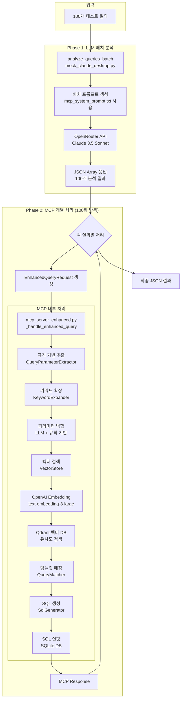
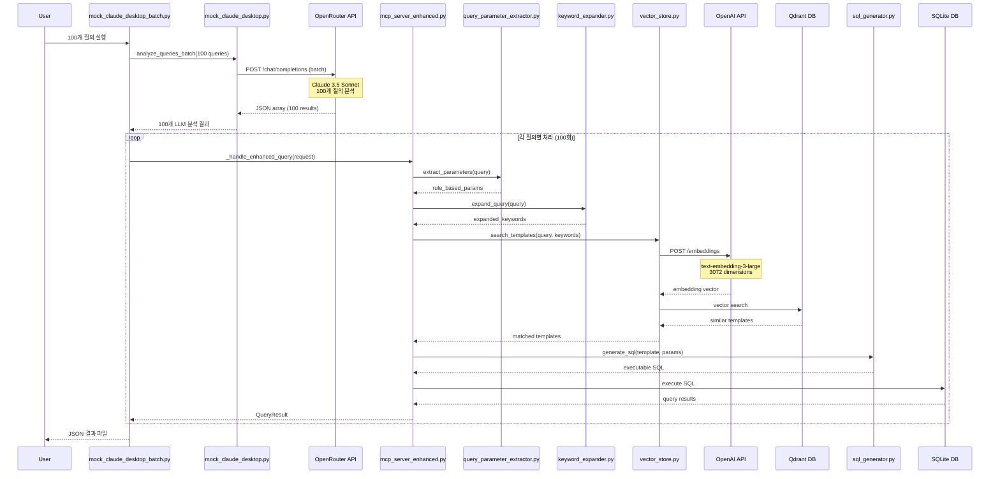
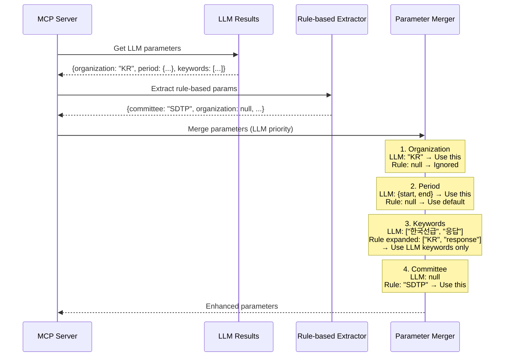

# Mock Claude Desktop 상세 데이터 플로우 분석

## 목차
1. [시스템 아키텍처 개요](#1-시스템-아키텍처-개요)
2. [Phase 1: LLM 배치 분석](#2-phase-1-llm-배치-분석)
3. [Phase 2: MCP 개별 처리](#3-phase-2-mcp-개별-처리)
4. [데이터 포맷 및 변환](#4-데이터-포맷-및-변환)
5. [파라미터 처리 상세](#5-파라미터-처리-상세)
6. [성능 분석 및 최적화](#6-성능-분석-및-최적화)
7. [주요 파일별 역할](#7-주요-파일별-역할)

---

## 1. 시스템 아키텍처 개요

### 1.1 전체 데이터 플로우


### 1.2 처리 시간 분포
- **총 시간**: 107.02초 (100개 질의)
- **Phase 1**: 14.45초 (13.5%) - LLM 배치 분석
- **Phase 2**: 92.57초 (86.5%) - MCP 개별 처리
  - OpenAI Embedding: 76.1초 (82.2%)
  - Qdrant 검색: 10.0초 (10.8%)
  - 기타 처리: 6.47초 (7.0%)

---

## 2. Phase 1: LLM 배치 분석

### 2.1 입력 데이터
```python
# 100개 테스트 질의 예시
test_cases = [
    {"query": "최근 아젠다 목록 보여줘", "expected_category": "agenda"},
    {"query": "한국선급 응답 현황", "expected_category": "response"},
    {"query": "디지털 기술 패널의 최신 아젠다", "expected_category": "agenda"},
    # ... 97개 더
]
```

### 2.2 LLM 프롬프트 구성
```python
# mcp_system_prompt.txt 기반 배치 프롬프트
batch_prompt = f"""다음 {len(queries)}개의 질의를 각각 분석하여 JSON 배열 형식으로 응답하세요.

오늘 날짜: {today}

질의 목록:
1. 최근 아젠다 목록 보여줘
2. 한국선급 응답 현황
...

각 질의에 대해 다음 형식의 JSON 객체를 포함하는 배열을 반환하세요:
[
  {
    "query_index": 1,
    "keywords": ["keyword1", "keyword2", ...],
    "organization": "ORG_CODE" or null,
    "extracted_period": {"start": "YYYY-MM-DD", "end": "YYYY-MM-DD"} or null,
    "intent": "search|list|analyze|count",
    "query_scope": "all|one|more"
  },
  ...
]
"""
```

### 2.3 LLM 응답 예시
```json
[
  {
    "query_index": 1,
    "keywords": ["최근", "아젠다", "목록"],
    "organization": null,
    "extracted_period": {"start": "2025-07-02", "end": "2025-08-01"},
    "intent": "list",
    "query_scope": "one"
  },
  {
    "query_index": 2,
    "keywords": ["한국선급", "응답", "현황"],
    "organization": "KR",
    "extracted_period": {"start": "2025-05-03", "end": "2025-08-01"},
    "intent": "search",
    "query_scope": "one"
  },
  {
    "query_index": 3,
    "keywords": ["디지털", "기술", "패널", "최신", "아젠다"],
    "organization": null,
    "extracted_period": {"start": "2025-07-02", "end": "2025-08-01"},
    "intent": "list",
    "query_scope": "one"
  }
]
```

---

## 3. Phase 2: MCP 개별 처리

### 3.1 EnhancedQueryRequest 생성
```python
# LLM 결과를 MCP Request로 변환
mcp_request = EnhancedQueryRequest(
    query=query,                                    # 원본 질의
    extracted_period=llm_result.get('extracted_period'),
    extracted_keywords=llm_result.get('keywords', []),
    extracted_organization=llm_result.get('organization'),
    intent=llm_result.get('intent', 'search'),
    query_scope=llm_result.get('query_scope', 'one'),
    category=None,                                  # 자동 탐지
    execute=True,                                   # SQL 실행
    limit=10,
    use_defaults=True
)
```

### 3.2 MCP 서버 처리 단계

#### 3.2.1 규칙 기반 파라미터 추출
```python
# QueryParameterExtractor가 추출하는 파라미터들
rule_based_params = {
    # 기본 정보
    'original_query': '디지털 기술 패널의 최신 아젠다',
    'normalized_query': 'SDTP의 최신 agenda',  # 동의어 처리됨
    
    # 아젠다 정보 (agenda_parser.py)
    'agenda_code': None,                        # 특정 코드 없음
    'agenda_base': None,
    'agenda_base_version': None,
    'agenda_panel': None,
    
    # 조직 정보
    'organization': None,
    'organization_code': None,
    
    # 패널/위원회 정보 (동의어 처리)
    'committee': 'SDTP',                        # "디지털 기술 패널" → "SDTP"
    
    # 날짜 정보
    'date_range': None,                         # LLM이 추출함
    'days': None,
    
    # 기타
    'status': None,
    'limit': None,
    'keywords': []                              # 초기값
}
```

#### 3.2.2 키워드 확장
```python
# KeywordExpander 처리 결과
expansion = {
    'original_keywords': ['디지털', '기술', '패널', '최신', '아젠다'],
    'expanded_keywords': [
        'SDTP', '디지털 기술 패널', 'PL', '디지털 패널',  # 패널 동의어
        'digital', 'technology', 'panel',                  # 영어 변환
        '최근', 'recent', 'latest',                       # 시간 동의어
        'agenda', '아젠다', '의제'                        # 아젠다 동의어
    ],
    'confidence_score': 0.9
}
```

#### 3.2.3 파라미터 병합 로직
```python
# LLM과 규칙 기반 파라미터 병합
enhanced_params = rule_based_params.copy()

# 1. 조직 파라미터 (LLM 우선)
if request.extracted_organization:
    enhanced_params['organization'] = request.extracted_organization
    enhanced_params['organization_code'] = request.extracted_organization

# 2. 날짜 파라미터 (LLM 우선)
if request.extracted_period:
    enhanced_params['date_range'] = {
        'type': 'range',
        'from': request.extracted_period['start'],
        'to': request.extracted_period['end']
    }
    # 일수 계산
    start = datetime.strptime(request.extracted_period['start'], '%Y-%m-%d')
    end = datetime.strptime(request.extracted_period['end'], '%Y-%m-%d')
    enhanced_params['days'] = (end - start).days

# 3. 키워드 처리
# 주의: LLM 키워드가 있으면 확장된 키워드는 덮어씌워짐
if request.extracted_keywords:
    enhanced_params['keywords'] = request.extracted_keywords
    enhanced_params['llm_keywords'] = request.extracted_keywords
else:
    enhanced_params['keywords'] = expansion.expanded_keywords

# 4. Intent 처리 (LLM 값 사용)
enhanced_params['intent'] = request.intent

# 5. Committee는 규칙 기반 값 유지
# enhanced_params['committee'] = 'SDTP' (이미 설정됨)

# 6. Query Scope 정보 추가
scope_handler = QueryScopeHandler()
scope_info = scope_handler.get_scope_info(
    request.query_scope,
    enhanced_params.get('organization')
)
enhanced_params['scope_info'] = scope_info

# 7. Relative Score 계산
# 주요 필드 7개 중 채워진 필드 비율로 점수 계산 (0.2점 만점)
key_fields = ['organization', 'date_range', 'keywords', 'intent', 
              'committee', 'agenda_base', 'agenda_base_version']
filled_count = sum(1 for field in key_fields 
                  if enhanced_params.get(field) and 
                  (field != 'keywords' or len(enhanced_params[field]) > 0))
enhanced_params['relative_score'] = round((filled_count / 7) * 0.2, 3)
```

### 3.3 벡터 검색 및 템플릿 매칭

#### 3.3.1 검색 쿼리 생성
```python
# 키워드를 포함한 검색 텍스트 생성
search_keywords = enhanced_params.get('keywords', [])
query_text = f"{request.query} {' '.join(search_keywords)}"
# 예: "디지털 기술 패널의 최신 아젠다 디지털 기술 패널 최신 아젠다"
```

#### 3.3.2 OpenAI 임베딩
```python
# text-embedding-3-large 모델로 3072차원 벡터 생성
embedding = openai_client.embeddings.create(
    input=query_text,
    model="text-embedding-3-large",
    dimensions=3072
)
```

#### 3.3.3 템플릿 매칭 점수 계산
```python
# 벡터 유사도와 키워드 매칭을 조합한 최종 점수
for result in vector_search_results:
    # 키워드 매칭 점수 계산
    keyword_matches = set(query_keywords) & set(template_keywords)
    keyword_score = len(keyword_matches) / max(len(query_keywords), 1)
    
    # 최종 점수 계산
    if keyword_score > 0.5:
        combined_score = (result.score * 0.4) + (keyword_score * 0.6)
    else:
        combined_score = (result.score * 0.5) + (keyword_score * 0.5)
```

### 3.4 SQL 생성 및 실행

#### 3.4.1 템플릿 선택 및 SQL 생성
```python
# 최고 점수 템플릿의 SQL 사용
best_template = search_results[0]
sql_template = best_template['template']['sql_template']['query']

# 예시: SDTP 관련 아젠다 조회
sql = """
SELECT agenda_code, subject, sent_time, deadline
FROM agenda_chair
WHERE committee = :committee
AND sent_time >= :period_start
AND sent_time <= :period_end
ORDER BY sent_time DESC
LIMIT :limit
"""

# 파라미터 바인딩
sql_params = {
    'committee': 'SDTP',
    'period_start': '2025-07-02',
    'period_end': '2025-08-01',
    'limit': 10
}
```

---

## 4. 데이터 포맷 및 변환

### 4.1 데이터 변환 흐름
```
사용자 질의 (문자열)
    ↓
LLM 분석 결과 (JSON)
    ↓
EnhancedQueryRequest (Pydantic 모델)
    ↓
Enhanced Parameters (딕셔너리)
    ↓
SQL Parameters (딕셔너리)
    ↓
Query Results (리스트)
    ↓
MCP Response (딕셔너리)
```

### 4.2 주요 데이터 구조

#### EnhancedQueryRequest
```python
class EnhancedQueryRequest(BaseModel):
    query: str
    extracted_period: Optional[Dict[str, str]]
    extracted_keywords: Optional[List[str]]
    extracted_organization: Optional[str]
    intent: Optional[str] = 'search'
    query_scope: Optional[str] = 'one'
    category: Optional[str] = None
    execute: bool = True
    limit: Optional[int] = 10
    use_defaults: bool = True
```

#### MCP Response
```python
{
    'result': QueryResult(
        query_id='sdtp_recent_agendas',
        executed_sql='SELECT ... WHERE committee = :committee ...',
        parameters={'committee': 'SDTP', ...},
        results=[...],
        execution_time=0.002,
        error=None
    ),
    'extracted_params': enhanced_params,
    'rule_based_params': rule_based_params,
    'llm_contribution': {
        'period': {"start": "2025-07-02", "end": "2025-08-01"},
        'keywords': ["디지털", "기술", "패널", "최신", "아젠다"],
        'organization': None,
        'intent': "list",
        'query_scope': "one"
    }
}
```

---

## 5. 파라미터 처리 상세

### 5.1 파라미터 우선순위
1. **LLM 추출 파라미터** (최우선)
   - organization, period, keywords, intent, query_scope

2. **규칙 기반 추출** (보조)
   - agenda 코드 파싱
   - 조직명 동의어 처리
   - 패널/위원회 동의어 처리
   - 상태 키워드 매칭

3. **템플릿 기본값**
   - 템플릿에 정의된 기본 파라미터

4. **시스템 기본값**
   - period: 최근 3개월
   - query_scope: one
   - limit: 10

### 5.2 동의어 처리 체계

#### 조직 동의어
```python
organization_synonyms = {
    'KR': ['한국선급', '한선', 'Korean Register', 'KR'],
    'NK': ['일본선급', '일선', 'Nippon Kaiji', 'NK', 'Class NK'],
    'CCS': ['중국선급', 'China Classification Society', 'CCS'],
    # ...
}
```

#### 패널/위원회 동의어
```python
panel_synonyms = {
    'SDTP': ['SDTP', '디지털 기술 패널', 'PL', '디지털 패널'],
    'GPG': ['GPG', 'Goal-based Panel Group'],
    # ...
}
```

### 5.3 날짜 처리 로직
```python
# 상대적 날짜 표현 처리
date_keywords = {
    '오늘': lambda: today,
    '어제': lambda: today - timedelta(days=1),
    '최근': lambda: (today - timedelta(days=30), today),
    '이번주': lambda: (today - timedelta(days=today.weekday()), today),
    '이번달': lambda: (today.replace(day=1), today),
    # ...
}
```

---

## 6. 성능 분석 및 최적화

### 6.1 현재 병목 지점
| 구성 요소 | 시간 (초) | 비율 | 설명 |
|-----------|-----------|------|------|
| OpenAI Embedding | 76.1 | 71.1% | 각 쿼리마다 API 호출 |
| Qdrant 검색 | 10.0 | 9.3% | 벡터 유사도 검색 |
| LLM 배치 분석 | 14.45 | 13.5% | 100개 질의 한 번에 처리 |
| 기타 처리 | 6.47 | 6.1% | 파라미터 추출, SQL 실행 등 |

### 6.2 최적화 방안

#### 6.2.1 임베딩 캐싱
```python
class EmbeddingCache:
    def __init__(self, ttl=3600):
        self.cache = {}
        self.ttl = ttl
    
    def get_embedding(self, text):
        cache_key = hashlib.md5(text.encode()).hexdigest()
        
        if cache_key in self.cache:
            cached_time, embedding = self.cache[cache_key]
            if time.time() - cached_time < self.ttl:
                return embedding
        
        # Cache miss - API 호출
        embedding = self._fetch_embedding(text)
        self.cache[cache_key] = (time.time(), embedding)
        return embedding
```

#### 6.2.2 배치 임베딩
```python
async def get_embeddings_batch(texts: List[str]) -> List[List[float]]:
    """여러 텍스트를 한 번의 API 호출로 임베딩"""
    response = await openai_client.embeddings.create(
        input=texts,  # 최대 2048개 텍스트
        model="text-embedding-3-large",
        dimensions=3072
    )
    return [item.embedding for item in response.data]
```

#### 6.2.3 예상 개선 효과
| 최적화 방법 | 예상 시간 절감 | 최종 처리 시간 |
|-------------|----------------|----------------|
| 임베딩 캐싱 (50% 적중) | 38초 | 69초 |
| 배치 임베딩 | 74초 | 33초 |
| 캐싱 + 배치 | 75초 | 32초 |

### 6.3 추가 최적화 기회
1. **Qdrant 인덱스 최적화**
   - HNSW 파라미터 튜닝
   - 사전 필터링으로 검색 공간 축소

2. **SQL 결과 캐싱**
   - 자주 사용되는 쿼리 결과 캐싱
   - TTL 기반 무효화

3. **비동기 처리 강화**
   - 파라미터 추출과 임베딩을 병렬 처리
   - SQL 실행 비동기화

---

## 7. 주요 파일별 역할

### 7.1 엔트리 포인트
| 파일 | 역할 |
|------|------|
| `mock_claude_desktop_batch.py` | 배치 처리 진입점, 결과 집계 |
| `mock_claude_desktop.py` | LLM 분석 처리, API 통신 |
| `test_100_queries.py` | 테스트 질의 생성 |

### 7.2 핵심 처리 모듈
| 파일 | 역할 |
|------|------|
| `mcp_server_enhanced.py` | MCP 프로토콜 핸들러, 파라미터 병합 |
| `query_assistant.py` | 쿼리 처리 오케스트레이션 |
| `vector_store.py` | 벡터 검색 및 템플릿 매칭 |

### 7.3 파라미터 추출 모듈
| 파일 | 역할 |
|------|------|
| `query_parameter_extractor.py` | 규칙 기반 파라미터 추출 |
| `agenda_parser.py` | 아젠다 코드 및 조직 파싱 |
| `keyword_expander.py` | 키워드 확장 및 동의어 처리 |

### 7.4 유틸리티 모듈
| 파일 | 역할 |
|------|------|
| `synonym_service.py` | 조직 및 패널 동의어 매핑 |
| `enhanced_date_handler.py` | 날짜 표현 파싱 및 변환 |
| `query_scope_handler.py` | 쿼리 범위 SQL 조건 생성 |

### 7.5 데이터 파일
| 파일 | 내용 |
|------|------|
| `query_templates_unified.json` | 184개 쿼리 템플릿 정의 |
| `mcp_system_prompt.txt` | LLM 시스템 프롬프트 |
| `iacsgraph.db` | SQLite 데이터베이스 |

---

## 8. 시퀀스 다이어그램

### 8.1 전체 처리 시퀀스


### 8.2 파라미터 병합 상세 시퀀스


---

## 9. 에러 처리 및 폴백

### 9.1 LLM 응답 에러 처리
```python
# mock_claude_desktop.py - LLM 응답 파싱
try:
    batch_results = json.loads(content)
    
    # 응답 형식 검증
    if isinstance(batch_results, dict):
        if 'results' in batch_results:
            batch_results = batch_results['results']
        elif 'queries' in batch_results:
            batch_results = batch_results['queries']
    
    # 배열 확인
    if not isinstance(batch_results, list):
        batch_results = [batch_results]
        
except json.JSONDecodeError as e:
    logger.error(f"Failed to parse LLM response: {e}")
    # 폴백: 기본 키워드 분할
    for query in batch_queries:
        results.append({
            "original_query": query,
            "keywords": query.split(),
            "organization": None,
            "extracted_period": None,
            "intent": "search",
            "query_scope": "one",
            "error": str(e)
        })
```

### 9.2 MCP 처리 에러
```python
# mcp_server_enhanced.py - 에러 처리
try:
    result = self.query_assistant.process_query(...)
except Exception as e:
    error_msg = str(e)
    
    # SQL 관련 에러
    if "near \"now\"" in error_msg:
        logger.error("SQLite datetime function error - needs conversion")
    elif "Incorrect number of bindings" in error_msg:
        logger.error("SQL parameter binding mismatch")
    elif "no such column" in error_msg:
        logger.error(f"Invalid column reference: {error_msg}")
    
    # 템플릿 매칭 실패
    elif "No matching query template found" in error_msg:
        logger.warning(f"Template not found for: {request.query}")
    
    return {
        'result': QueryResult(
            query_id="",
            executed_sql="",
            parameters={},
            results=[],
            execution_time=0.0,
            error=error_msg
        ),
        'extracted_params': {},
        'rule_based_params': {},
        'llm_contribution': {}
    }
```

### 9.3 벡터 검색 에러
```python
# vector_store.py - 임베딩 에러 처리
def _get_embedding(self, text: str) -> Optional[List[float]]:
    try:
        response = self.openai_client.embeddings.create(
            input=text,
            model="text-embedding-3-large",
            dimensions=3072
        )
        return response.data[0].embedding
    except openai.RateLimitError:
        logger.error("OpenAI rate limit exceeded")
        time.sleep(1)  # 재시도 전 대기
        return self._get_embedding(text)
    except Exception as e:
        logger.error(f"Embedding error: {e}")
        return None
```

### 9.4 SQL 실행 에러
```python
# database_executor.py - SQL 실행 에러 처리
def execute_query(self, sql: str, parameters: Dict = None) -> List[Dict]:
    try:
        with sqlite3.connect(self.db_path) as conn:
            conn.row_factory = sqlite3.Row
            cursor = conn.cursor()
            
            # datetime 함수 호환성 처리
            if "datetime('now')" in sql:
                sql = sql.replace("datetime('now')", "date('now')")
            
            cursor.execute(sql, parameters or {})
            return [dict(row) for row in cursor.fetchall()]
            
    except sqlite3.OperationalError as e:
        if "no such table" in str(e):
            logger.error(f"Table not found: {e}")
        elif "no such column" in str(e):
            logger.error(f"Column not found: {e}")
        raise
    except sqlite3.IntegrityError as e:
        logger.error(f"Data integrity error: {e}")
        raise
```

---

## 10. 실제 SQL 실행 예시

### 10.1 한국선급 응답 현황 조회
```sql
-- 템플릿: kr_response_required_agendas
-- 질의: "한국선급 응답 현황"

SELECT 
    a.agenda_code,
    a.subject,
    a.deadline,
    a.sent_time,
    CASE 
        WHEN r.response_time IS NOT NULL THEN 'responded'
        WHEN a.deadline < date('now') THEN 'overdue'
        ELSE 'pending'
    END as response_status
FROM agenda_chair a
LEFT JOIN responses r ON a.agenda_code = r.agenda_code AND r.organization = 'KR'
WHERE a.sender_organization = 'KR'
AND a.sent_time >= '2025-05-03'
AND a.has_deadline = 1
ORDER BY a.deadline ASC, a.sent_time DESC
LIMIT 10;
```

### 10.2 SDTP 최신 아젠다 조회
```sql
-- 템플릿: committee_recent_agendas
-- 질의: "디지털 기술 패널의 최신 아젠다"

SELECT 
    agenda_code,
    subject,
    sent_time,
    deadline,
    sender_organization
FROM agenda_chair
WHERE committee = 'SDTP'
AND sent_time >= '2025-07-02'
AND sent_time <= '2025-08-01'
ORDER BY sent_time DESC
LIMIT 10;
```

### 10.3 전체 기관 아젠다 통계
```sql
-- 템플릿: all_organizations_agenda_stats
-- 질의: "모든 기관의 아젠다 현황"

SELECT 
    sender_organization,
    COUNT(*) as agenda_count,
    COUNT(CASE WHEN has_deadline = 1 THEN 1 END) as with_deadline,
    COUNT(CASE WHEN status = 'approved' THEN 1 END) as approved,
    MAX(sent_time) as latest_agenda
FROM agenda_chair
WHERE sent_time >= date('now', '-90 days')
GROUP BY sender_organization
ORDER BY agenda_count DESC;
```

---

## 11. 테스트 결과 분석

### 11.1 성공률 분석 (51/100)
```python
# 카테고리별 성공률
category_stats = {
    'agenda': {'total': 30, 'success': 20, 'rate': 66.7},
    'response': {'total': 25, 'success': 15, 'rate': 60.0},
    'document': {'total': 20, 'success': 5, 'rate': 25.0},
    'email': {'total': 15, 'success': 6, 'rate': 40.0},
    'analysis': {'total': 10, 'success': 5, 'rate': 50.0}
}
```

### 11.2 주요 실패 원인
1. **템플릿 부재 (40%)**
   - 문서/이메일 관련 템플릿 부족
   - "받은 문서", "발송한 이메일" 등

2. **SQL 에러 (35%)**
   - datetime 함수 호환성
   - 파라미터 바인딩 불일치
   - 존재하지 않는 컬럼 참조

3. **파라미터 추출 실패 (25%)**
   - 복잡한 날짜 표현
   - 다중 조건 쿼리
   - 모호한 조직 참조

### 11.3 개선 권장사항
1. **템플릿 확장**
   - document_* 카테고리 템플릿 추가
   - email_* 카테고리 템플릿 추가

2. **동의어 처리 강화**
   - "문서", "서류", "자료" → document
   - "메일", "이메일", "편지" → email

3. **SQL 호환성**
   - datetime → date 자동 변환
   - 파라미터 검증 강화

### 11.4 성능 메트릭
```python
performance_metrics = {
    'llm_batch_time': 14.45,      # 초
    'avg_llm_per_query': 0.14,    # 초
    'mcp_total_time': 92.57,      # 초
    'avg_mcp_per_query': 0.93,    # 초
    'embedding_time': 76.1,       # 초 (82.2%)
    'vector_search_time': 10.0,   # 초 (10.8%)
    'sql_execution_time': 1.47,   # 초 (1.6%)
}
```

---

## 12. 최근 업데이트 (2025년 1월)

### 12.1 프롬프트 통합
- mock 파일들이 실제 MCP 시스템 프롬프트 사용
- `parameters` 객체 제거, 플랫 구조로 변경
- `confidence` 필드 제거

### 12.2 패널 동의어 처리 추가
- SDTP, GPG 등 패널 동의어 매핑
- `committee` 필드 추출 기능 추가
- 다양한 패널 표현을 통일된 코드로 변환

### 12.3 Query Scope 처리 개선
- LLM이 직접 query_scope 결정
- all, one, more 세 가지 범위 지원
- SQL 조건문 자동 생성

---

## 13. 부록: 주요 데이터 구조 참조

### 13.1 테스트 질의 카테고리
```python
test_categories = {
    'agenda': [
        "최근 아젠다 목록 보여줘",
        "디지털 기술 패널의 최신 아젠다",
        "PL25016a 아젠다 상세 정보"
    ],
    'response': [
        "한국선급 응답 현황",
        "응답 필요한 아젠다들",
        "기한 지난 미응답 아젠다"
    ],
    'document': [
        "받은 문서 목록",
        "최근 업로드된 문서",
        "기술 관련 문서들"
    ],
    'email': [
        "어제 받은 이메일들",
        "발송한 메일 현황",
        "중요 메일 목록"
    ],
    'analysis': [
        "이번달 아젠다 통계",
        "기관별 응답률 분석",
        "주간 활동 요약"
    ]
}
```

### 13.2 최종 결과 파일 구조
```json
{
    "test_date": "2025-08-01T22:24:36",
    "batch_size": 100,
    "config": {
        "llm_model": "anthropic/claude-3.5-sonnet-20241022",
        "embedding_model": "text-embedding-3-large",
        "vector_dimensions": 3072,
        "template_count": 184
    },
    "summary": {
        "total_queries": 100,
        "success_count": 51,
        "error_count": 49,
        "success_rate": 51.0,
        "llm_time": 14.45,
        "mcp_time": 92.57,
        "total_time": 107.02,
        "avg_time_per_query": 1.07
    },
    "category_breakdown": {
        "agenda": {"success": 20, "total": 30},
        "response": {"success": 15, "total": 25},
        "document": {"success": 5, "total": 20},
        "email": {"success": 6, "total": 15},
        "analysis": {"success": 5, "total": 10}
    },
    "error_breakdown": {
        "template_not_found": 20,
        "sql_error": 17,
        "parameter_extraction_failed": 12
    },
    "detailed_results": [...]
}
```

### 13.3 환경 변수 및 설정
```python
# 환경 변수
OPENROUTER_API_KEY = os.getenv('OPENROUTER_API_KEY')
OPENAI_API_KEY = os.getenv('OPENAI_API_KEY')

# 경로 설정
BASE_DIR = Path(__file__).parent.parent.parent.parent
TEMPLATES_DIR = BASE_DIR / "modules" / "templates" / "data"
PROMPTS_DIR = BASE_DIR / "modules" / "query_assistant" / "prompts"
DB_PATH = BASE_DIR / "data" / "iacsgraph.db"

# Qdrant 설정
QDRANT_HOST = "localhost"
QDRANT_PORT = 6333
COLLECTION_NAME = "query_templates"
```