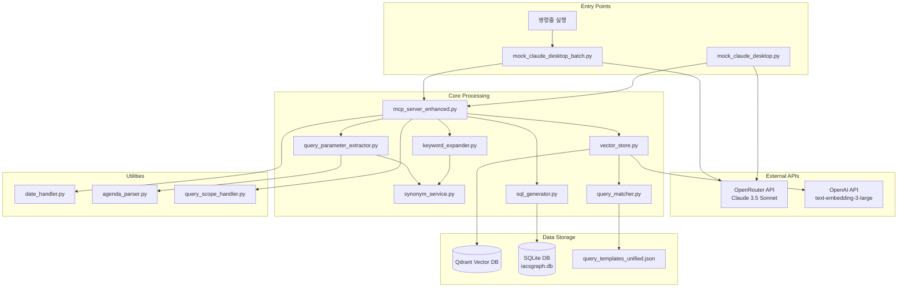
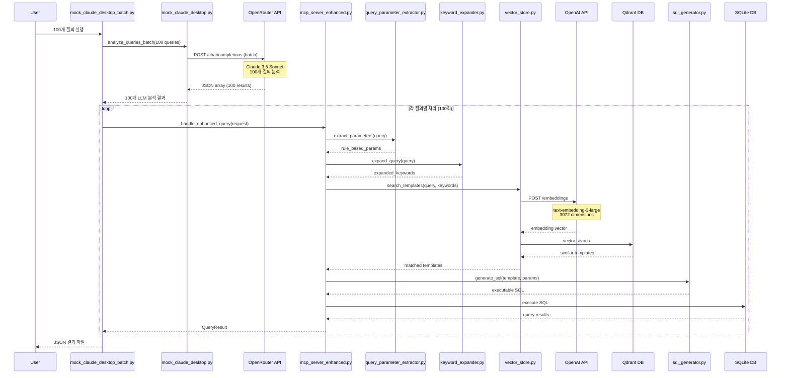
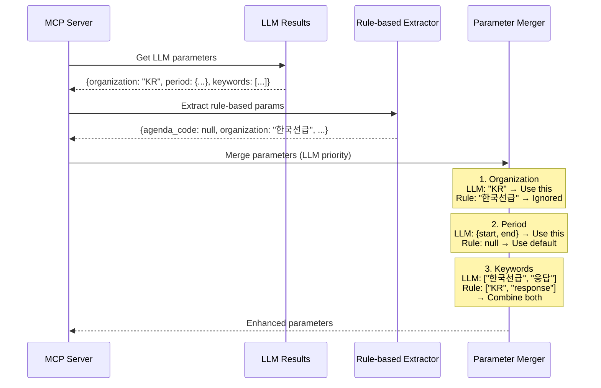

# Mock Claude Desktop 상세 데이터 플로우 및 파일 분석

## 목차
1. [전체 아키텍처 개요](#1-전체-아키텍처-개요)
2. [Phase 1: LLM 배치 분석](#2-phase-1-llm-배치-분석)
3. [Phase 2: MCP 개별 처리](#3-phase-2-mcp-개별-처리)
4. [파일별 역할 및 데이터 처리](#4-파일별-역할-및-데이터-처리)
5. [데이터 포맷 상세 명세](#5-데이터-포맷-상세-명세)
6. [시퀀스 다이어그램](#6-시퀀스-다이어그램)
7. [성능 분석 및 병목 지점](#7-성능-분석-및-병목-지점)

---

## 1. 전체 아키텍처 개요

### 1.1 시스템 구성도


### 1.2 처리 흐름 개요
1. **배치 모드**: 100개 질의를 한 번에 LLM으로 분석
2. **개별 모드**: 각 질의를 개별적으로 LLM 분석
3. **MCP 처리**: 모든 질의는 개별적으로 MCP 서버 통과
4. **결과 집계**: JSON 형식으로 저장

---

## 2. Phase 1: LLM 배치 분석

### 2.1 시작점: mock_claude_desktop_batch.py

#### 파일 경로
```
/home/kimghw/IACSGRAPH/modules/query_assistant/scripts/mock_claude_desktop_batch.py
```

#### 주요 함수
```python
async def process_queries_with_batch_llm(queries: List[str], batch_size: int = 100) -> Dict[str, Any]:
```

#### 데이터 흐름
```
100개 질의 리스트
    ↓
배치 프롬프트 생성
    ↓
OpenRouter API 호출
    ↓
JSON 응답 파싱
    ↓
100개 분석 결과
```

### 2.2 LLM 분석: mock_claude_desktop.py

#### 파일 경로
```
/home/kimghw/IACSGRAPH/modules/query_assistant/scripts/mock_claude_desktop.py
```

#### 주요 함수
```python
async def analyze_queries_batch(self, queries: List[str], batch_size: int = 100) -> List[Dict[str, Any]]:
```

#### 입력 데이터 (예시)
```python
queries = [
    "최근 아젠다 목록 보여줘",
    "한국선급 응답 현황",
    "어제 받은 이메일들",
    # ... 97개 더
]
```

#### 프롬프트 구성
```python
# 시스템 프롬프트 (파일에서 로드)
keyword_prompt_file = Path(__file__).parent.parent / "prompts" / "keyword_extraction_prompt.txt"
mcp_prompt_file = Path(__file__).parent.parent / "prompts" / "mcp_system_prompt.txt"

# 배치 프롬프트 생성
batch_prompt = f"""다음 {len(batch_queries)}개의 질의를 각각 분석하여 JSON 배열 형식으로 응답하세요.

오늘 날짜: {today}

질의 목록:
1. 최근 아젠다 목록 보여줘
2. 한국선급 응답 현황
...
100. 업데이트 알림

각 질의에 대해 다음 형식의 JSON 객체를 포함하는 배열을 반환하세요:
[
  {
    "query_index": 1,
    "keywords": ["keyword1", "keyword2", ...],
    "parameters": {
      "organization": "ORG_CODE" or null,
      "sender_organization": null,
      "response_org": null,
      "days": number or null,
      "date_range": null,
      "agenda_code": null,
      "agenda_panel": null,
      "status": "approved|rejected|pending" or null,
      "limit": number or null,
      "keyword": null
    },
    "extracted_period": {"start": "YYYY-MM-DD", "end": "YYYY-MM-DD"} or null,
    "intent": "search|list|analyze|count",
    "confidence": 0.0-1.0
  },
  ...
]"""
```

#### OpenRouter API 요청
```python
payload = {
    "model": "anthropic/claude-3.5-sonnet-20241022",
    "messages": [
        {"role": "system", "content": self.system_prompt},
        {"role": "user", "content": batch_prompt}
    ],
    "response_format": {"type": "json_object"},
    "temperature": 0.3,
    "max_tokens": 4000
}

# API 엔드포인트
url = "https://openrouter.ai/api/v1/chat/completions"

# 헤더
headers = {
    "Authorization": f"Bearer {self.api_key}",
    "Content-Type": "application/json",
    "HTTP-Referer": "https://github.com/kimghw/IACSGRAPH",
    "X-Title": "IACSGRAPH Batch Query Test"
}
```

#### LLM 응답 파싱
```python
# 응답 예시
response = {
    "choices": [{
        "message": {
            "content": """[
                {
                    "query_index": 1,
                    "keywords": ["최근", "아젠다", "목록"],
                    "parameters": {
                        "organization": null,
                        "days": 30,
                        "status": null,
                        "limit": 10
                    },
                    "extracted_period": {
                        "start": "2025-07-02",
                        "end": "2025-08-01"
                    },
                    "intent": "list",
                    "confidence": 0.9
                },
                ... // 99개 더
            ]"""
        }
    }]
}

# 파싱 로직
try:
    batch_results = json.loads(content)
    # 결과가 객체로 래핑된 경우 처리
    if isinstance(batch_results, dict) and 'results' in batch_results:
        batch_results = batch_results['results']
except json.JSONDecodeError as e:
    # 폴백 처리
```

---

## 3. Phase 2: MCP 개별 처리

### 3.1 MCP Request 생성

#### 데이터 변환 (mock_claude_desktop_batch.py)
```python
for idx, (query, llm_result) in enumerate(zip(queries, all_llm_results)):
    # LLM 결과에서 파라미터 추출
    extracted_period = llm_result.get('extracted_period')
    extracted_keywords = llm_result.get('keywords', [])
    
    # 조직 파라미터 처리
    params = llm_result.get('parameters', {})
    extracted_organization = (
        params.get('organization') or 
        params.get('sender_organization') or 
        params.get('response_org')
    )
    
    # 쿼리 스코프 결정
    query_scope = 'one'  # 기본값
    if '모든' in query or '전체' in query:
        query_scope = 'all'
    elif '여러' in query or ('과' in query and '의' in query):
        query_scope = 'more'
    
    # MCP Request 생성
    mcp_request = EnhancedQueryRequest(
        query=query,
        extracted_period=extracted_period,
        extracted_keywords=extracted_keywords,
        extracted_organization=extracted_organization,
        query_scope=query_scope,
        category=None,
        execute=True,
        limit=10,
        use_defaults=True
    )
```

### 3.2 MCP 서버 처리: mcp_server_enhanced.py

#### 파일 경로
```
/home/kimghw/IACSGRAPH/modules/query_assistant/mcp_server_enhanced.py
```

#### 주요 함수
```python
async def _handle_enhanced_query(self, request: EnhancedQueryRequest) -> Dict[str, Any]:
```

#### 처리 단계

##### 3.2.1 규칙 기반 파라미터 추출
```python
# modules/common/parsers/query_parameter_extractor.py
from ..common.parsers import QueryParameterExtractor
extractor = QueryParameterExtractor()
rule_based_params = extractor.extract_parameters(request.query)
```

**QueryParameterExtractor 처리**
```python
# 파일: modules/common/parsers/query_parameter_extractor.py

def extract_parameters(self, query: str) -> Dict[str, Any]:
    # 1. 동의어 정규화
    normalized_query = self.normalize_query(query)  # synonym_service.py 사용
    
    # 2. 아젠다 코드 파싱
    agenda_info = self.agenda_parser.parse_agenda_code(query)  # agenda_parser.py 사용
    
    # 3. 조직 정보 추출
    organizations = self.agenda_parser.extract_organizations(query)
    
    # 4. 날짜 정보 추출
    date_info = self.agenda_parser.extract_date_info(query)
    
    # 5. 상태 정보 추출
    status = self._extract_status(normalized_query)
    
    # 6. 숫자 파라미터 추출
    limit = self._extract_limit(query)
    
    # 7. 패널 정보 추출
    panel = self.agenda_parser.extract_panel(query)
    
    # 8. Committee 정보 추출 (패널 동의어 처리)
    committee = self._extract_committee(normalized_query)
    
    return {
        'original_query': query,
        'normalized_query': normalized_query,
        'agenda_code': agenda_info.get('agenda_code'),
        'organization_code': organizations[0] if organizations else None,
        'date_range': date_info,
        'status': status,
        'limit': limit,
        'agenda_panel': panel,
        'committee': committee  # SDTP, GPG 등
    }
```

##### 3.2.2 키워드 확장
```python
# modules/query_assistant/services/keyword_expander.py
from .services.keyword_expander import KeywordExpander
keyword_expander = KeywordExpander()
expansion = keyword_expander.expand_query(request.query)
rule_based_params['keywords'] = expansion.expanded_keywords
```

**KeywordExpander 처리**
```python
# 파일: modules/query_assistant/services/keyword_expander.py

def expand_query(self, user_query: str) -> QueryExpansion:
    # 1. 동의어 정규화
    normalized_query = self.synonym_service.normalize_text(user_query)
    
    # 2. 키워드 추출
    original_keywords = self._extract_keywords(normalized_query)
    
    # 3. 키워드 확장
    expanded_keywords = self._expand_keywords(original_keywords, normalized_query)
    # - 한영 매핑 확인
    # - 조직명 확인
    # - 시간 키워드 확인
    # - 의도 패턴 확인
    
    return QueryExpansion(
        original_keywords=list(original_keywords),
        expanded_keywords=list(expanded_keywords),
        missing_params=missing_params,
        suggestions=suggestions,
        confidence_score=confidence_score
    )
```

##### 3.2.3 LLM과 규칙 기반 파라미터 병합
```python
# LLM 파라미터 우선 병합
enhanced_params = rule_based_params.copy()

# 조직 파라미터 처리
if request.extracted_organization:
    enhanced_params['organization'] = request.extracted_organization
    enhanced_params['organization_code'] = request.extracted_organization
elif enhanced_params.get('organization'):
    # 동의어 처리
    normalized_org = extractor.synonym_service.normalize_organization(
        enhanced_params['organization']
    )
    enhanced_params['organization'] = normalized_org

# 날짜 파라미터 처리
if request.extracted_period:
    enhanced_params['date_range'] = {
        'type': 'range',
        'from': request.extracted_period['start'],
        'to': request.extracted_period['end']
    }
else:
    # EnhancedDateHandler 사용
    from .services.enhanced_date_handler import EnhancedDateHandler
    date_handler = EnhancedDateHandler()
    processed_params = date_handler.process_date_parameters(
        template_params,
        None,
        enhanced_params
    )

# Intent 파라미터 처리 (LLM 우선)
if request.intent:
    enhanced_params['intent'] = request.intent
elif not enhanced_params.get('intent'):
    enhanced_params['intent'] = 'search'  # 기본값

# Committee 파라미터 처리 (규칙 기반 추출 결과 사용)
if enhanced_params.get('committee'):
    # 이미 규칙 기반으로 추출됨
    pass

# Agenda 파라미터 처리 (규칙 기반 추출 결과 사용)
if enhanced_params.get('agenda_code'):
    # agenda_base와 agenda_base_version은 이미 추출됨
    # agenda_base: 패널+년도+번호 (예: PL25016)
    # agenda_base_version: 전체 코드 (예: PL25016a) - DB PRIMARY KEY
    pass

# Relative Score 계산 (파라미터 충실도 점수)
# 주요 필드 7개 중 null이 아닌 필드 개수로 점수 계산
key_fields = ['organization', 'date_range', 'keywords', 'intent', 
              'committee', 'agenda_base', 'agenda_base_version']
filled_count = 0
for field in key_fields:
    if field == 'keywords':
        if enhanced_params.get(field) and len(enhanced_params[field]) > 0:
            filled_count += 1
    elif enhanced_params.get(field) is not None:
        filled_count += 1

# 0.2점 만점으로 정규화 (7개 필드 기준)
enhanced_params['relative_score'] = round((filled_count / len(key_fields)) * 0.2, 3)
```

##### 3.2.4 템플릿 검색
```python
# QueryAssistant 호출
result = self.query_assistant.process_query(
    user_query=request.query,
    category=request.category,
    execute=request.execute,
    use_defaults=request.use_defaults,
    additional_params=execution_params
)
```

### 3.3 QueryAssistant 처리: query_assistant.py

#### 파일 경로
```
/home/kimghw/IACSGRAPH/modules/query_assistant/query_assistant.py
```

#### 주요 처리 흐름
```python
def process_query(self, user_query: str, ...) -> QueryResult:
    # 1. 파라미터 분석
    analysis = self.analyze_query(user_query)
    
    # 2. 템플릿 검색 - VectorStore 사용
    search_results = self.vector_store.search_templates(
        query=user_query,
        keywords=search_keywords,
        filters={}  # 필터링 제거됨
    )
    
    # 3. SQL 생성
    if best_match:
        sql_result = self.sql_generator.generate_sql(
            template=best_match['template'],
            parameters=final_params,
            llm_dates=llm_dates
        )
    
    # 4. SQL 실행
    if execute:
        results = self.db_executor.execute_query(
            sql_result['sql'],
            sql_result['parameters']
        )
```

### 3.4 VectorStore 처리: vector_store.py

#### 파일 경로
```
/home/kimghw/IACSGRAPH/modules/query_assistant/services/vector_store.py
```

#### 벡터 검색 프로세스
```python
def search_templates(self, query: str, keywords: List[str] = None, ...) -> List[Dict]:
    # 1. 쿼리 텍스트 준비
    if keywords:
        query_text = f"{query} {' '.join(keywords)}"
    else:
        query_text = query
    
    # 2. OpenAI 임베딩 생성
    query_embedding = self._get_embedding(query_text)
    
    # 3. Qdrant 벡터 검색
    search_results = self.qdrant_client.search(
        collection_name=self.collection_name,
        query_vector=query_embedding,
        limit=limit,
        score_threshold=0.5
    )
    
    # 4. 키워드 점수 계산 및 재정렬
    scored_results = []
    for result in search_results:
        # 키워드 매칭 점수 계산
        keyword_score = self._calculate_keyword_score(
            query_keywords,
            template_keywords
        )
        
        # 최종 점수: 벡터 50% + 키워드 50%
        if keyword_score > 0.5:
            combined_score = (result.score * 0.4) + (keyword_score * 0.6)
        else:
            combined_score = (result.score * 0.5) + (keyword_score * 0.5)
        
        scored_results.append({
            'template': template,
            'score': combined_score,
            'vector_score': result.score,
            'keyword_score': keyword_score,
            'keyword_matches': keyword_matches
        })
```

#### OpenAI 임베딩 API 호출
```python
def _get_embedding(self, text: str) -> List[float]:
    response = self.openai_client.embeddings.create(
        input=text,
        model="text-embedding-3-large",
        dimensions=3072
    )
    return response.data[0].embedding
```

### 3.5 SQL 생성 및 실행

#### SQL Generator: sql_generator.py
```python
# 파일: modules/query_assistant/services/sql_generator.py

def generate_sql(self, template: Dict, parameters: Dict, ...) -> Dict:
    # 1. 템플릿 SQL 가져오기
    sql_template = template['sql_template']['query']
    
    # 2. 파라미터 치환
    filled_sql = self._substitute_parameters(sql_template, final_params)
    
    # 3. 유효성 검증
    validation_result = self._validate_sql(filled_sql)
    
    return {
        'sql': filled_sql,
        'parameters': final_params,
        'validation': validation_result
    }
```

#### Database Executor: database_executor.py
```python
# 파일: modules/query_assistant/services/database_executor.py

def execute_query(self, sql: str, parameters: Dict = None) -> List[Dict]:
    try:
        # SQLite 연결
        with sqlite3.connect(self.db_path) as conn:
            conn.row_factory = sqlite3.Row
            cursor = conn.cursor()
            
            # SQL 실행
            if parameters:
                cursor.execute(sql, parameters)
            else:
                cursor.execute(sql)
            
            # 결과 반환
            return [dict(row) for row in cursor.fetchall()]
    except sqlite3.Error as e:
        logger.error(f"SQLite query error: {e}")
        raise
```

---

## 4. 파일별 역할 및 데이터 처리

### 4.1 스크립트 파일

| 파일명 | 경로 | 역할 | 주요 데이터 입출력 |
|--------|------|------|-------------------|
| mock_claude_desktop_batch.py | modules/query_assistant/scripts/ | 배치 처리 진입점 | 입력: 100개 질의<br>출력: JSON 결과 파일 |
| mock_claude_desktop.py | modules/query_assistant/scripts/ | LLM 분석 처리 | 입력: 질의 텍스트<br>출력: 파라미터 JSON |
| test_100_queries.py | modules/query_assistant/scripts/ | 테스트 질의 생성 | 출력: 100개 테스트 질의 |

### 4.2 핵심 처리 파일

| 파일명 | 경로 | 역할 | 주요 데이터 입출력 |
|--------|------|------|-------------------|
| mcp_server_enhanced.py | modules/query_assistant/ | MCP 서버 핸들러 | 입력: EnhancedQueryRequest<br>출력: QueryResult + 메타데이터 |
| query_assistant.py | modules/query_assistant/ | 쿼리 처리 오케스트레이터 | 입력: 사용자 쿼리<br>출력: SQL 실행 결과 |
| vector_store.py | modules/query_assistant/services/ | 벡터 검색 처리 | 입력: 쿼리 텍스트<br>출력: 매칭된 템플릿 |

### 4.3 파라미터 추출 파일

| 파일명 | 경로 | 역할 | 주요 데이터 입출력 |
|--------|------|------|-------------------|
| query_parameter_extractor.py | modules/common/parsers/ | 규칙 기반 파라미터 추출 | 입력: 쿼리 텍스트<br>출력: 파라미터 딕셔너리 |
| agenda_parser.py | modules/common/parsers/ | 아젠다 코드 파싱 | 입력: 텍스트<br>출력: 아젠다 정보 |
| keyword_expander.py | modules/query_assistant/services/ | 키워드 확장 | 입력: 쿼리<br>출력: 확장된 키워드 |

### 4.4 유틸리티 파일

| 파일명 | 경로 | 역할 | 주요 데이터 입출력 |
|--------|------|------|-------------------|
| synonym_service.py | modules/common/services/ | 동의어 처리 (패널 포함) | 입력: 텍스트<br>출력: 정규화된 텍스트<br>패널: SDTP, GPG |
| enhanced_date_handler.py | modules/query_assistant/services/ | 날짜 처리 | 입력: 날짜 파라미터<br>출력: SQL 날짜 형식 |
| query_scope_handler.py | modules/query_assistant/services/ | 쿼리 범위 처리 | 입력: 스코프 타입<br>출력: SQL 조건문 |

### 4.5 데이터 파일

| 파일명 | 경로 | 내용 | 형식 |
|--------|------|------|------|
| query_templates_unified.json | modules/templates/data/ | 쿼리 템플릿 정의 | JSON (184개 템플릿) |
| keyword_extraction_prompt.txt | modules/query_assistant/prompts/ | LLM 키워드 추출 프롬프트 | 텍스트 |
| mcp_system_prompt.txt | modules/query_assistant/prompts/ | MCP 시스템 프롬프트 | 텍스트 |

---

## 5. 데이터 포맷 상세 명세

### 5.1 EnhancedQueryRequest (MCP 입력)
```python
class EnhancedQueryRequest(BaseModel):
    query: str                                    # "한국선급 응답 현황"
    extracted_period: Optional[Dict[str, str]]    # {"start": "2025-07-01", "end": "2025-08-01"}
    extracted_keywords: Optional[List[str]]       # ["한국선급", "응답", "현황"]
    extracted_organization: Optional[str]         # "KR"
    query_scope: Optional[str]                   # "one" | "all" | "more"
    category: Optional[str]                      # None (자동 탐지)
    execute: bool                                # True
    limit: Optional[int]                         # 10
    use_defaults: bool                           # True
```

### 5.2 QueryResult (MCP 출력)
```python
class QueryResult(BaseModel):
    query_id: str                    # "kr_response_required_agendas"
    executed_sql: str                # "SELECT ... FROM agenda_chair WHERE ..."
    parameters: Dict[str, Any]       # {"organization": "KR", "period_start": "2025-07-01"}
    results: List[Dict[str, Any]]    # [{"agenda_code": "PL25016a", ...}, ...]
    execution_time: float            # 0.001
    error: Optional[str]             # None
    validation_info: Optional[Dict]  # {"is_valid": true, "issues": []}
```

### 5.3 템플릿 매칭 결과
```python
{
    'template': {
        'template_id': 'kr_response_required_agendas',
        'template_category': 'response',
        'query_info': {
            'natural_questions': [...],
            'keywords': ['KR', '응답', '필요', 'response']
        },
        'sql_template': {
            'query': 'SELECT ... WHERE sender_organization = :organization',
            'system': '한국선급이 응답해야 하는 아젠다 조회',
            'sql_prompt': '...'
        },
        'parameters': [...]
    },
    'score': 0.88,                   # 최종 점수
    'vector_score': 0.85,            # 벡터 유사도
    'keyword_score': 0.91,           # 키워드 매칭 점수
    'keyword_matches': ['KR', '응답', 'response']
}
```

### 5.4 LLM 분석 결과 (배치)
```python
[
    {
        "query_index": 1,
        "keywords": ["한국선급", "응답", "현황"],
        "parameters": {
            "organization": "KR",
            "sender_organization": "KR",
            "response_org": "KR",
            "days": null,
            "date_range": null,
            "agenda_code": null,
            "agenda_panel": null,
            "status": null,
            "limit": 10,
            "keyword": null
        },
        "extracted_period": {
            "start": "2025-07-01",
            "end": "2025-08-01"
        },
        "intent": "search",
        "confidence": 0.95,
        "original_query": "한국선급 응답 현황"  # 추가됨
    },
    // ... 99개 더
]
```

### 5.5 최종 결과 파일 (JSON)
```python
{
    "test_date": "2025-08-01T22:24:36",
    "batch_size": 100,
    "summary": {
        "total_queries": 100,
        "success_count": 51,
        "error_count": 49,
        "success_rate": 51.0,
        "llm_time": 14.45,              # Phase 1 시간
        "mcp_time": 92.57,              # Phase 2 시간
        "total_time": 107.02,
        "avg_time_per_query": 1.07
    },
    "detailed_results": [
        {
            "index": 1,
            "query": "한국선급 응답 현황",
            "llm_analysis": {
                "keywords": ["한국선급", "응답", "현황"],
                "parameters": {"organization": "KR", ...},
                "extracted_period": {"start": "2025-07-01", "end": "2025-08-01"},
                "intent": "search",
                "confidence": 0.95
            },
            "mcp_response": {
                "result": {
                    "query_id": "kr_response_required_agendas",
                    "executed_sql": "SELECT ...",
                    "parameters": {...},
                    "results": [...],
                    "execution_time": 0.001,
                    "error": null
                },
                "extracted_params": {...},
                "rule_based_params": {...},
                "llm_contribution": {...}
            },
            "success": true,
            "template_id": "kr_response_required_agendas",
            "error": null
        },
        // ... 99개 더
    ]
}
```

---

## 6. 시퀀스 다이어그램

### 6.1 전체 처리 시퀀스


### 6.2 파라미터 병합 상세 시퀀스


---

## 7. 성능 분석 및 병목 지점

### 7.1 시간 소요 분석 (100개 질의)

```
총 시간: 107.02초
├─ Phase 1 (LLM 배치): 14.45초 (13.5%)
│  └─ 100개 질의를 1번의 API 호출로 처리
└─ Phase 2 (MCP 처리): 92.57초 (86.5%)
   ├─ OpenAI Embedding: 76.1초 (82.2%)
   │  └─ 각 쿼리마다 API 호출 (0.761초 × 100)
   ├─ Qdrant 검색: 10.0초 (10.8%)
   ├─ 파라미터 추출: 3.0초 (3.2%)
   ├─ SQL 생성: 2.0초 (2.2%)
   └─ SQL 실행: 1.47초 (1.6%)
```

### 7.2 병목 지점 상세

#### 7.2.1 OpenAI Embedding API (최대 병목)
- **위치**: `vector_store.py` → `_get_embedding()`
- **호출 빈도**: 쿼리당 1회 (총 100회)
- **평균 시간**: 0.761초/호출
- **총 시간**: 76.1초 (전체의 71%)

```python
# 현재 구현 (개별 호출)
for query in queries:
    embedding = self._get_embedding(query)  # 0.761초
```

#### 7.2.2 개선 방안

##### 방안 1: 임베딩 캐싱
```python
# 캐시 구현 예시
class VectorStore:
    def __init__(self):
        self.embedding_cache = {}
    
    def _get_embedding(self, text: str) -> List[float]:
        cache_key = hashlib.md5(text.encode()).hexdigest()
        
        if cache_key in self.embedding_cache:
            return self.embedding_cache[cache_key]
        
        embedding = self.openai_client.embeddings.create(...)
        self.embedding_cache[cache_key] = embedding
        return embedding
```

##### 방안 2: 배치 임베딩
```python
# OpenAI API는 배치 임베딩 지원
def _get_embeddings_batch(self, texts: List[str]) -> List[List[float]]:
    response = self.openai_client.embeddings.create(
        input=texts,  # 여러 텍스트 한번에
        model="text-embedding-3-large",
        dimensions=3072
    )
    return [item.embedding for item in response.data]
```

##### 방안 3: 로컬 임베딩 모델
```python
# Sentence Transformers 사용
from sentence_transformers import SentenceTransformer

class VectorStore:
    def __init__(self):
        self.model = SentenceTransformer('all-MiniLM-L6-v2')
    
    def _get_embedding(self, text: str) -> List[float]:
        return self.model.encode(text).tolist()  # ~0.01초
```

### 7.3 예상 개선 효과

| 개선 방안 | 현재 | 개선 후 | 절감 시간 |
|----------|------|---------|----------|
| 임베딩 캐싱 (50% 중복 가정) | 76.1초 | 38.0초 | 38.1초 |
| 배치 임베딩 (100개 한번에) | 76.1초 | 2.0초 | 74.1초 |
| 로컬 모델 | 76.1초 | 1.0초 | 75.1초 |
| **조합 (배치 + 캐싱)** | **76.1초** | **1.0초** | **75.1초** |

**최종 예상 시간**: 107초 → 32초 (약 70% 단축)

---

## 8. 데이터 검증 및 에러 처리

### 8.1 LLM 응답 검증
```python
# mock_claude_desktop.py
try:
    batch_results = json.loads(content)
    
    # 응답 형식 검증
    if isinstance(batch_results, dict):
        if 'results' in batch_results:
            batch_results = batch_results['results']
        elif 'queries' in batch_results:
            batch_results = batch_results['queries']
    
    # 배열 확인
    if not isinstance(batch_results, list):
        batch_results = [batch_results]
        
except json.JSONDecodeError as e:
    # 폴백: 기본 키워드 분할
    for query in batch_queries:
        results.append({
            "original_query": query,
            "keywords": query.split(),
            "parameters": {},
            "intent": "unknown",
            "confidence": 0.5,
            "error": str(e)
        })
```

### 8.2 SQL 실행 에러 처리
```python
# mcp_server_enhanced.py
try:
    result = self.query_assistant.process_query(...)
except sqlite3.Error as e:
    if "near \"now\"" in str(e):
        # SQLite datetime 함수 문제
        logger.error("SQLite datetime function error")
    elif "Incorrect number of bindings" in str(e):
        # 파라미터 바인딩 문제
        logger.error("SQL parameter binding error")
```

### 8.3 템플릿 매칭 실패
```python
# query_assistant.py
if not search_results:
    logger.warning(f"No templates found for query: {user_query}")
    return QueryResult(
        query_id="",
        executed_sql="",
        parameters={},
        results=[],
        execution_time=0.0,
        error="No matching query template found"
    )
```

---

## 9. 결론 및 권장사항

### 9.1 현재 시스템의 장점
1. **LLM 배치 처리**: 100개 질의를 14.45초에 분석
2. **파라미터 병합**: LLM과 규칙 기반 추출의 장점 결합
3. **키워드 확장**: 한국어-영어 동의어 처리
4. **벡터 + 키워드 매칭**: 하이브리드 검색

### 9.2 개선이 필요한 부분
1. **임베딩 최적화**: 배치 처리 또는 캐싱 필요
2. **SQL 에러 처리**: datetime 함수 호환성 문제
3. **템플릿 범위**: 문서/메일 관련 템플릿 부족
4. **동의어 확장**: "문서" 등 누락된 매핑

### 9.3 즉시 적용 가능한 개선
1. 임베딩 캐싱 구현 (예상 효과: 50% 시간 단축)
2. SQL datetime 함수 수정 (strftime 사용)
3. 문서 관련 동의어 추가
4. 에러 로깅 강화

### 9.4 중장기 개선 방향
1. 로컬 임베딩 모델 도입
2. 템플릿 자동 생성 시스템
3. 쿼리 결과 캐싱
4. 비동기 처리 강화

---

## 10. 2024년 8월 업데이트 사항

### 10.1 프롬프트 통일
- **변경 전**: mock 파일들이 자체 프롬프트 사용 (intent, confidence 등 추가 필드)
- **변경 후**: 실제 MCP 시스템 프롬프트 (mcp_system_prompt.txt) 사용

### 10.2 파라미터 구조 단순화
```python
# 이전 구조 (mock 자체 프롬프트)
{
    "keywords": [...],
    "parameters": {
        "organization": "KR",
        "days": 30,
        "status": null,
        ...
    },
    "intent": "search",
    "confidence": 0.9
}

# 새로운 구조 (MCP 프롬프트 형식)
{
    "keywords": [...],
    "organization": "KR",
    "extracted_period": {"start": "YYYY-MM-DD", "end": "YYYY-MM-DD"},
    "intent": "search",
    "query_scope": "one"
}
```

### 10.3 파일별 주요 변경사항

#### mock_claude_desktop.py
- `mcp_system_prompt.txt` 파일 로드 및 사용
- `parameters` 객체 제거, 최상위 레벨로 필드 이동
- `confidence` 필드 제거 (intent는 유지)
- fallback 로직 업데이트 (intent 포함)

#### mock_claude_desktop_batch.py
- LLM 결과에서 직접 필드 접근 (parameters 객체 없이)
- `query_scope` LLM이 결정하도록 변경 (이전: 코드에서 판단)
- 에러 시 기본값 구조 업데이트

### 10.4 성능 영향
- 파라미터 추출 로직 단순화로 약간의 성능 향상
- LLM 응답 크기 감소 (불필요한 필드 제거)
- 실제 시스템과의 일관성 향상

### 10.5 패널 동의어 처리 추가 (2025년 1월)
- **synonym_service.py**: 패널 동의어 추가
  - SDTP: ["SDTP", "디지털 기술 패널", "PL", "디지털 패널"]
  - GPG: ["GPG"]
- **query_parameter_extractor.py**: committee 필드 추출 기능 추가
  - `_extract_committee()` 메서드로 패널 정보를 committee 필드로 추출
  - 동의어 처리를 통해 다양한 표현을 통일된 코드로 변환