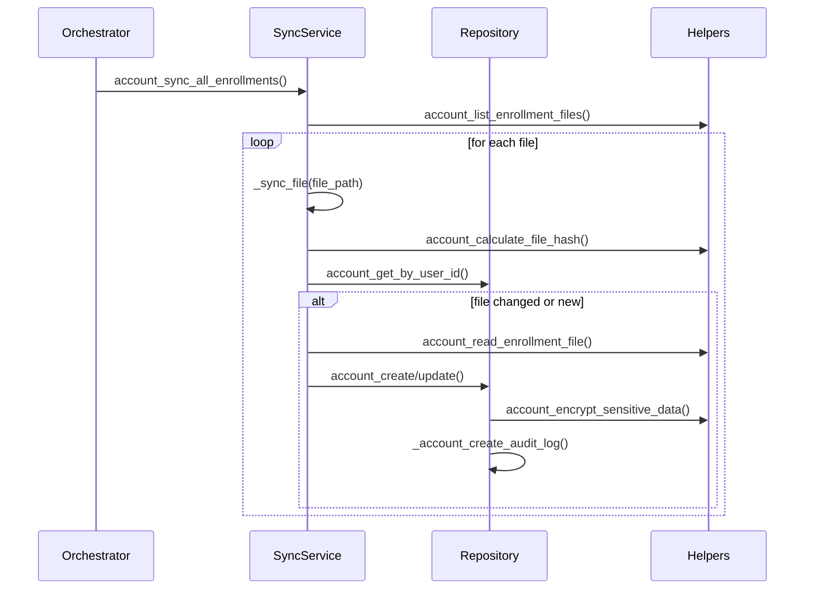

# Account 모듈 구현 명세서

## 1. 개요

Account 모듈은 enrollment 파일과 데이터베이스 간의 계정 동기화, 계정 생명주기 관리, 계정별 OAuth 클라이언트 정보 관리를 담당하는 핵심 모듈입니다.

### 1.1 주요 책임
- `enrollment/*.yaml` 파일 스캔 및 DB 동기화
- 계정 CRUD 및 상태 관리 (ACTIVE, INACTIVE, LOCKED, REAUTH_REQUIRED)
- 계정별 OAuth 클라이언트 정보 및 토큰의 암호화 저장
- 계정 변경 이력 추적을 위한 감사 로그 생성

### 1.2 유즈케이스
- **UC-1**: enrollment 파일 동기화
- **UC-1.1**: 신규 계정 등록
- **UC-1.2**: 기존 계정 정보 업데이트
- **UC-1.3**: 제거된 계정 비활성화
- **UC-1.4**: 계정 상태 관리 (활성화/비활성화)

## 2. 아키텍처 설계

### 2.1 모듈 구조
```
modules/account/
├── __init__.py
├── account_orchestrator.py      # 계정 관리 오케스트레이터 (비즈니스 로직)
├── account_sync_service.py      # enrollment 동기화 서비스
├── account_repository.py        # 데이터베이스 CRUD 및 트랜잭션
├── account_schema.py            # Pydantic 데이터 모델
└── _account_helpers.py          # 암호화, 파일 처리 등 유틸리티
```

### 2.2 의존성 관계
```
account_orchestrator.py (API 진입점)
    ↓
account_sync_service.py  # enrollment 파일 처리 로직
    ↓
account_repository.py    # 데이터베이스 상호작용
    ↓
_account_helpers.py      # 암호화, 파일 해시 등 공통 유틸리티
```

### 2.3 외부 의존성
- `infra.core.database`: DB 연결 관리
- `infra.core.logger`: 전역 로깅 시스템
- `infra.core.config`: 환경 변수 관리
- `infra.core.exceptions`: 표준 예외 클래스

## 3. 데이터 모델

### 3.1 데이터베이스 스키마 (`accounts` 테이블)
```sql
CREATE TABLE accounts (
    id INTEGER PRIMARY KEY AUTOINCREMENT,
    user_id TEXT UNIQUE NOT NULL,
    user_name TEXT NOT NULL,
    email TEXT UNIQUE NOT NULL,
    status TEXT NOT NULL DEFAULT 'ACTIVE',
    is_active BOOLEAN NOT NULL DEFAULT 0,
    
    -- Enrollment 정보
    enrollment_file_path TEXT NOT NULL,
    enrollment_file_hash TEXT NOT NULL,
    
    -- OAuth 정보 (암호화 저장)
    oauth_client_id TEXT NOT NULL,
    oauth_client_secret TEXT NOT NULL,
    oauth_tenant_id TEXT NOT NULL,
    oauth_redirect_uri TEXT NOT NULL,
    auth_type TEXT NOT NULL,
    delegated_permissions TEXT,
    
    -- 토큰 정보 (암호화 저장)
    access_token TEXT,
    refresh_token TEXT,
    token_expiry TIMESTAMP,
    
    -- 메타데이터
    last_sync_time TIMESTAMP,
    created_at TIMESTAMP NOT NULL DEFAULT CURRENT_TIMESTAMP,
    updated_at TIMESTAMP NOT NULL DEFAULT CURRENT_TIMESTAMP
);
```

### 3.2 Pydantic 모델 (`account_schema.py`)
- **`AccountStatus`**: 계정 상태 Enum (ACTIVE, INACTIVE, LOCKED, REAUTH_REQUIRED)
- **`AuthType`**: 인증 타입 Enum
- **`OAuthConfig`**: YAML 파일 내 OAuth 설정 모델
- **`EnrollmentFileData`**: YAML 파일 전체 데이터 모델
- **`AccountCreate`**: 계정 생성용 데이터 모델
- **`AccountUpdate`**: 계정 업데이트용 데이터 모델
- **`AccountResponse`**: API 응답용 계정 데이터 모델
- **`AccountAuditLog`**: 감사 로그 데이터 모델
- **`AccountSyncResult`**: 동기화 결과 요약 모델

## 4. 핵심 로직 설명

### 4.1 AccountOrchestrator
- **역할**: Account 모듈의 모든 비즈니스 로직을 조정하는 중앙 컨트롤러.
- **주요 기능**:
    - `account_sync_all_enrollments()`: 전체 동기화 프로세스를 시작하고 결과를 요약.
    - `account_sync_single_file()`: 단일 파일을 동기화.
    - `account_get_by_user_id()`: 사용자 ID로 계정 정보를 조회.
    - `account_activate() / account_deactivate()`: 계정 상태를 변경.

### 4.2 AccountSyncService
- **역할**: `enrollment` 디렉터리의 파일을 읽고, 파싱하고, 데이터베이스와 동기화하는 실제 작업을 수행.
- **주요 기능**:
    - `account_sync_all_enrollments()`: 모든 YAML 파일을 순회하며 `_sync_file` 호출.
    - `_sync_file()`: 단일 파일의 해시를 비교하여 변경 여부를 감지하고, 변경 시 `repository`를 통해 DB에 생성/업데이트 요청.
    - `_load_and_validate_enrollment_data()`: YAML 파일을 읽고 Pydantic 모델로 유효성을 검증.

### 4.3 AccountRepository
- **역할**: 데이터베이스와의 모든 상호작용(CRUD)을 담당. SQL 쿼리와 트랜잭션을 관리.
- **주요 기능**:
    - `account_create_from_enrollment()`: 신규 계정 정보를 DB에 삽입.
    - `account_update_by_id()`: 기존 계정 정보를 업데이트.
    - `account_get_by_user_id()`: 계정 정보를 조회하여 `AccountResponse` 모델로 반환.
    - **트랜잭션 관리**: `with self.db.transaction()` 구문을 사용하여 동기화 작업의 원자성을 보장.
    - **감사 로그**: 계정 생성 및 변경 시 `account_audit_logs` 테이블에 기록을 남김.

### 4.4 _account_helpers.py
- **`AccountCryptoHelpers`**: `Fernet`을 사용하여 OAuth 클라이언트 시크릿, 토큰 등 민감 정보를 암호화/복호화.
- **`AccountFileHelpers`**: YAML 파일을 읽고, 파일의 SHA256 해시를 계산하여 변경 사항을 감지.
- **`AccountAuditHelpers`**: 감사 로그 메시지를 생성하고 JSON으로 직렬화 가능한 형태로 데이터를 정제.

## 5. 호출 스택 다이어그램

### 5.1 계정 동기화 플로우


## 6. 보안 및 품질 관리

- **보안**:
    - ✅ **민감 정보 암호화**: `client_secret`, `access_token`, `refresh_token`은 Fernet 암호화를 통해 DB에 저장.
    - ✅ **로그 마스킹**: `_account_sanitize_values` 헬퍼를 통해 민감 정보가 로그에 노출되지 않도록 처리.
- **품질**:
    - ✅ **350줄 제한**: 모든 모듈 파일이 350줄 이하로 유지됨.
    - ✅ **타입 힌트**: 모든 함수/메서드에 타입 힌트가 적용됨.
    - ✅ **단위 테스트**: 규칙에 따라 단위 테스트는 제거되었으며, 기능 검증은 시나리오 기반의 수동 테스트로 대체됩니다.
    - ✅ **원자성 보장**: DB 작업은 트랜잭션으로 처리되어 데이터 일관성을 유지.
