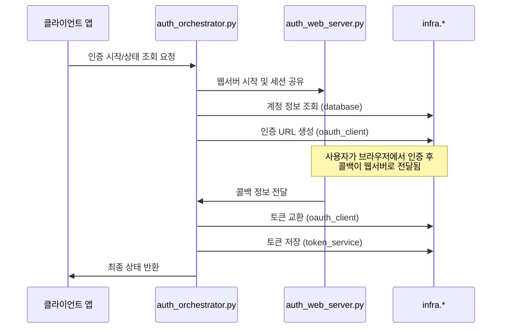

# Auth 모듈 - OAuth 2.0 인증 플로우 관리

Auth 모듈은 OAuth 2.0 인증 플로우를 조정하고 메모리 기반의 임시 세션을 관리하는 경량화된 모듈입니다. `infra` 서비스들을 최대한 활용하여 OAuth 플로우 관리에만 집중합니다.

## 🚀 주요 기능

- **OAuth 플로우 조정**: 인증 URL 생성, 콜백 처리, 토큰 교환까지의 전체 플로우를 관리합니다.
- **메모리 세션 관리**: 인증 과정에서 사용되는 임시 세션을 메모리에 저장하고 관리합니다. (DB 저장 없음)
- **일괄 인증 처리**: 여러 계정의 인증 상태를 확인하고 필요한 경우 순차적으로 인증을 조정합니다.
- **infra 서비스 연동**: `token_service`, `oauth_client`, `database` 등 기존 `infra` 서비스를 직접 활용합니다.

## 📁 모듈 구조

```
modules/auth/
├── __init__.py                 # 모듈 초기화 및 export
├── auth_orchestrator.py        # OAuth 플로우 조정 (메인 API)
├── auth_web_server.py          # OAuth 콜백 처리 웹서버 관리
├── auth_schema.py              # OAuth 관련 Pydantic 모델
├── _auth_helpers.py            # OAuth 전용 유틸리티
└── references/
    └── graphapi_delegated_auth.md  # Microsoft Graph API 인증 가이드
```

## 🔄 호출 스택 다이어그램



## 📝 사용 방법

`AuthOrchestrator`는 `get_auth_orchestrator()`를 통해 싱글턴 인스턴스로 접근할 수 있습니다. 모든 기능은 Pydantic 모델을 사용하여 요청하고 응답받습니다.

### 1. 인증 인스턴스 가져오기

```python
from modules.auth import get_auth_orchestrator

# AuthOrchestrator 인스턴스 가져오기
auth_orchestrator = get_auth_orchestrator()
```

### 2. 단일 사용자 인증

인증을 시작하고, 생성된 `auth_url`로 사용자를 안내합니다. 사용자가 인증을 완료하면 `get_session_status`를 통해 상태를 확인할 수 있습니다.

- **`auth_orchestrator_start_authentication(request: AuthStartRequest) -> AuthStartResponse`**
  - **요청**: `AuthStartRequest` (user_id)
  - **응답**: `AuthStartResponse` (session_id, auth_url, expires_at)
- **`auth_orchestrator_get_session_status(session_id: str) -> AuthStatusResponse`**
  - **요청**: `session_id`
  - **응답**: `AuthStatusResponse` (session_id, user_id, status, message, is_completed)

### 3. 일괄 인증

여러 사용자의 인증 상태를 한 번에 확인하고, 인증이 필요한 사용자에 대해 인증 URL을 생성하여 반환합니다.

- **`auth_orchestrator_bulk_authentication(request: AuthBulkRequest) -> AuthBulkResponse`**
  - **요청**: `AuthBulkRequest` (user_ids)
  - **응답**: `AuthBulkResponse` (총 사용자 수, 상태별 사용자 수, 사용자별 상태 목록)

### 4. 전체 계정 상태 조회

데이터베이스에 저장된 모든 계정의 현재 인증 상태와 토큰 만료 여부를 조회합니다.

- **`auth_orchestrator_get_all_accounts_status() -> List[Dict[str, Any]]`**
  - **응답**: 각 계정의 상태 정보가 담긴 딕셔너리 리스트

### 5. 세션 정리

만료되었거나 완료된 임시 인증 세션을 메모리에서 정리합니다.

- **`auth_orchestrator_cleanup_sessions(request: AuthCleanupRequest) -> AuthCleanupResponse`**
  - **요청**: `AuthCleanupRequest` (만료 기준 시간(분), 강제 정리 여부)
  - **응답**: `AuthCleanupResponse` (정리된 세션 수, 남은 세션 수)

## 🔧 주요 컴포넌트

- **`AuthOrchestrator`**: OAuth 플로우의 메인 조정자. 인증 시작, 상태 확인, 일괄 처리 등 모듈의 핵심 API를 제공합니다.
- **`AuthWebServerManager`**: OAuth 콜백 처리를 위한 임시 웹서버의 생명주기를 관리합니다. `AuthOrchestrator`에 의해 내부적으로 제어됩니다.
- **`AuthSession`**: 인증 과정을 관리하는 메모리 기반 임시 세션 모델. CSRF 방지용 `state` 토큰과 만료 시간을 포함합니다.

## 🛡️ 보안 고려사항

- **CSRF 방지**: 각 세션마다 고유한 `state` 토큰을 생성하여 콜백 시 검증합니다.
- **세션 만료**: 모든 임시 세션은 기본 10분의 만료 시간을 가지며, 만료 시 자동으로 정리될 수 있습니다.
- **민감 데이터 마스킹**: 로그 출력 시 토큰과 같은 민감 정보는 자동으로 마스킹됩니다.

## ⚙️ 의존성

- `infra.core.token_service`: 토큰 저장, 갱신, 상태 확인
- `infra.core.oauth_client`: OAuth 클라이언트 (인증 URL 생성, 토큰 교환)
- `infra.core.database`: DB 연결 및 계정 정보 직접 쿼리
- `infra.core.logger`: 전역 로깅 시스템
- `infra.core.config`: 환경 변수 관리

## 🚨 제한사항

- **메모리 세션**: 서버 재시작 시 진행 중이던 인증 세션 정보가 소실됩니다.
- **단일 서버 환경**: 여러 서버 인스턴스 간 세션 공유를 지원하지 않습니다.
- **동시 인증**: 사용자당 하나의 진행 중인 인증 세션만 허용됩니다.

## 🧪 테스트

테스트는 `/test/scenario/`에 정의된 시나리오에 따라 수행됩니다.
