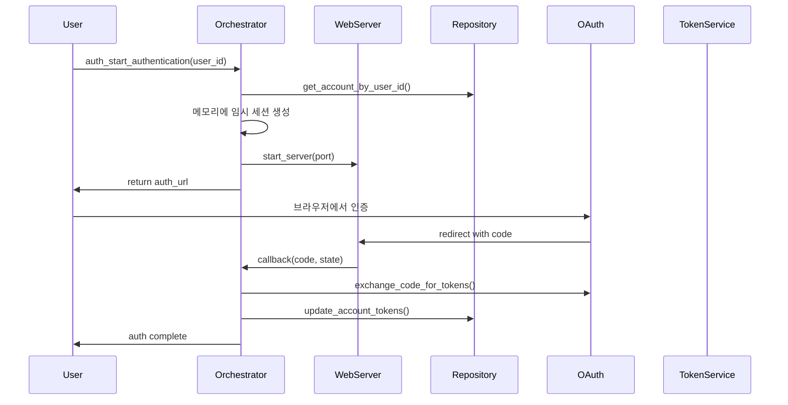
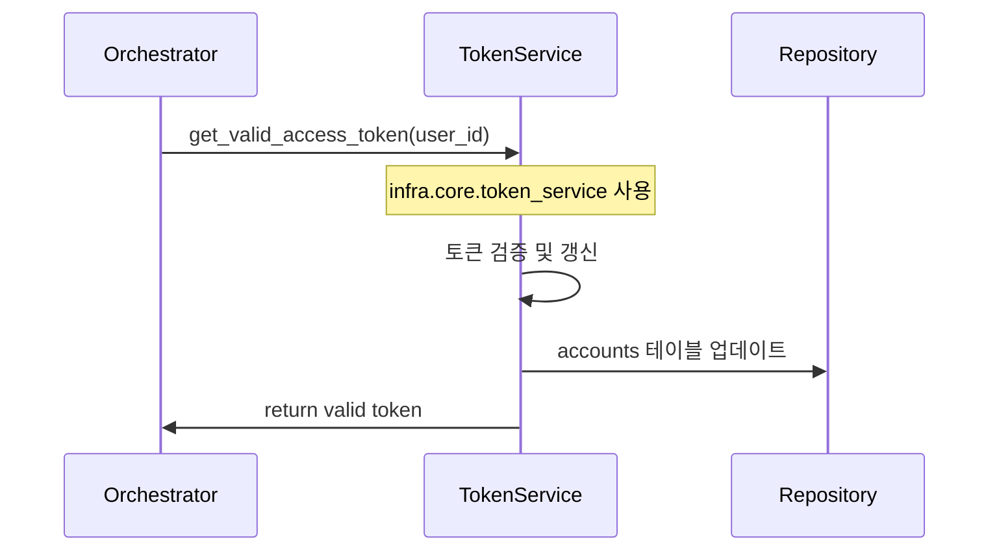
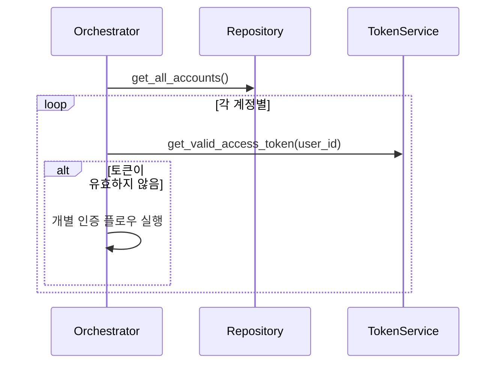

# Auth 모듈 구현 명세서 (간소화)

## 1. 개요

Auth 모듈은 **infra 서비스 최대 활용**을 통해 OAuth 2.0 인증 플로우 조정에만 집중하는 경량화된 모듈입니다. 기존 infra 레이어의 `token_service`, `database`, `oauth_client`를 직접 활용하여 중복을 제거하고 OAuth 플로우 관리에만 특화됩니다.

### 1.1 핵심 책임 (간소화)
- **OAuth 플로우 조정**: 인증 URL 생성, 콜백 처리, 메모리 세션 관리
- **infra 서비스 연동**: 기존 서비스들을 통한 토큰 저장/조회/갱신
- **일괄 인증 처리**: 여러 계정의 순차적 인증 조정
- **임시 세션 관리**: 메모리 기반 OAuth 세션 (DB 저장 없음)

### 1.2 제거된 책임 (infra 활용)
- ❌ **토큰 저장/갱신**: `infra.core.token_service` 완전 활용
- ❌ **DB 연결 관리**: `infra.core.database` 직접 사용
- ❌ **계정 정보 관리**: accounts 테이블 직접 쿼리
- ❌ **토큰 검증**: `infra.core.oauth_client` 활용

### 1.3 유즈케이스 (간소화)
- **UC-2.1**: OAuth 인증 플로우 조정 (URL 생성 → 콜백 처리)
- **UC-2.2**: 메모리 세션 관리 (임시 저장소)
- **UC-2.3**: 일괄 인증 조정 (infra.token_service 상태 확인 연동)
- **UC-2.4**: 에러 처리 및 리소스 정리

## 2. 아키텍처 설계

### 2.1 모듈 구조 (간소화)
```
modules/auth/
├── __init__.py
├── auth_orchestrator.py         # OAuth 플로우 조정 (메인 API)
├── auth_web_server.py          # OAuth 콜백 처리 웹서버
├── auth_schema.py              # OAuth 관련 Pydantic 모델만
├── _auth_helpers.py            # OAuth 전용 유틸리티만
└── references/
    └── graphapi_delegated_auth.md  # Microsoft Graph API 인증 가이드
```

### 2.2 의존성 관계 (간소화)
```
auth_orchestrator.py (OAuth 플로우 조정)
    ↓
auth_web_server.py          # OAuth 콜백 처리
_auth_helpers.py           # OAuth 전용 헬퍼
    ↓
infra.core.database        # accounts 테이블 직접 쿼리
infra.core.token_service   # 토큰 저장/갱신/상태확인
infra.core.oauth_client    # 토큰 교환
infra.core.config/logger   # 설정 및 로깅
```

### 2.3 외부 의존성
- `infra.core.database`: DB 연결 관리 및 직접 쿼리
- `infra.core.logger`: 전역 로깅 시스템
- `infra.core.config`: 환경 변수 관리
- `infra.core.token_service`: 토큰 갱신 및 상태 확인용만 사용
- `infra.core.oauth_client`: OAuth 클라이언트 (토큰 교환용)

## 3. 데이터 모델

### 3.1 기존 accounts 테이블 활용
```sql
-- 기존 accounts 테이블 (account 모듈에서 생성)
CREATE TABLE accounts (
    id INTEGER PRIMARY KEY AUTOINCREMENT,
    user_id TEXT NOT NULL UNIQUE,
    user_name TEXT NOT NULL,
    email TEXT,
    access_token TEXT,
    refresh_token TEXT,
    token_expiry TIMESTAMP,
    oauth_client_id TEXT,
    oauth_client_secret TEXT,
    oauth_tenant_id TEXT,
    oauth_redirect_uri TEXT,
    status TEXT NOT NULL DEFAULT 'INACTIVE',
    is_active BOOLEAN NOT NULL DEFAULT TRUE,
    last_sync_time TIMESTAMP,
    created_at TIMESTAMP DEFAULT CURRENT_TIMESTAMP,
    updated_at TIMESTAMP DEFAULT CURRENT_TIMESTAMP
);
```

### 3.2 메모리 기반 임시 세션 (DB 저장 없음)
```python
# 메모리에서만 관리되는 임시 세션 정보
session_data = {
    'session_id': str,
    'user_id': str,
    'state': str,
    'code_verifier': str,    # PKCE용
    'code_challenge': str,   # PKCE용
    'redirect_uri': str,
    'status': AuthStatus,
    'created_at': datetime,
    'expires_at': datetime
}
```

### 3.3 Pydantic 모델 (`auth_schema.py`)
- **`AuthStatus`**: 인증 상태 Enum (PENDING, AUTHENTICATED, FAILED)
- **`AuthFlowConfig`**: 인증 플로우 설정
- **`AuthStartResponse`**: 인증 시작 응답 (인증 URL 포함)
- **`AuthCompleteResponse`**: 인증 완료 응답
- **`AuthCallbackData`**: OAuth 콜백 데이터
- **`PKCEData`**: PKCE 관련 데이터

## 4. 핵심 로직 설명

### 4.1 AuthOrchestrator (메인 API)
- **역할**: Auth 모듈의 모든 인증 플로우를 조정하는 중앙 컨트롤러
- **주요 기능**:
    - `auth_start_authentication()`: 인증 프로세스 시작, 인증 URL 생성
    - `auth_complete_authentication()`: 콜백 대기 및 처리
    - `auth_start_and_complete_flow()`: 전체 인증 플로우 통합 실행
    - `auth_authenticate_all_accounts()`: 모든 계정 일괄 인증
    - `auth_check_accounts_token_status()`: 모든 계정 토큰 상태 확인

### 4.2 AuthWebServer
- **역할**: OAuth 리다이렉션을 처리하는 로컬 웹서버
- **주요 기능**:
    - `auth_start_server()`: 지정된 포트에서 웹서버 시작
    - `auth_wait_for_callback()`: OAuth 콜백 대기 및 데이터 수집
    - `auth_stop_server()`: 인증 완료 후 서버 종료
    - **PKCE(Proof Key for Code Exchange)** 지원으로 보안 강화

### 4.3 AuthRepository
- **역할**: accounts 테이블 직접 액세스 및 인증 데이터 관리
- **주요 기능**:
    - `auth_get_account_by_user_id()`: 계정 정보 조회
    - `auth_update_account_tokens()`: 토큰 정보 업데이트
    - `auth_update_account_status()`: 계정 상태 업데이트
    - `auth_get_all_accounts()`: 모든 계정 목록 조회
    - **참고**: 기존 infra.core.database의 공통 함수들과 중복되지 않도록 auth 전용 메서드만 구현

### 4.4 _auth_helpers.py
- **`AuthStateGenerator`**: 안전한 state 및 PKCE 값 생성
- **`AuthURLBuilder`**: OAuth 인증 URL 구성
- **`AuthTimeHelpers`**: 세션 만료 시간 계산
- **`AuthErrorHandler`**: 인증 오류 처리 및 분류
- **`AuthValidationHelpers`**: 인증 데이터 검증

## 5. 인증 플로우 시퀀스

### 5.1 신규 인증 플로우 (간소화)


### 5.2 토큰 갱신 플로우 (infra 사용)


### 5.3 일괄 인증 플로우


## 6. 보안 고려사항

### 6.1 PKCE (Proof Key for Code Exchange)
- **code_verifier**: 43-128자의 랜덤 문자열
- **code_challenge**: code_verifier의 SHA256 해시 (base64url 인코딩)
- Authorization 요청 시 code_challenge 전송, 토큰 교환 시 code_verifier 검증

### 6.2 State 파라미터
- CSRF 공격 방지를 위한 고유한 랜덤 값
- 메모리에 임시 저장되어 콜백 시 검증
- 인증 완료 후 즉시 삭제

### 6.3 보안 저장
- 모든 토큰은 accounts 테이블에 저장
- 민감한 정보는 필요시 `infra.core.token_service`의 암호화 기능 활용

## 7. 에러 처리

### 7.1 인증 실패 시나리오
- **INVALID_CLIENT**: 잘못된 client_id 또는 client_secret
- **INVALID_GRANT**: 만료되거나 무효한 authorization code  
- **ACCESS_DENIED**: 사용자가 권한 부여 거부
- **NETWORK_ERROR**: 네트워크 연결 문제
- **SESSION_EXPIRED**: 인증 세션 만료

### 7.2 복구 전략
- 인증 실패 시 accounts 테이블의 status를 적절히 업데이트
- 구체적인 오류 메시지 로깅
- 재시도 가능한 오류는 exponential backoff 적용
- 메모리 세션은 자동으로 만료 처리

## 8. 성능 및 확장성

### 8.1 동시 인증 처리
- 포트 충돌 방지를 위한 동적 포트 할당
- 여러 사용자의 동시 인증 지원 (메모리 세션 격리)
- 각 인증 플로우별 독립적인 상태 관리

### 8.2 리소스 관리
- 웹서버는 인증 완료 후 즉시 종료
- 메모리 세션은 타임아웃으로 자동 정리
- DB 연결은 infra.core.database를 통해 효율적으로 관리

## 9. 모듈 간 상호작용

### 9.1 account 모듈과의 관계
- **데이터 공유**: accounts 테이블을 공유하되, 각 모듈은 자신의 책임 영역만 관리
- **account 모듈**: 계정 생성/삭제, 계정 정보 관리, 동기화
- **auth 모듈**: OAuth 인증, 토큰 관리, 인증 상태 관리

### 9.2 infra 레이어 활용
- **token_service**: 토큰 갱신 및 상태 확인용으로만 사용
- **database**: 직접 쿼리 실행
- **config/logger/exceptions**: 표준 인프라 서비스 활용

## 10. 구현 우선순위

### 10.1 Phase 1: 기본 인증 플로우 (필수)
1. **AuthOrchestrator**: 기본 API 구조
2. **AuthWebServer**: 콜백 처리 웹서버
3. **AuthRepository**: accounts 테이블 직접 액세스
4. **기본 OAuth Flow**: 인증 URL 생성 → 콜백 처리 → 토큰 저장

### 10.2 Phase 2: 토큰 관리 (필수)
1. **Token Status Check**: infra.token_service 연동
2. **Bulk Authentication**: 일괄 인증 기능
3. **Error Handling**: 포괄적인 오류 처리

### 10.3 Phase 3: 보안 강화 (권장)
1. **PKCE 구현**: 보안 강화
2. **State 검증**: CSRF 방지
3. **Session Management**: 메모리 세션 최적화

### 10.4 Phase 4: 운영 기능 (선택)
1. **Monitoring**: 인증 상태 모니터링
2. **Analytics**: 인증 통계 및 로깅
3. **Admin Functions**: 관리자 기능

## 11. 구현 가이드라인

### 11.1 accounts 테이블 사용 원칙
- **읽기**: `SELECT` 쿼리를 통해 계정 정보 조회
- **토큰 업데이트**: `access_token`, `refresh_token`, `token_expiry` 필드만 업데이트
- **상태 관리**: `status` 필드로 인증 상태 관리 (ACTIVE, INACTIVE, REAUTH_REQUIRED)
- **충돌 방지**: account 모듈과 동시 수정을 피하기 위한 적절한 락킹

### 11.2 infra.core.token_service 활용
- **토큰 검증**: `get_valid_access_token()` 사용
- **토큰 갱신**: `validate_and_refresh_token()` 사용  
- **계정 상태**: `check_authentication_status()` 사용
- **직접 저장 금지**: 토큰은 infra 서비스를 통해서만 저장

### 11.3 메모리 세션 관리
- **임시성**: 인증 플로우 동안만 유지
- **자동 정리**: 타임아웃 및 완료 시 즉시 삭제
- **격리**: 사용자별 독립적인 세션 공간

이 설계를 통해 auth 모듈은 기존 accounts 테이블을 효율적으로 활용하면서도, 복잡한 세션 테이블 없이 안전하고 간결한 OAuth 인증 플로우를 제공할 수 있습니다.
