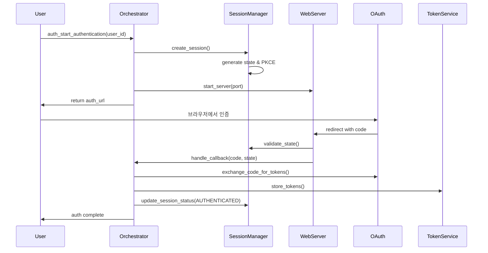
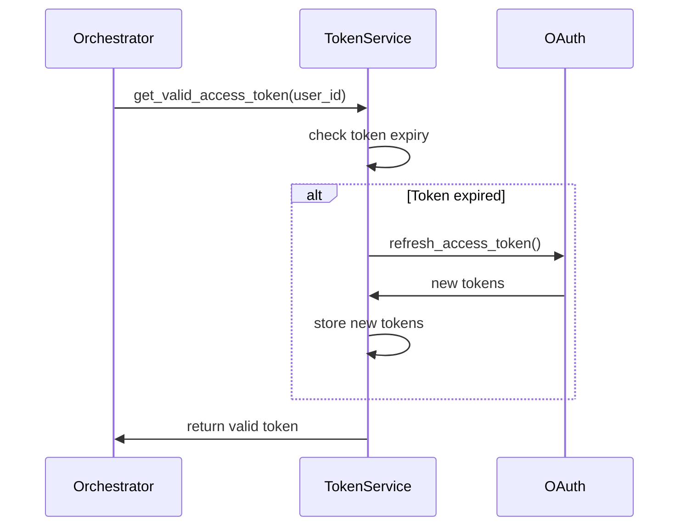

# Auth 모듈 구현 명세서

## 1. 개요

Auth 모듈은 Microsoft Graph API 접근을 위한 OAuth 2.0 인증 플로우를 구현하고, 각 계정의 인증 상태를 관리하는 독립적인 모듈입니다. Authorization Code Flow를 지원하며, 로컬 웹서버를 통해 OAuth 콜백을 처리합니다.

### 1.1 주요 책임
- OAuth 2.0 Authorization Code Flow 구현
- 로컬 웹서버를 통한 리다이렉션 처리
- 계정별 인증 상태 관리 및 토큰 저장
- 토큰 자동 갱신 및 만료 처리
- 인증 세션 관리

### 1.2 유즈케이스
- **UC-2**: 사용자 인증 및 권한 부여
- **UC-2.1**: 신규 계정 인증 (Authorization Code Flow)
- **UC-2.2**: 토큰 갱신 (Refresh Token 사용)
- **UC-2.3**: 인증 상태 확인 및 검증
- **UC-2.4**: 인증 세션 종료 (로그아웃)

## 2. 아키텍처 설계

### 2.1 모듈 구조
```
modules/auth/
├── __init__.py
├── auth_orchestrator.py         # 인증 관리 오케스트레이터
├── auth_web_server.py          # OAuth 콜백 처리 웹서버
├── auth_session_manager.py     # 인증 세션 및 상태 관리
├── auth_repository.py          # 인증 데이터 저장소
├── auth_schema.py              # Pydantic 데이터 모델
└── _auth_helpers.py            # 유틸리티 함수들
```

### 2.2 의존성 관계
```
auth_orchestrator.py (API 진입점)
    ↓
auth_web_server.py      # OAuth 리다이렉션 처리
auth_session_manager.py # 세션 상태 관리
    ↓
auth_repository.py      # 데이터베이스 상호작용
    ↓
_auth_helpers.py        # 공통 유틸리티
```

### 2.3 외부 의존성
- `infra.core.database`: DB 연결 관리
- `infra.core.logger`: 전역 로깅 시스템
- `infra.core.config`: 환경 변수 관리
- `infra.core.oauth_client`: OAuth 클라이언트 (재사용)
- `infra.core.token_service`: 토큰 관리 서비스 (재사용)

## 3. 데이터 모델

### 3.1 인증 세션 관리 (`auth_sessions` 테이블)
```sql
CREATE TABLE IF NOT EXISTS auth_sessions (
    id INTEGER PRIMARY KEY AUTOINCREMENT,
    session_id TEXT UNIQUE NOT NULL,
    user_id TEXT NOT NULL,
    state TEXT NOT NULL,
    code_verifier TEXT,
    code_challenge TEXT,
    redirect_uri TEXT NOT NULL,
    auth_status TEXT NOT NULL DEFAULT 'PENDING',
    auth_start_time TIMESTAMP NOT NULL,
    auth_complete_time TIMESTAMP,
    error_message TEXT,
    created_at TIMESTAMP NOT NULL DEFAULT CURRENT_TIMESTAMP,
    expires_at TIMESTAMP NOT NULL,
    FOREIGN KEY (user_id) REFERENCES accounts(user_id)
);

CREATE INDEX idx_auth_sessions_session_id ON auth_sessions(session_id);
CREATE INDEX idx_auth_sessions_user_id ON auth_sessions(user_id);
CREATE INDEX idx_auth_sessions_state ON auth_sessions(state);
```

### 3.2 Pydantic 모델 (`auth_schema.py`)
- **`AuthStatus`**: 인증 상태 Enum (PENDING, AUTHENTICATED, FAILED, EXPIRED)
- **`AuthSessionCreate`**: 인증 세션 생성 요청
- **`AuthSessionResponse`**: 인증 세션 응답
- **`AuthCallbackData`**: OAuth 콜백 데이터
- **`AuthStartResponse`**: 인증 시작 응답 (인증 URL 포함)
- **`AuthCompleteResponse`**: 인증 완료 응답
- **`TokenValidationResult`**: 토큰 검증 결과

## 4. 핵심 로직 설명

### 4.1 AuthOrchestrator
- **역할**: Auth 모듈의 모든 인증 플로우를 조정하는 중앙 컨트롤러
- **주요 기능**:
    - `auth_start_authentication()`: 인증 프로세스 시작, 인증 URL 생성
    - `auth_wait_for_callback()`: 콜백 대기 및 처리
    - `auth_refresh_token()`: 토큰 자동 갱신
    - `auth_validate_session()`: 세션 유효성 검증
    - `auth_logout()`: 인증 세션 종료

### 4.2 AuthWebServer
- **역할**: OAuth 리다이렉션을 처리하는 로컬 웹서버
- **주요 기능**:
    - `start_server()`: 지정된 포트에서 웹서버 시작
    - `handle_callback()`: OAuth 콜백 처리 및 authorization code 수집
    - `stop_server()`: 인증 완료 후 서버 종료
    - **PKCE(Proof Key for Code Exchange)** 지원으로 보안 강화

### 4.3 AuthSessionManager
- **역할**: 인증 세션 상태를 관리하고 추적
- **주요 기능**:
    - `create_session()`: 새로운 인증 세션 생성
    - `update_session_status()`: 세션 상태 업데이트
    - `validate_state()`: CSRF 방지를 위한 state 검증
    - `cleanup_expired_sessions()`: 만료된 세션 정리

### 4.4 AuthRepository
- **역할**: 인증 관련 데이터의 영속성 관리
- **주요 기능**:
    - `create_auth_session()`: 인증 세션 DB 저장
    - `get_session_by_state()`: state로 세션 조회
    - `update_session_status()`: 세션 상태 업데이트
    - `get_active_sessions()`: 활성 세션 목록 조회

### 4.5 _auth_helpers.py
- **`AuthStateGenerator`**: 안전한 state 및 PKCE 값 생성
- **`AuthURLBuilder`**: OAuth 인증 URL 구성
- **`AuthTimeHelpers`**: 세션 만료 시간 계산
- **`AuthErrorHandler`**: 인증 오류 처리 및 분류

## 5. 인증 플로우 시퀀스

### 5.1 신규 인증 플로우


### 5.2 토큰 갱신 플로우


## 6. 보안 고려사항

### 6.1 PKCE (Proof Key for Code Exchange)
- **code_verifier**: 43-128자의 랜덤 문자열
- **code_challenge**: code_verifier의 SHA256 해시 (base64url 인코딩)
- Authorization 요청 시 code_challenge 전송, 토큰 교환 시 code_verifier 검증

### 6.2 State 파라미터
- CSRF 공격 방지를 위한 고유한 랜덤 값
- 세션별로 생성되어 DB에 저장
- 콜백 시 검증하여 요청 무결성 확인

### 6.3 보안 저장
- 모든 토큰은 `infra.core.token_service`를 통해 암호화되어 저장
- 세션 정보는 일정 시간 후 자동 만료 및 삭제

## 7. 에러 처리

### 7.1 인증 실패 시나리오
- **INVALID_CLIENT**: 잘못된 client_id 또는 client_secret
- **INVALID_GRANT**: 만료되거나 무효한 authorization code
- **ACCESS_DENIED**: 사용자가 권한 부여 거부
- **NETWORK_ERROR**: 네트워크 연결 문제

### 7.2 복구 전략
- 인증 실패 시 세션 상태를 FAILED로 업데이트
- 구체적인 오류 메시지 저장 및 로깅
- 재시도 가능한 오류는 exponential backoff 적용

## 8. 성능 및 확장성

### 8.1 동시 인증 처리
- 포트 충돌 방지를 위한 동적 포트 할당
- 여러 사용자의 동시 인증 지원
- 세션별 독립적인 상태 관리

### 8.2 리소스 관리
- 웹서버는 인증 완료 후 즉시 종료
- 만료된 세션은 주기적으로 정리
- 메모리 누수 방지를 위한 적절한 타임아웃 설정

## 9. 모듈 간 상호작용

Auth 모듈은 독립적으로 동작하며, 다른 모듈과의 상호작용은 다음과 같이 최소화됩니다:

- **Account 모듈**: user_id를 통한 계정 식별 (DB 레벨에서만 연결)
- **infra 레이어**: 공통 서비스(DB, OAuth 클라이언트, 토큰 서비스) 사용
- **다른 모듈**: 직접적인 의존성 없음

## 10. 구현 우선순위

1. **기본 인증 플로우** (필수)
   - 인증 URL 생성 및 웹서버 시작
   - 콜백 처리 및 토큰 교환
   - 세션 상태 관리

2. **토큰 관리** (필수)
   - 토큰 저장 및 조회
   - 자동 갱신 메커니즘
   - 만료 처리

3. **보안 강화** (권장)
   - PKCE 구현
   - State 검증
   - 에러 처리 고도화

4. **운영 기능** (선택)
   - 세션 모니터링
   - 통계 및 로깅
   - 관리자 기능