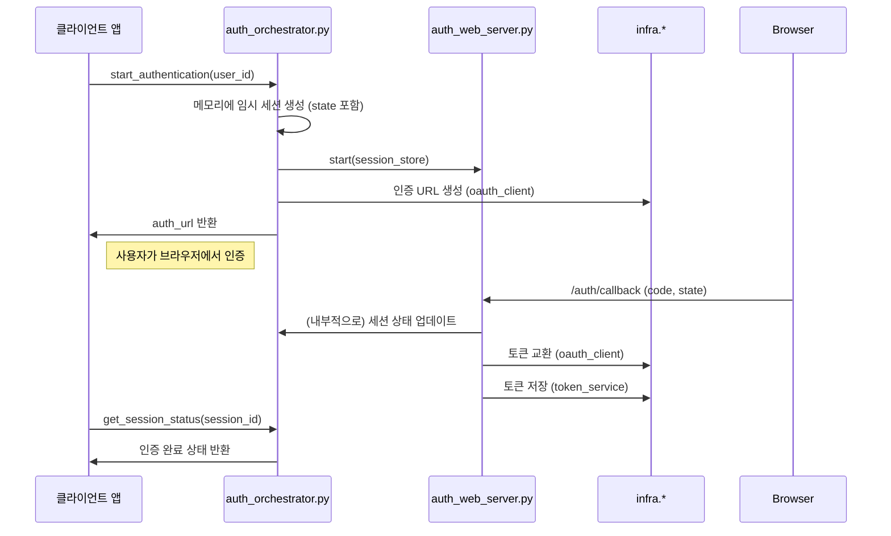
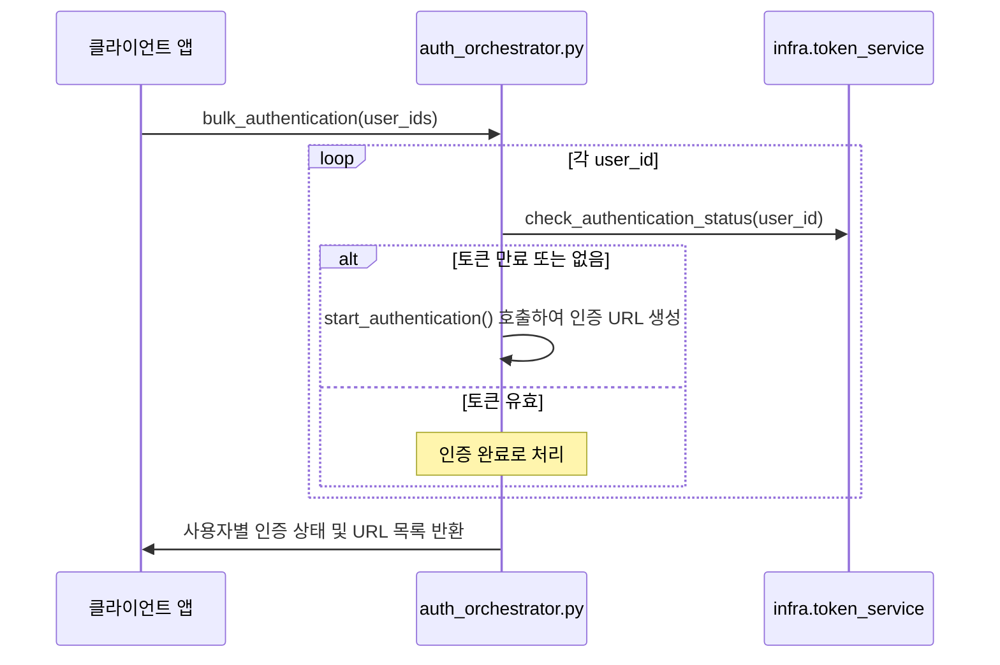

# Auth 모듈 구현 명세서 (As-Is)

## 1. 개요

Auth 모듈은 **infra 서비스 최대 활용**을 통해 OAuth 2.0 인증 플로우 조정에만 집중하는 경량화된 모듈입니다. 기존 infra 레이어의 `token_service`, `database`, `oauth_client`를 직접 활용하여 중복을 제거하고 OAuth 플로우 관리에만 특화됩니다.

### 1.1 핵심 책임
- **OAuth 플로우 조정**: 인증 URL 생성, 콜백 처리, 토큰 교환까지의 전체 플로우를 관리합니다.
- **infra 서비스 연동**: `token_service`, `database`, `oauth_client` 등 기존 서비스를 직접 활용하여 토큰 저장/조회/갱신을 수행합니다.
- **일괄 인증 처리**: 여러 계정의 인증 상태를 확인하고 필요한 경우 순차적으로 인증을 조정합니다.
- **임시 세션 관리**: 인증 과정에서 사용되는 임시 세션을 메모리에 저장하고 관리합니다. (DB 저장 없음)

### 1.2 제거된 책임 (infra 활용)
- ❌ **자체 Repository**: `infra.core.database`를 직접 사용하여 데이터베이스와 상호작용합니다.
- ❌ **자체 토큰 관리**: `infra.core.token_service`를 통해 토큰 저장, 갱신, 상태 확인을 수행합니다.

## 2. 아키텍처 설계

### 2.1 모듈 구조
```
modules/auth/
├── __init__.py                 # 모듈 초기화 및 export
├── auth_orchestrator.py        # OAuth 플로우 조정 (메인 API)
├── auth_web_server.py          # OAuth 콜백 처리 웹서버 관리
├── auth_schema.py              # OAuth 관련 Pydantic 모델
├── _auth_helpers.py            # OAuth 전용 유틸리티
└── references/
    └── graphapi_delegated_auth.md  # Microsoft Graph API 인증 가이드
```

### 2.2 의존성 관계
```
auth_orchestrator.py (OAuth 플로우 조정)
    ↓
auth_web_server.py          # OAuth 콜백 처리
_auth_helpers.py           # OAuth 전용 헬퍼
    ↓
infra.core.database        # accounts 테이블 직접 쿼리
infra.core.token_service   # 토큰 저장/갱신/상태확인
infra.core.oauth_client    # 토큰 교환
infra.core.config/logger   # 설정 및 로깅
```

## 3. 데이터 모델

### 3.1 `accounts` 테이블 활용
Auth 모듈은 `account` 모듈에서 생성하고 관리하는 `accounts` 테이블을 직접 읽고, 토큰 관련 필드를 업데이트합니다.

### 3.2 메모리 기반 임시 세션 (`AuthSession` 모델)
인증 플로우 동안 메모리에서만 관리되는 임시 세션 정보입니다. `auth_schema.py`의 `AuthSession` 모델을 따릅니다.
```python
# auth_schema.py/AuthSession
class AuthSession(BaseModel):
    session_id: str
    user_id: str
    state: str  # CSRF 방지용
    auth_url: str
    status: AuthState
    created_at: datetime
    expires_at: datetime
    error_message: Optional[str]
    # ...
```

### 3.3 Pydantic 모델 (`auth_schema.py`)
- **`AuthState`**: 인증 상태 Enum (`PENDING`, `CALLBACK_RECEIVED`, `COMPLETED`, `FAILED`, `EXPIRED`)
- **`AuthSession`**: 메모리 기반 인증 세션 모델
- **`AuthCallback`**: OAuth 콜백 데이터 모델
- **`TokenData`**: 토큰 데이터 모델
- **`AuthStartRequest` / `AuthStartResponse`**: 인증 시작 요청/응답
- **`AuthStatusResponse`**: 인증 상태 응답
- **`AuthBulkRequest` / `AuthBulkResponse` / `AuthBulkStatus`**: 일괄 인증 관련 모델
- **`AuthCleanupRequest` / `AuthCleanupResponse`**: 세션 정리 관련 모델

## 4. 핵심 로직 설명

### 4.1 `AuthOrchestrator` (메인 API)
- **역할**: Auth 모듈의 모든 인증 플로우를 조정하는 중앙 컨트롤러. `get_auth_orchestrator()`를 통해 싱글턴으로 제공됩니다.
- **주요 기능**:
    - `auth_orchestrator_start_authentication()`: 단일 사용자의 인증 프로세스를 시작하고, 인증 URL을 생성하여 반환합니다.
    - `auth_orchestrator_get_session_status()`: 특정 세션의 현재 상태를 조회합니다.
    - `auth_orchestrator_bulk_authentication()`: 여러 사용자의 인증 상태를 확인하고, 필요한 경우 일괄적으로 인증을 시작합니다.
    - `auth_orchestrator_get_all_accounts_status()`: DB에 저장된 모든 계정의 인증 상태와 토큰 만료 여부를 조회합니다.
    - `auth_orchestrator_cleanup_sessions()`: 만료되거나 완료된 임시 세션을 메모리에서 정리합니다.
    - `auth_orchestrator_shutdown()`: 오케스트레이터와 관련된 리소스(웹서버 등)를 정리합니다.

### 4.2 `AuthWebServerManager` & `AuthWebServer`
- **역할**: OAuth 리다이렉션을 처리하는 로컬 웹서버의 생명주기를 관리합니다. `AuthOrchestrator`에 의해 내부적으로 제어됩니다.
- **주요 기능**:
    - `auth_web_server_manager_start()`: 지정된 포트에서 웹서버를 시작하고 세션 저장소를 공유받습니다.
    - `auth_web_server_manager_stop()`: 인증 완료 또는 타임아웃 시 서버를 종료합니다.
    - `_process_callback()`: 콜백 요청을 받아 `state` 값을 검증하고, 인증 코드를 토큰으로 교환한 후 `token_service`를 통해 저장합니다.

### 4.3 `_auth_helpers.py`
- **역할**: `Auth` 모듈 내에서만 사용되는 순수 함수들을 제공합니다.
- **주요 기능**:
    - 세션 ID 및 `state` 토큰 생성 (`auth_generate_session_id`, `auth_generate_state_token`)
    - 콜백 URL 파싱 및 검증 (`auth_parse_callback_params`, `auth_validate_callback_url`)
    - 세션 만료 시간 계산 및 HTML 응답 페이지 생성
    - 민감 데이터 마스킹 및 세션 활동 로깅

## 5. 인증 플로우 시퀀스

### 5.1 단일 사용자 인증 플로우


### 5.2 일괄 인증 플로우


## 6. 보안 고려사항

- **CSRF 방지**: 인증 요청 시 생성된 `state` 파라미터를 메모리 세션에 저장하고, 콜백 시 수신된 `state` 값과 비교하여 요청의 유효성을 검증합니다.
- **세션 관리**: 모든 임시 세션은 타임아웃(기본 10분)을 가지며, `auth_orchestrator_cleanup_sessions`를 통해 주기적으로 정리할 수 있습니다. 인증이 완료되거나 실패한 세션은 즉시 정리되지는 않으나, 타임아웃에 의해 제거됩니다.
- **민감 정보 저장**: `oauth_client_secret`과 같은 민감 정보는 `account` 모듈의 `AccountCryptoHelpers`를 통해 암호화되어 DB에 저장되며, `auth_orchestrator`에서 필요시 복호화하여 사용합니다.

**참고**: 현재 구현에는 PKCE(Proof Key for Code Exchange)가 적용되어 있지 않습니다. 향후 보안 강화를 위해 도입을 고려할 수 있습니다.

## 7. 에러 처리
- **OAuth 콜백 오류**: `auth_web_server`가 콜백 URL의 `error` 파라미터를 감지하면, 세션 상태를 `FAILED`로 변경하고 오류 메시지를 기록합니다.
- **토큰 교환 실패**: 토큰 교환 과정에서 예외 발생 시, 세션 상태를 `FAILED`로 변경하고 오류를 기록합니다.
- **세션 만료**: `get_session_status` 호출 시 세션이 만료되었으면 `EXPIRED` 상태를 반환하고 세션을 정리합니다.

## 8. 모듈 간 상호작용

- **`account` 모듈과의 관계**: `accounts` 테이블을 공유합니다. `account` 모듈은 계정 정보(이름, 이메일, OAuth 설정 등)를 관리하고, `auth` 모듈은 해당 정보를 읽어와 인증을 수행하고 토큰 관련 필드(`access_token`, `refresh_token`, `token_expiry`)를 업데이트합니다.
- **`infra` 레이어 활용**: `token_service`, `database`, `oauth_client`, `config`, `logger` 등 공통 인프라 서비스를 직접 사용하여 기능 중복을 최소화합니다.
