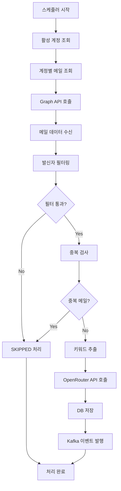

# Mail Processor 모듈

Microsoft Graph API를 통해 새로운 메일을 주기적으로 조회하고, 키워드를 추출하여 로컬 DB에 저장하며, Kafka 이벤트를 발행하는 모듈입니다.

## 주요 기능

1. **자동 메일 처리** - 스케줄러를 통한 주기적 새 메일 조회
2. **키워드 추출** - OpenRouter API를 활용한 지능형 키워드 추출
3. **발신자 필터링** - 스팸/광고 메일 자동 필터링
4. **히스토리 관리** - SQLite DB를 통한 메일 처리 이력 저장
5. **이벤트 발행** - Kafka를 통한 실시간 이벤트 스트리밍

## 아키텍처 특징

- **완전 독립성**: 다른 모듈의 함수를 직접 호출하지 않음
- **자체 구현**: Graph API 호출, 키워드 추출 등 모든 기능을 자체 구현
- **350줄 제한**: 파일당 350줄을 초과하지 않도록 헬퍼 클래스 분리
- **에러 처리**: 계정별 독립적 에러 처리로 전체 프로세스 중단 방지

## 사용 방법

### 1. 모듈 임포트

```python
from modules.mail_processor import (
    MailProcessorOrchestrator,
    MailProcessingResult,
    ProcessingStatus,
    GraphMailItem
)
```

### 2. 오케스트레이터 초기화 및 실행

```python
# 메일 처리 오케스트레이터 생성
orchestrator = MailProcessorOrchestrator()

# 새 메일 처리 실행
result = await orchestrator.process_new_mails()

print(f"처리 완료: {result.processed_count}개 처리, {result.skipped_count}개 건너뜀")
```

## API 메서드

### process_new_mails() - 새 메일 처리

모든 활성 계정의 새 메일을 처리합니다.

**출력 형식:**
```python
MailProcessingResult(
    account_id="ALL",
    total_fetched=150,        # 조회된 총 메일 수
    processed_count=120,      # 성공적으로 처리된 메일 수
    skipped_count=25,         # 필터링으로 건너뛴 메일 수
    failed_count=5,           # 처리 실패한 메일 수
    last_sync_time=datetime.now(),
    execution_time_ms=2500,   # 실행 시간 (밀리초)
    errors=["에러 메시지 목록"]
)
```

### get_processing_stats() - 처리 통계 조회

메일 처리 통계와 서비스 상태를 조회합니다.

**출력 형식:**
```python
{
    "mail_stats": {
        "total_mails": 1500,
        "recent_hour": 25,
        "recent_day": 180
    },
    "filter_stats": {
        "blocked_domains_count": 10,
        "blocked_keywords_count": 15,
        "blocked_patterns_count": 8
    },
    "services_status": {
        "keyword_extractor": "active",
        "mail_filter": "active",
        "graph_api": "active",
        "database": "active",
        "kafka": "active"
    }
}
```

## 처리 흐름



## 키워드 추출

### OpenRouter 활용
- **모델**: ChatGPT o3-mini (기본값)
- **최대 키워드**: 5개 (설정 가능)
- **언어**: 한국어 우선
- **특징**: 문서번호, 기관명, 기술내용, 일정 등 추출

### Fallback 방식
- OpenRouter API 실패 시 자동 전환
- 정규식 기반 한국어/영문 단어 추출
- 빈도수 기반 상위 키워드 선택

## 발신자 필터링

### 차단 도메인
```
noreply.com, no-reply.com, donotreply.com,
notifications.com, alerts.com, system.com,
newsletter.com, marketing.com, promo.com
```

### 차단 키워드
```
newsletter, promotion, marketing, advertisement,
광고, 홍보, 마케팅, 뉴스레터, 구독취소
```

### 차단 패턴
```
noreply@, no-reply@, system@, newsletter@,
marketing@, promo@, ads@
```

## 데이터 저장

### SQLite 테이블: mail_history
```sql
CREATE TABLE mail_history (
    id INTEGER PRIMARY KEY AUTOINCREMENT,
    account_id INTEGER NOT NULL,
    message_id TEXT NOT NULL UNIQUE,
    received_time TIMESTAMP NOT NULL,
    subject TEXT,
    sender TEXT,
    keywords TEXT, -- JSON 형태
    processed_at TIMESTAMP DEFAULT CURRENT_TIMESTAMP
);
```

### 저장 데이터 예시
```json
{
    "account_id": "kimghw",
    "message_id": "AAMkADU2MGM5YzRjLTE4NmItNDE4NC...",
    "received_time": "2025-06-16T10:30:00Z",
    "subject": "[EA004] 프로젝트 진행 상황 보고",
    "sender": "manager@company.com",
    "keywords": ["EA004", "프로젝트", "진행상황", "보고서", "회의"]
}
```

## Kafka 이벤트

### 토픽: email-raw-data

**이벤트 구조:**
```json
{
    "event_type": "email.raw_data_received",
    "event_id": "uuid-string",
    "account_id": "kimghw",
    "occurred_at": "2025-06-16T10:30:00Z",
    "api_endpoint": "/v1.0/me/messages",
    "response_status": 200,
    "request_params": {
        "$select": "id,subject,from,body,bodyPreview,receivedDateTime",
        "$top": 50
    },
    "response_data": {
        "value": [메일 데이터 배열]
    },
    "response_timestamp": "2025-06-16T10:30:00Z"
}
```

## 환경 설정

### .env 파일 설정
```env
# OpenRouter 키워드 추출 설정
OPENROUTER_API_KEY=your_openrouter_api_key_here
OPENROUTER_MODEL=openai/o3-mini

# 메일 처리 설정
MAX_KEYWORDS_PER_MAIL=5
MAX_MAILS_PER_ACCOUNT=200
MAIL_PROCESSING_BATCH_SIZE=50

# 필터링 설정
ENABLE_SENDER_FILTERING=true
```

## 에러 처리

### 계정별 독립 처리
- 한 계정의 실패가 다른 계정에 영향 없음
- 계정별 에러 로그를 DB에 기록
- 연속 실패 시 계정 상태 변경

### API 호출 에러 처리
- **401 Unauthorized**: 토큰 갱신 1회 시도
- **429 Rate Limit**: 지수 백오프로 재시도
- **500 Server Error**: 3회 재시도 후 포기
- **Network Error**: 연결 타임아웃 30초

### 키워드 추출 에러 처리
- OpenRouter API 실패 시 Fallback 사용
- Rate limit 시 빈 키워드 리스트 반환
- 네트워크 오류 시 정규식 기반 추출

## 성능 최적화

### 배치 처리
- 계정당 최대 200개 메일 처리
- 50개씩 페이징하여 메모리 사용량 제한
- 비동기 병렬 처리로 성능 향상

### 중복 방지
- 메일 ID + 발신자 주소 조합으로 중복 검사
- DB 인덱스 활용으로 빠른 중복 검사

### 리소스 관리
- aiohttp 세션 재사용
- DB 연결 풀링
- Kafka Producer 재사용

## 모니터링

### 구조화된 로깅
```python
# 처리 시작
logger.info("메일 처리 시작", extra={
    "account_count": len(active_accounts)
})

# 키워드 추출 결과
logger.debug("키워드 추출 완료", extra={
    "mail_id": mail_id,
    "keywords": keywords,
    "method": "openrouter"
})
```

### 메트릭 수집
- 처리된 메일 수
- 키워드 추출 성공률
- API 호출 응답 시간
- 에러 발생률

## 사용 예시

### 기본 메일 처리
```python
async def process_mails():
    orchestrator = MailProcessorOrchestrator()
    
    # 새 메일 처리
    result = await orchestrator.process_new_mails()
    
    print(f"처리 결과:")
    print(f"- 총 조회: {result.total_fetched}개")
    print(f"- 처리 성공: {result.processed_count}개")
    print(f"- 필터링: {result.skipped_count}개")
    print(f"- 처리 실패: {result.failed_count}개")
    print(f"- 실행 시간: {result.execution_time_ms}ms")
    
    if result.errors:
        print(f"에러 목록: {result.errors}")
```

### 통계 조회
```python
async def get_stats():
    orchestrator = MailProcessorOrchestrator()
    
    stats = await orchestrator.get_processing_stats()
    
    print(f"메일 통계: {stats['mail_stats']}")
    print(f"필터 통계: {stats['filter_stats']}")
    print(f"서비스 상태: {stats['services_status']}")
```

### GraphMailItem 객체 처리
```python
from datetime import datetime

async def process_graph_mail_item():
    orchestrator = MailProcessorOrchestrator()
    
    # GraphMailItem 객체 생성
    mail_item = GraphMailItem(
        id="mail_001",
        subject="프로젝트 진행 상황 보고",
        from_address={"emailAddress": {"name": "매니저", "address": "manager@company.com"}},
        received_date_time=datetime.now(),
        body_preview="프로젝트 진행 상황을 보고드립니다.",
        body={"contentType": "text", "content": "상세한 프로젝트 내용..."},
        is_read=False,
        has_attachments=False,
        importance="normal"
    )
    
    # 메일 처리
    result = await orchestrator.process_graph_mail_item("account_id", mail_item)
    
    print(f"처리 결과: {result.processing_status}")
    print(f"추출된 키워드: {result.keywords}")
```

## 주의사항

1. **OpenRouter API 키 필수**: 키워드 추출을 위해 API 키 설정 필요
2. **토큰 관리**: Graph API 토큰은 자동으로 갱신됨
3. **메모리 사용량**: 대량 메일 처리 시 메모리 사용량 모니터링 필요
4. **Kafka 연결**: 이벤트 발행 실패는 전체 프로세스를 중단시키지 않음

## 호출 스택

```
MailProcessorOrchestrator.process_new_mails()
├── MailProcessorDatabaseHelper.get_active_accounts()
├── _process_account_mails()
│   ├── MailProcessorGraphApiHelper.fetch_mails_from_graph()
│   ├── _process_single_mail()
│   │   ├── MailProcessorFilterService.should_process()
│   │   ├── MailProcessorDatabaseHelper.is_duplicate_mail()
│   │   └── MailProcessorKeywordExtractorService.extract_keywords()
│   ├── MailProcessorDatabaseHelper.save_mail_history()
│   └── MailProcessorKafkaHelper.publish_kafka_event()
└── MailProcessorDatabaseHelper.update_account_sync_time()
```

이 모듈은 완전히 독립적으로 동작하며, 스케줄러를 통해 주기적으로 실행되어 새로운 메일을 자동으로 처리합니다.
