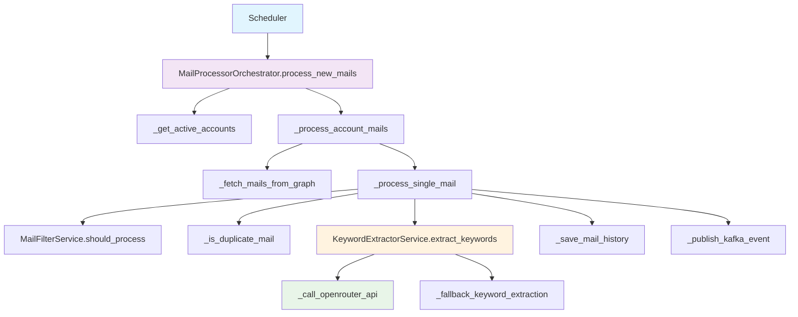

# Mail Processor 모듈 구현 계획서

## 1. 개요
Mail Processor 모듈은 스케줄러를 통해 주기적으로 새로운 메일을 조회하고, 로컬 DB에 저장하며, Kafka 이벤트를 발행하는 핵심 모듈입니다. 완전히 독립적으로 동작하며, 다른 모듈의 함수를 직접 호출하지 않고 자체 구현을 통해 모든 기능을 수행합니다.

## 2. 아키텍처 설계

### 2.1 모듈 구조
```
modules/mail_processor/
├── __init__.py
├── mail_processor_orchestrator.py    # 메인 오케스트레이터
├── mail_processor_schema.py          # Pydantic 스키마
├── _mail_processor_helpers.py        # 헬퍼 함수 (350줄 제한 대응)
├── mail_filter_service.py            # 발신자 필터링
├── keyword_extractor_service.py      # 키워드 추출 (OpenRouter 활용)
└── README.md
```

### 2.2 핵심 원칙
- **완전 독립성**: 다른 모듈의 함수를 호출하지 않음
- **자체 구현**: Graph API 호출, 키워드 추출 등 모든 기능을 자체 구현
- **350줄 제한**: 파일당 350줄을 초과하지 않도록 헬퍼 클래스 분리
- **에러 처리**: 계정별 독립적 에러 처리로 전체 프로세스 중단 방지

## 3. 상세 구현 계획

### 3.1 Mail Processor Orchestrator (`mail_processor_orchestrator.py`)

#### 3.1.1 클래스 구조
```python
class MailProcessorOrchestrator:
    """메일 처리 오케스트레이터 - 완전 독립적 구현"""
    
    def __init__(self):
        self.db_manager = get_database_manager()
        self.kafka_manager = get_kafka_manager()
        self.token_service = get_token_service()
        self.filter_service = MailFilterService()
        self.keyword_service = KeywordExtractorService()
        self.logger = get_logger(__name__)
        self.config = get_config()
    
    async def process_new_mails(self) -> MailProcessingResult:
        """새 메일 처리 메인 함수"""
        
    async def _get_active_accounts(self) -> List[Dict]:
        """활성 계정 조회"""
        
    async def _fetch_mails_from_graph(self, account: Dict) -> List[Dict]:
        """Graph API 직접 호출"""
        
    async def _process_single_mail(self, account_id: str, mail: Dict) -> ProcessedMailData:
        """개별 메일 처리"""
        
    async def _save_mail_history(self, conn, processed_mail: ProcessedMailData):
        """메일 히스토리 저장"""
        
    async def _publish_kafka_event(self, account_id: str, mail: Dict):
        """Kafka 이벤트 발행"""
```

#### 3.1.2 주요 메서드 구현

##### 🔄 **1단계: 새 메일 처리 메인 함수**
```python
async def process_new_mails(self) -> MailProcessingResult:
    """새 메일 처리 및 이벤트 발행"""
    start_time = time.time()
    total_processed = 0
    total_skipped = 0
    total_failed = 0
    errors = []
    
    try:
        # 1. 활성 계정 조회
        active_accounts = await self._get_active_accounts()
        self.logger.info(f"활성 계정 {len(active_accounts)}개 처리 시작")
        
        for account in active_accounts:
            try:
                # 2. 계정별 메일 처리
                result = await self._process_account_mails(account)
                total_processed += result.processed_count
                total_skipped += result.skipped_count
                total_failed += result.failed_count
                
                if result.errors:
                    errors.extend(result.errors)
                
            except Exception as e:
                error_msg = f"계정 {account['user_id']} 처리 실패: {str(e)}"
                self.logger.error(error_msg, exc_info=True)
                errors.append(error_msg)
                total_failed += 1
                
                # 계정별 에러 기록
                await self._handle_account_error(account['id'], str(e))
        
        execution_time = int((time.time() - start_time) * 1000)
        
        return MailProcessingResult(
            account_id="ALL",
            total_fetched=total_processed + total_skipped,
            processed_count=total_processed,
            skipped_count=total_skipped,
            failed_count=total_failed,
            last_sync_time=datetime.now(),
            execution_time_ms=execution_time,
            errors=errors
        )
        
    except Exception as e:
        self.logger.error(f"메일 처리 전체 실패: {str(e)}", exc_info=True)
        raise
```

##### 📧 **2단계: Graph API 직접 호출**
```python
async def _fetch_mails_from_graph(self, account: Dict) -> List[Dict]:
    """Graph API 직접 호출로 메일 조회"""
    import aiohttp
    import json
    
    try:
        # 유효한 토큰 획득
        access_token = await self.token_service.get_valid_access_token(account['user_id'])
        if not access_token:
            raise Exception(f"유효한 토큰이 없습니다: {account['user_id']}")
        
        # 마지막 동기화 이후 메일만 조회
        since_filter = ""
        if account.get('last_sync_time'):
            since_date = account['last_sync_time'].isoformat() + 'Z'
            since_filter = f"&$filter=receivedDateTime ge {since_date}"
        
        # Graph API URL 구성
        url = f"https://graph.microsoft.com/v1.0/me/messages"
        params = {
            "$select": "id,subject,from,body,bodyPreview,receivedDateTime,hasAttachments,importance,isRead",
            "$top": 50,
            "$orderby": "receivedDateTime desc"
        }
        
        if since_filter:
            params["$filter"] = f"receivedDateTime ge {since_date}"
        
        headers = {
            'Authorization': f'Bearer {access_token}',
            'Content-Type': 'application/json',
            'Prefer': 'outlook.body-content-type="text"'
        }
        
        all_mails = []
        
        async with aiohttp.ClientSession() as session:
            while url and len(all_mails) < 200:  # 최대 200개 제한
                async with session.get(url, headers=headers, params=params) as response:
                    if response.status == 200:
                        data = await response.json()
                        mails = data.get('value', [])
                        all_mails.extend(mails)
                        
                        # 다음 페이지 URL
                        url = data.get('@odata.nextLink')
                        params = {}  # nextLink에 이미 파라미터 포함
                        
                        self.logger.debug(f"계정 {account['user_id']}: {len(mails)}개 메일 조회")
                        
                    elif response.status == 401:
                        # 토큰 만료 - 재시도 1회
                        self.logger.warning(f"토큰 만료, 갱신 시도: {account['user_id']}")
                        access_token = await self.token_service.force_token_refresh(account['user_id'])
                        headers['Authorization'] = f'Bearer {access_token}'
                        continue
                        
                    else:
                        error_text = await response.text()
                        raise Exception(f"Graph API 호출 실패: {response.status} - {error_text}")
        
        self.logger.info(f"계정 {account['user_id']}: 총 {len(all_mails)}개 메일 조회 완료")
        return all_mails
        
    except Exception as e:
        self.logger.error(f"Graph API 호출 실패 - 계정 {account['user_id']}: {str(e)}")
        raise
```

##### 🔍 **3단계: 발신자 필터링**
```python
# mail_filter_service.py
class MailFilterService:
    """발신자 필터링 서비스"""
    
    def __init__(self):
        self.blocked_domains = {
            'noreply.com', 'no-reply.com', 'donotreply.com',
            'notifications.com', 'alerts.com', 'system.com'
        }
        self.blocked_keywords = {
            'newsletter', 'promotion', 'marketing', 'advertisement',
            '광고', '홍보', '마케팅', '뉴스레터'
        }
    
    def should_process(self, sender_address: str, subject: str = "") -> bool:
        """메일 처리 여부 결정"""
        if not sender_address:
            return False
        
        sender_lower = sender_address.lower()
        subject_lower = subject.lower()
        
        # 도메인 차단 확인
        domain = self._extract_domain(sender_lower)
        if domain in self.blocked_domains:
            return False
        
        # 키워드 차단 확인
        for keyword in self.blocked_keywords:
            if keyword in sender_lower or keyword in subject_lower:
                return False
        
        return True
    
    def _extract_domain(self, email: str) -> str:
        """이메일에서 도메인 추출"""
        if '@' in email:
            return email.split('@')[1]
        return ''
```

##### 🧠 **4단계: 키워드 추출 (OpenRouter 활용)**
```python
# keyword_extractor_service.py
class KeywordExtractorService:
    """OpenRouter를 활용한 키워드 추출 서비스"""
    
    def __init__(self):
        self.config = get_config()
        self.logger = get_logger(__name__)
        
        # OpenRouter 설정
        self.api_key = self.config.openrouter_api_key
        self.model = self.config.openrouter_model or "openai/o3-mini"  # ChatGPT o3 사용
        self.base_url = "https://openrouter.ai/api/v1"
        
    async def extract_keywords(self, text: str, max_keywords: int = 5) -> List[str]:
        """메일 본문에서 키워드 추출"""
        try:
            # 텍스트 정제
            clean_text = self._clean_text(text)
            
            # 너무 짧은 텍스트는 빈 리스트 반환
            if len(clean_text.strip()) < 10:
                return []
            
            # OpenRouter API 호출
            keywords = await self._call_openrouter_api(clean_text, max_keywords)
            
            if keywords:
                self.logger.debug(f"키워드 추출 성공: {keywords}")
                return keywords
            else:
                # Fallback 키워드 추출
                return self._fallback_keyword_extraction(clean_text, max_keywords)
                
        except Exception as e:
            self.logger.warning(f"키워드 추출 실패, fallback 사용: {str(e)}")
            return self._fallback_keyword_extraction(text, max_keywords)
    
    async def _call_openrouter_api(self, text: str, max_keywords: int) -> List[str]:
        """OpenRouter API 호출"""
        import aiohttp
        import json
        
        # 텍스트 길이 제한 (2000자)
        limited_text = text[:2000] if len(text) > 2000 else text
        
        prompt = f"""다음 이메일 본문에서 가장 중요한 키워드 {max_keywords}개를 한국어로 추출해주세요.
키워드는 명사 위주로 추출하고, 콤마로 구분하여 나열해주세요. 제목에나 기본적으로 메일 번호가 숫자와 문자로 식별됩니다. 그 식별번호는 키워드에 포함되어야 합니다. 메일 내용을 보면 어떤 기관, 어떤 종류의 문서 작업, 다음 회의일정, 주요 기술 내용, 향후 작업 계획 등이 있으며 이것들도 키워드에 속합니다. 

이메일 본문: {limited_text}

형식: 키워드1(문서번호), 키워드2, 키워드3, 키워드4, 키워드5"""

        headers = {
            "Authorization": f"Bearer {self.api_key}",
            "Content-Type": "application/json",
            "HTTP-Referer": "https://iacsgraph.local",
            "X-Title": "IACSGRAPH Mail Processor"
        }
        
        payload = {
            "model": self.model,
            "messages": [
                {"role": "user", "content": prompt}
            ],
            "max_tokens": 100,
            "temperature": 0.3,
            "top_p": 1.0
        }
        
        async with aiohttp.ClientSession() as session:
            async with session.post(
                f"{self.base_url}/chat/completions",
                headers=headers,
                json=payload,
                timeout=aiohttp.ClientTimeout(total=30)
            ) as response:
                if response.status == 200:
                    data = await response.json()
                    content = data['choices'][0]['message']['content'].strip()
                    
                    # 키워드 파싱
                    keywords = [kw.strip() for kw in content.split(',')]
                    keywords = [kw for kw in keywords if kw and len(kw) >= 2]
                    
                    return keywords[:max_keywords]
                    
                elif response.status == 429:
                    # Rate limit - 잠시 대기 후 fallback
                    self.logger.warning("OpenRouter API rate limit, fallback 사용")
                    return []
                    
                else:
                    error_text = await response.text()
                    self.logger.error(f"OpenRouter API 오류: {response.status} - {error_text}")
                    return []
    
    def _fallback_keyword_extraction(self, text: str, max_keywords: int) -> List[str]:
        """OpenAI 실패 시 간단한 fallback 키워드 추출"""
        import re
        from collections import Counter
        
        # 간단한 한국어 단어 추출
        clean_text = self._clean_text(text)
        korean_words = re.findall(r'[가-힣]{2,}', clean_text)
        
        # 빈도수 기반 상위 키워드 선택
        word_counts = Counter(korean_words)
        top_keywords = [word for word, count in word_counts.most_common(max_keywords)]
        
        return top_keywords
    
    def _clean_text(self, text: str) -> str:
        """텍스트 정제"""
        import re
        
        if not text:
            return ""
        
        # HTML 태그 제거
        clean = re.sub(r'<[^>]+>', '', text)
        
        # 과도한 공백 정리
        clean = re.sub(r'\s+', ' ', clean)
        
        # 특수문자 정리 (한글, 영문, 숫자, 기본 구두점만 유지)
        clean = re.sub(r'[^\w\s가-힣.,!?]', ' ', clean)
        
        return clean.strip()
```

##### 💾 **5단계: 데이터 저장 및 이벤트 발행**
```python
async def _process_single_mail(self, account_id: str, mail: Dict) -> ProcessedMailData:
    """개별 메일 처리"""
    try:
        mail_id = mail['id']
        sender_info = mail.get('from', {}).get('emailAddress', {})
        sender_address = sender_info.get('address', '')
        subject = mail.get('subject', '')
        
        # 발신자 필터링
        if not self.filter_service.should_process(sender_address, subject):
            return ProcessedMailData(
                mail_id=mail_id,
                account_id=account_id,
                sender_address=sender_address,
                subject=subject,
                body_preview=mail.get('bodyPreview', ''),
                sent_time=datetime.fromisoformat(mail['receivedDateTime'].replace('Z', '+00:00')),
                processing_status=ProcessingStatus.SKIPPED,
                error_message="발신자 필터링으로 제외"
            )
        
        # 중복 검사
        if await self._is_duplicate_mail(mail_id, sender_address):
            return ProcessedMailData(
                mail_id=mail_id,
                account_id=account_id,
                sender_address=sender_address,
                subject=subject,
                body_preview=mail.get('bodyPreview', ''),
                sent_time=datetime.fromisoformat(mail['receivedDateTime'].replace('Z', '+00:00')),
                processing_status=ProcessingStatus.SKIPPED,
                error_message="중복 메일"
            )
        
        # 키워드 추출
        body_content = mail.get('body', {}).get('content', '') or mail.get('bodyPreview', '')
        keywords = await self.keyword_service.extract_keywords(body_content)
        
        # 처리된 메일 데이터 생성
        processed_mail = ProcessedMailData(
            mail_id=mail_id,
            account_id=account_id,
            sender_address=sender_address,
            subject=subject,
            body_preview=mail.get('bodyPreview', ''),
            sent_time=datetime.fromisoformat(mail['receivedDateTime'].replace('Z', '+00:00')),
            keywords=keywords,
            processing_status=ProcessingStatus.SUCCESS
        )
        
        return processed_mail
        
    except Exception as e:
        self.logger.error(f"메일 처리 실패 - {mail.get('id', 'unknown')}: {str(e)}")
        return ProcessedMailData(
            mail_id=mail.get('id', 'unknown'),
            account_id=account_id,
            sender_address=mail.get('from', {}).get('emailAddress', {}).get('address', ''),
            subject=mail.get('subject', ''),
            body_preview=mail.get('bodyPreview', ''),
            sent_time=datetime.now(),
            processing_status=ProcessingStatus.FAILED,
            error_message=str(e)
        )

async def _save_mail_history(self, conn, processed_mail: ProcessedMailData):
    """메일 히스토리 저장"""
    query = """
        INSERT INTO mail_history (
            account_id, message_id, received_time, subject, 
            sender, keywords, processed_at
        ) VALUES (?, ?, ?, ?, ?, ?, ?)
    """
    
    keywords_json = json.dumps(processed_mail.keywords, ensure_ascii=False)
    
    await conn.execute(query, (
        processed_mail.account_id,
        processed_mail.mail_id,
        processed_mail.sent_time,
        processed_mail.subject,
        processed_mail.sender_address,
        keywords_json,
        processed_mail.processed_at
    ))

async def _publish_kafka_event(self, account_id: str, mail: Dict):
    """Kafka 이벤트 발행"""
    try:
        producer = await self.kafka_manager.get_producer()
        
        event = MailReceivedEvent(
            event_id=str(uuid.uuid4()),
            account_id=account_id,
            occurred_at=datetime.now(),
            request_params={
                "$select": "id,subject,from,body,bodyPreview,receivedDateTime",
                "$top": 50
            },
            response_data={"value": [mail]},
            response_timestamp=datetime.now()
        )
        
        await producer.send(
            'email-raw-data',
            value=event.model_dump(),
            key=account_id.encode('utf-8')
        )
        
        self.logger.debug(f"Kafka 이벤트 발행 완료: {mail['id']}")
        
    except Exception as e:
        self.logger.error(f"Kafka 이벤트 발행 실패: {str(e)}")
        # 이벤트 발행 실패는 전체 프로세스를 중단시키지 않음
```

### 3.2 환경 설정

#### 3.2.1 `.env` 파일 추가 설정
```env
# OpenRouter 키워드 추출 설정
OPENROUTER_API_KEY=your_openrouter_api_key_here
OPENROUTER_MODEL=openai/o3-mini
OPENROUTER_BASE_URL=https://openrouter.ai/api/v1

# 메일 처리 설정
MAX_KEYWORDS_PER_MAIL=5
MIN_KEYWORD_LENGTH=2
MAX_MAILS_PER_ACCOUNT=200
MAIL_PROCESSING_BATCH_SIZE=50

# 필터링 설정
ENABLE_SENDER_FILTERING=true
BLOCKED_DOMAINS=noreply.com,no-reply.com,donotreply.com
BLOCKED_KEYWORDS=newsletter,promotion,marketing,광고,홍보
```

#### 3.2.2 `pyproject.toml` 의존성 추가
```toml
[project]
dependencies = [
    # 기존 의존성...
    "aiohttp>=3.9.0",
    "openrouter-client>=1.0.0",  # OpenRouter Python 클라이언트
]
```

### 3.3 스키마 정의 (`mail_processor_schema.py`)

```python
"""Mail Processor 모듈 스키마 정의"""
from pydantic import BaseModel, Field
from typing import List, Optional, Dict, Any
from datetime import datetime
from enum import Enum


class ProcessingStatus(str, Enum):
    """처리 상태"""
    SUCCESS = "SUCCESS"
    FAILED = "FAILED"
    SKIPPED = "SKIPPED"


class MailReceivedEvent(BaseModel):
    """Kafka로 전송될 메일 수신 이벤트"""
    event_type: str = "email.raw_data_received"
    event_id: str
    account_id: str
    occurred_at: datetime
    api_endpoint: str = "/v1.0/me/messages"
    response_status: int = 200
    request_params: Dict[str, Any]
    response_data: Dict[str, Any]  # 전체 Graph API 응답
    response_timestamp: datetime


class ProcessedMailData(BaseModel):
    """처리된 메일 데이터"""
    mail_id: str
    account_id: str
    sender_address: str
    subject: str
    body_preview: str
    sent_time: datetime
    keywords: List[str] = Field(default_factory=list)
    processing_status: ProcessingStatus
    error_message: Optional[str] = None
    processed_at: datetime = Field(default_factory=datetime.now)


class MailProcessingResult(BaseModel):
    """메일 처리 결과"""
    account_id: str
    total_fetched: int
    processed_count: int
    skipped_count: int
    failed_count: int
    last_sync_time: datetime
    execution_time_ms: int
    errors: List[str] = Field(default_factory=list)


class AccountProcessingStatus(BaseModel):
    """계정별 처리 상태"""
    account_id: str
    email: str
    status: str
    last_sync_at: Optional[datetime] = None
    error_message: Optional[str] = None
```

## 4. 호출 스택 다이어그램



## 5. 에러 처리 전략

### 5.1 계정별 독립 처리
- 한 계정의 실패가 다른 계정 처리에 영향을 주지 않음
- 계정별 에러 로그를 DB에 기록
- 연속 실패 시 계정 상태를 `ERROR`로 변경

### 5.2 API 호출 에러 처리
- **401 Unauthorized**: 토큰 갱신 1회 시도
- **429 Rate Limit**: 지수 백오프로 재시도
- **500 Server Error**: 3회 재시도 후 포기
- **Network Error**: 연결 타임아웃 30초

### 5.3 키워드 추출 에러 처리
- OpenRouter API 실패 시 Fallback 키워드 추출 사용
- Rate limit 시 빈 키워드 리스트 반환
- 네트워크 오류 시 정규식 기반 한국어 단어 추출

## 6. 성능 최적화

### 6.1 배치 처리
- 계정당 최대 200개 메일 처리
- 50개씩 페이징하여 메모리 사용량 제한
- 비동기 병렬 처리로 성능 향상

### 6.2 중복 방지
- 메일 ID + 발신자 주소 조합으로 중복 검사
- DB 인덱스 활용으로 빠른 중복 검사
- 메모리 캐시 활용 고려 (향후)

### 6.3 리소스 관리
- aiohttp 세션 재사용
- DB 연결 풀링
- Kafka Producer 재사용

## 7. 모니터링 및 로깅

### 7.1 구조화된 로깅
```python
# 처리 시작
logger.info("메일 처리 시작", extra={
    "account_count": len(active_accounts),
    "run_id": run_id
})

# 계정별 처리 결과
logger.info("계정 처리 완료", extra={
    "account_id": account_id,
    "processed": processed_count,
    "skipped": skipped_count,
    "failed": failed_count,
    "execution_time_ms": execution_time
})

# 키워드 추출 결과
logger.debug("키워드 추출 완료", extra={
    "mail_id": mail_id,
    "keywords": keywords,
    "method": "openrouter" or "fallback"
})
```

### 7.2 메트릭 수집
- 처리된 메일 수
- 키워드 추출 성공률
- API 호출 응답 시간
- 에러 발생률

## 8. 테스트 시나리오

### 8.1 기본 시나리오
1. **정상 처리**: 새 메일 조회 → 키워드 추출 → DB 저장 → 이벤트 발행
2. **중복 메일**: 이미 처리된 메일은 SKIPPED 처리
3. **필터링**: 차단된 발신자 메일은 SKIPPED 처리
4. **토큰 만료**: 자동 갱신 후 재시도

### 8.2 에러 시나리오
1. **Graph API 오류**: 계정별 에러 기록, 다른 계정 계속 처리
2. **OpenRouter API 오류**: Fallback 키워드 추출 사용
3. **DB 연결 오류**: 전체 프로세스 중단, 에러 로그 기록
4. **Kafka 연결 오류**: 이벤트 발행 실패, 메일 처리는 계속

## 9. 배포 및 운영

### 9.1 스케줄러 설정
```python
# scheduler/main.py
scheduler.add_job(
    mail_processor_orchestrator.process_new_mails,
    'interval',
    minutes=5,  # 5분마다 실행
    id='process_new_mails',
    max_instances=1  # 중복 실행 방지
)
```

### 9.2 환경별 설정
- **개발환경**: 1분마다, 최대 10개 메일
- **스테이징**: 5분마다, 최대 50개 메일  
- **프로덕션**: 5분마다, 최대 200개 메일

## 10. 향후 확장 계획

### 10.1 성능 개선
- Redis 캐시 도입으로 중복 검사 최적화
- 메일 본문 압축 저장
- 키워드
