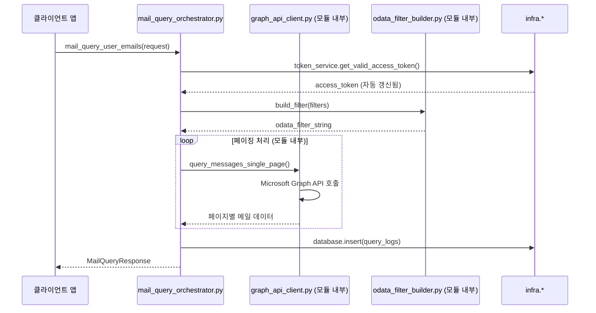

# Mail Query 모듈 구현 명세서

## 1. 개요

Mail Query 모듈은 **Microsoft Graph API**를 통해 메일 데이터를 조회하고 필터링하는 핵심 모듈입니다. **infra 서비스 최대 활용** 원칙에 따라 기존 `token_service`, `oauth_client`, `database` 등을 직접 사용하여 중복을 제거하고 Graph API 호출과 OData 필터링에만 집중합니다.

### 1.1 핵심 책임
- **Graph API 메일 조회**: Microsoft Graph API `/me/messages` 엔드포인트 호출 (독립적)
- **OData 필터링**: 날짜, 발신자, 읽음 상태 등 다양한 필터 조건 처리 (모듈 내부)
- **페이징 처리**: `$top`, `$skip`, `@odata.nextLink`를 통한 대용량 메일 처리 (모듈 내부)
- **조회 로그 기록**: 기본 쿼리 실행 로그 (`infra.database` 직접 사용)

### 1.2 제거된 책임 (infra 활용)
- ❌ **자체 토큰 관리**: `infra.core.token_service`를 통해 유효한 토큰 자동 제공
- ❌ **자체 Repository**: `infra.core.database`를 직접 사용하여 로그 저장
- ❌ **자체 OAuth 클라이언트**: `infra.core.oauth_client` 활용 (필요시)

## 2. 아키텍처 설계

### 2.1 모듈 구조 (완전 독립적)
```
modules/mail_query/
├── __init__.py                    # 모듈 초기화 및 export
├── mail_query_orchestrator.py     # 메일 조회 오케스트레이터 (완전 독립적)
├── mail_query_schema.py           # 메일 조회 관련 Pydantic 모델
├── graph_api_client.py            # Microsoft Graph API 클라이언트 (모듈 내부)
├── odata_filter_builder.py        # OData 필터 문자열 생성 (모듈 내부)
├── _mail_query_helpers.py         # 유틸리티 함수 (350줄 제한 대응)
└── README.md                      # 모듈 사용법 가이드
```

### 2.2 의존성 관계 (단방향)
```
mail_query_orchestrator.py (메인 API, 완전 독립적)
    ↓ (자체 구현)
graph_api_client.py (Graph API 호출)
odata_filter_builder.py (필터 생성)
_mail_query_helpers.py (헬퍼 함수)
    ↓ (infra 서비스 직접 사용)
infra.core.token_service (토큰 관리)
infra.core.database (로그 저장)
infra.core.config (설정)
infra.core.logger (로깅)
```

### 2.3 핵심 설계 원칙
- **350줄 제한**: 모든 파일이 350줄 이하 유지
- **완전 독립성**: 다른 모듈(`account`, `auth`)에 의존하지 않음
- **infra 최대 활용**: 공통 기능은 infra 서비스 직접 사용
- **YAGNI 원칙**: 현재 필요한 기능만 구현

## 3. 데이터 모델 (`mail_query_schema.py`)

### 3.1 요청/응답 모델 (Pydantic v2 기준)
```python
from datetime import datetime
from typing import Optional, List, Dict, Any
from pydantic import BaseModel, Field, validator

class MailQueryRequest(BaseModel):
    """메일 조회 요청"""
    user_id: str = Field(..., description="사용자 ID")
    filters: Optional["MailQueryFilters"] = Field(None, description="필터 조건")
    pagination: Optional["PaginationOptions"] = Field(None, description="페이징 옵션")
    select_fields: Optional[List[str]] = Field(None, description="선택할 필드")

class MailQueryFilters(BaseModel):
    """메일 필터 조건"""
    date_from: Optional[datetime] = Field(None, description="시작 날짜")
    date_to: Optional[datetime] = Field(None, description="종료 날짜")
    sender_address: Optional[str] = Field(None, description="발신자 이메일")
    subject_contains: Optional[str] = Field(None, description="제목 포함 텍스트")
    is_read: Optional[bool] = Field(None, description="읽음 상태")
    has_attachments: Optional[bool] = Field(None, description="첨부파일 여부")
    importance: Optional[str] = Field(None, description="중요도")

    @validator('importance')
    def validate_importance(cls, v):
        if v and v not in ['low', 'normal', 'high']:
            raise ValueError("importance는 'low', 'normal', 'high' 중 하나여야 합니다")
        return v

class PaginationOptions(BaseModel):
    """페이징 옵션"""
    top: int = Field(default=50, ge=1, le=1000, description="한 번에 가져올 메일 수")
    skip: int = Field(default=0, ge=0, description="건너뛸 메일 수")
    max_pages: int = Field(default=10, ge=1, le=50, description="최대 페이지 수")

class GraphMailItem(BaseModel):
    """Graph API 메일 아이템"""
    id: str = Field(..., description="메일 ID")
    subject: Optional[str] = Field(None, description="제목")
    sender: Optional[Dict[str, Any]] = Field(None, description="발신자 정보")
    from_address: Optional[Dict[str, Any]] = Field(None, alias="from", description="From 필드")
    to_recipients: List[Dict[str, Any]] = Field(default_factory=list, description="수신자 목록")
    received_date_time: datetime = Field(..., description="수신 시간")
    body_preview: Optional[str] = Field(None, description="본문 미리보기")
    body: Optional[Dict[str, Any]] = Field(None, description="본문 전체")
    is_read: bool = Field(default=False, description="읽음 상태")
    has_attachments: bool = Field(default=False, description="첨부파일 여부")
    importance: str = Field(default="normal", description="중요도")
    web_link: Optional[str] = Field(None, description="웹 링크")

class MailQueryResponse(BaseModel):
    """메일 조회 응답"""
    user_id: str = Field(..., description="사용자 ID")
    total_fetched: int = Field(..., description="조회된 메일 수")
    messages: List[GraphMailItem] = Field(..., description="메일 목록")
    has_more: bool = Field(..., description="추가 데이터 여부")
    next_link: Optional[str] = Field(None, description="다음 페이지 링크")
    execution_time_ms: int = Field(..., description="실행 시간(밀리초)")
    query_info: Dict[str, Any] = Field(..., description="쿼리 정보")

class MailQueryLog(BaseModel):
    """메일 조회 로그"""
    user_id: str = Field(..., description="사용자 ID")
    query_type: str = Field(default="mail_query", description="쿼리 타입")
    odata_filter: Optional[str] = Field(None, description="OData 필터")
    select_fields: Optional[str] = Field(None, description="선택 필드")
    top: int = Field(..., description="페이지 크기")
    skip: int = Field(..., description="건너뛴 수")
    result_count: int = Field(..., description="결과 수")
    execution_time_ms: int = Field(..., description="실행 시간")
    has_error: bool = Field(default=False, description="오류 여부")
    error_message: Optional[str] = Field(None, description="오류 메시지")
    created_at: datetime = Field(default_factory=datetime.utcnow, description="생성 시간")
```

## 4. 핵심 컴포넌트 구현

### 4.1 `MailQueryOrchestrator` (완전 독립적 메인 API)
```python
# mail_query_orchestrator.py
import time
from typing import Optional
from datetime import datetime

from infra.core.token_service import get_token_service
from infra.core.database import get_database_manager
from infra.core.logger import get_logger
from infra.core.exceptions import AuthenticationError, DatabaseError
from .mail_query_schema import MailQueryRequest, MailQueryResponse
from .graph_api_client import GraphAPIClient
from .odata_filter_builder import ODataFilterBuilder

logger = get_logger(__name__)

class MailQueryOrchestrator:
    """메일 조회 오케스트레이터 (완전 독립적)"""
    
    def __init__(self):
        # infra 서비스 직접 사용
        self.token_service = get_token_service()
        self.db = get_database_manager()
        
        # 모듈 내부 구현
        self.graph_client = GraphAPIClient()
        self.filter_builder = ODataFilterBuilder()
    
    async def mail_query_user_emails(self, request: MailQueryRequest) -> MailQueryResponse:
        """사용자 메일 조회 (독립적 구현)"""
        start_time = time.time()
        
        try:
            # 1. infra.token_service를 통한 토큰 확보
            access_token = await self.token_service.get_valid_access_token(request.user_id)
            if not access_token:
                raise AuthenticationError(f"유효한 토큰이 없습니다: {request.user_id}")
            
            # 2. 모듈 내부: OData 필터 생성
            odata_filter = None
            select_fields = None
            
            if request.filters:
                odata_filter = self.filter_builder.build_filter(request.filters)
            
            if request.select_fields:
                select_fields = ",".join(request.select_fields)
            
            # 3. 모듈 내부: Graph API 호출
            messages = []
            total_pages = 0
            next_link = None
            
            pagination = request.pagination or PaginationOptions()
            
            # 페이징 처리 (모듈 내부 구현)
            current_skip = pagination.skip
            
            for page_num in range(pagination.max_pages):
                page_data = await self.graph_client.query_messages_single_page(
                    access_token=access_token,
                    odata_filter=odata_filter,
                    select_fields=select_fields,
                    top=pagination.top,
                    skip=current_skip
                )
                
                if not page_data.get('messages'):
                    break
                
                messages.extend(page_data['messages'])
                next_link = page_data.get('next_link')
                total_pages += 1
                
                if not page_data.get('has_more'):
                    break
                    
                current_skip += pagination.top
            
            # 4. 응답 생성
            execution_time = int((time.time() - start_time) * 1000)
            
            response = MailQueryResponse(
                user_id=request.user_id,
                total_fetched=len(messages),
                messages=messages,
                has_more=bool(next_link),
                next_link=next_link,
                execution_time_ms=execution_time,
                query_info={
                    "odata_filter": odata_filter,
                    "select_fields": select_fields,
                    "pages_fetched": total_pages,
                    "pagination": pagination.dict()
                }
            )
            
            # 5. infra.database를 통한 로그 기록
            await self._log_query_execution(request, response, odata_filter, select_fields)
            
            logger.info(f"메일 조회 완료: user_id={request.user_id}, "
                       f"count={len(messages)}, time={execution_time}ms")
            
            return response
            
        except Exception as e:
            execution_time = int((time.time() - start_time) * 1000)
            await self._log_query_error(request, str(e), execution_time)
            logger.error(f"메일 조회 실패: user_id={request.user_id}, error={str(e)}")
            raise
    
    async def mail_query_get_mailbox_info(self, user_id: str) -> Dict[str, Any]:
        """사용자 메일박스 정보 조회"""
        access_token = await self.token_service.get_valid_access_token(user_id)
        if not access_token:
            raise AuthenticationError(f"유효한 토큰이 없습니다: {user_id}")
        
        return await self.graph_client.get_mailbox_info(access_token)
    
    async def _log_query_execution(
        self, 
        request: MailQueryRequest, 
        response: MailQueryResponse,
        odata_filter: Optional[str],
        select_fields: Optional[str]
    ):
        """쿼리 실행 로그 기록 (infra.database 직접 사용)"""
        try:
            pagination = request.pagination or PaginationOptions()
            
            log_data = {
                "user_id": request.user_id,
                "query_type": "mail_query",
                "odata_filter": odata_filter,
                "select_fields": select_fields,
                "top": pagination.top,
                "skip": pagination.skip,
                "result_count": response.total_fetched,
                "execution_time_ms": response.execution_time_ms,
                "has_error": False,
                "error_message": None,
                "created_at": datetime.utcnow()
            }
            
            self.db.insert("query_logs", log_data)
            
        except Exception as e:
            logger.error(f"쿼리 로그 기록 실패: {str(e)}")
    
    async def _log_query_error(self, request: MailQueryRequest, error_message: str, execution_time: int):
        """쿼리 오류 로그 기록"""
        try:
            pagination = request.pagination or PaginationOptions()
            
            log_data = {
                "user_id": request.user_id,
                "query_type": "mail_query",
                "odata_filter": None,
                "select_fields": None,
                "top": pagination.top,
                "skip": pagination.skip,
                "result_count": 0,
                "execution_time_ms": execution_time,
                "has_error": True,
                "error_message": error_message,
                "created_at": datetime.utcnow()
            }
            
            self.db.insert("query_logs", log_data)
            
        except Exception as e:
            logger.error(f"오류 로그 기록 실패: {str(e)}")
```

### 4.2 `GraphAPIClient` (모듈 내부 구현)
```python
# graph_api_client.py
import aiohttp
from typing import Optional, Dict, Any, List

from infra.core.config import get_config
from infra.core.logger import get_logger
from infra.core.exceptions import APIConnectionError, TokenExpiredError
from .mail_query_schema import GraphMailItem
from ._mail_query_helpers import parse_graph_mail_item

logger = get_logger(__name__)

class GraphAPIClient:
    """Microsoft Graph API 클라이언트 (모듈 내부)"""
    
    def __init__(self):
        self.config = get_config()
        self.base_url = "https://graph.microsoft.com/v1.0"
    
    async def query_messages_single_page(
        self,
        access_token: str,
        odata_filter: Optional[str] = None,
        select_fields: Optional[str] = None,
        top: int = 50,
        skip: int = 0
    ) -> Dict[str, Any]:
        """단일 페이지 메시지 조회"""
        
        url = f"{self.base_url}/me/messages"
        params = {
            "$top": min(top, 1000),  # Graph API 최대 제한
            "$skip": skip,
            "$orderby": "receivedDateTime desc"
        }
        
        if odata_filter:
            params["$filter"] = odata_filter
        if select_fields:
            params["$select"] = select_fields
        
        headers = {
            "Authorization": f"Bearer {access_token}",
            "Accept": "application/json",
            "Content-Type": "application/json"
        }
        
        try:
            async with aiohttp.ClientSession() as session:
                async with session.get(url, headers=headers, params=params) as response:
                    if response.status == 401:
                        raise TokenExpiredError("액세스 토큰이 만료되었습니다")
                    
                    if response.status != 200:
                        raise APIConnectionError(
                            f"Graph API 호출 실패: {response.status}",
                            api_endpoint=url,
                            status_code=response.status
                        )
                    
                    data = await response.json()
                    
                    # GraphMailItem으로 변환
                    messages = []
                    for item in data.get('value', []):
                        try:
                            graph_item = parse_graph_mail_item(item)
                            messages.append(graph_item)
                        except Exception as e:
                            logger.warning(f"메일 아이템 파싱 실패: {str(e)}")
                            continue
                    
                    return {
                        'messages': messages,
                        'has_more': '@odata.nextLink' in data,
                        'next_link': data.get('@odata.nextLink'),
                        'total_count': len(messages)
                    }
                    
        except aiohttp.ClientError as e:
            raise APIConnectionError(
                f"Graph API 네트워크 오류: {str(e)}",
                api_endpoint=url
            ) from e
    
    async def get_mailbox_info(self, access_token: str) -> Dict[str, Any]:
        """메일박스 정보 조회"""
        url = f"{self.base_url}/me/mailboxSettings"
        headers = {"Authorization": f"Bearer {access_token}"}
        
        async with aiohttp.ClientSession() as session:
            async with session.get(url, headers=headers) as response:
                if response.status == 200:
                    return await response.json()
                else:
                    raise APIConnectionError(
                        f"메일박스 정보 조회 실패: {response.status}",
                        api_endpoint=url,
                        status_code=response.status
                    )
```

### 4.3 `ODataFilterBuilder` (모듈 내부)
```python
# odata_filter_builder.py
from typing import Optional
from datetime import datetime

from .mail_query_schema import MailQueryFilters
from ._mail_query_helpers import escape_odata_string

class ODataFilterBuilder:
    """OData 필터 문자열 생성기 (모듈 내부)"""
    
    def build_filter(self, filters: MailQueryFilters) -> Optional[str]:
        """필터 조건을 OData 필터 문자열로 변환"""
        conditions = []
        
        # 날짜 필터
        if filters.date_from:
            date_str = filters.date_from.strftime("%Y-%m-%dT%H:%M:%S.000Z")
            conditions.append(f"receivedDateTime ge {date_str}")
        
        if filters.date_to:
            date_str = filters.date_to.strftime("%Y-%m-%dT%H:%M:%S.000Z")
            conditions.append(f"receivedDateTime le {date_str}")
        
        # 발신자 필터
        if filters.sender_address:
            escaped_sender = escape_odata_string(filters.sender_address)
            conditions.append(f"from/emailAddress/address eq '{escaped_sender}'")
        
        # 제목 포함 필터
        if filters.subject_contains:
            escaped_subject = escape_odata_string(filters.subject_contains)
            conditions.append(f"contains(subject, '{escaped_subject}')")
        
        # 읽음 상태 필터
        if filters.is_read is not None:
            conditions.append(f"isRead eq {str(filters.is_read).lower()}")
        
        # 첨부파일 여부 필터
        if filters.has_attachments is not None:
            conditions.append(f"hasAttachments eq {str(filters.has_attachments).lower()}")
        
        # 중요도 필터
        if filters.importance:
            conditions.append(f"importance eq '{filters.importance}'")
        
        return " and ".join(conditions) if conditions else None
```

### 4.4 `_mail_query_helpers.py` (350줄 제한 대응)
```python
# _mail_query_helpers.py
from typing import Dict, Any
from datetime import datetime

from .mail_query_schema import GraphMailItem

def escape_odata_string(value: str) -> str:
    """OData 문자열 이스케이프"""
    return value.replace("'", "''").replace("\\", "\\\\")

def parse_graph_mail_item(item: Dict[str, Any]) -> GraphMailItem:
    """Graph API 응답을 GraphMailItem으로 변환"""
    # 날짜 파싱
    received_date = item.get('receivedDateTime')
    if isinstance(received_date, str):
        received_date = datetime.fromisoformat(received_date.replace('Z', '+00:00'))
    
    return GraphMailItem(
        id=item.get('id', ''),
        subject=item.get('subject'),
        sender=item.get('sender'),
        from_address=item.get('from'),
        to_recipients=item.get('toRecipients', []),
        received_date_time=received_date,
        body_preview=item.get('bodyPreview'),
        body=item.get('body'),
        is_read=item.get('isRead', False),
        has_attachments=item.get('hasAttachments', False),
        importance=item.get('importance', 'normal'),
        web_link=item.get('webLink')
    )

def format_query_summary(
    user_id: str, 
    result_count: int, 
    execution_time_ms: int,
    has_error: bool = False
) -> str:
    """쿼리 결과 요약 포맷"""
    status = "ERROR" if has_error else "SUCCESS"
    return f"[{status}] user_id={user_id}, count={result_count}, time={execution_time_ms}ms"

def validate_pagination_params(top: int, skip: int, max_pages: int) -> bool:
    """페이징 매개변수 유효성 검사"""
    if not (1 <= top <= 1000):
        return False
    if skip < 0:
        return False
    if not (1 <= max_pages <= 50):
        return False
    return True
```

## 5. 호출 스택 다이어그램 (완전 독립적)



## 6. 구현 일정 (2-3일, 350줄 제한 준수)

### Day 1: 기본 구조 및 스키마
- **오전 (4시간)**: 
  - 모듈 구조 생성 (`__init__.py`, `README.md`)
  - Pydantic 스키마 완전 정의 (`mail_query_schema.py`) - 350줄 이하
- **오후 (4시간)**: 
  - OData 필터 빌더 구현 (`odata_filter_builder.py`) - 200줄 이하
  - 헬퍼 함수 구현 (`_mail_query_helpers.py`) - 150줄 이하

### Day 2: Graph API 클라이언트 및 오케스트레이터
- **오전 (4시간)**: 
  - Graph API 클라이언트 구현 (`graph_api_client.py`) - 350줄 이하
  - 기본 API 호출 및 에러 처리
- **오후 (4시간)**: 
  - 오케스트레이터 기본 구현 (`mail_query_orchestrator.py`) - 350줄 이하
  - infra 서비스 연동 (token_service, database)

### Day 3: 페이징 처리 및 테스트
- **오전 (4시간)**: 
  - 페이징 처리 고도화
  - 로그 기록 기능 완성
- **오후 (4시간)**: 
  - 실제 Graph API 연동 테스트
  - 에러 시나리오 검증
  - 문서 작성 (`README.md`)

## 7. 성공 기준

### 7.1 기능 요구사항
- ✅ Microsoft Graph API `/me/messages` 엔드포인트 호출 성공
- ✅ 날짜, 발신자, 제목 등 5가지 이상 필터 조건 지원
- ✅ 1000개 이상 메일에 대한 페이징 처리
- ✅ infra.token_service와 완전 연동 (자동 토큰 갱신)
- ✅ infra.database를 통한 조회 로그 기록

### 7.2 품질 요구사항
- ✅ **모든 파일 350줄 이하** 유지
- ✅ **완전한 타입 힌트** 적용 (Pydantic v2)
- ✅ **infra 서비스 최대 활용** (중복 제거)
- ✅ **완전 독립성**: 다른 모듈(`account`, `auth`)에 의존하지 않음
- ✅ 구조화된 에러 처리 및 로깅

### 7.3 통합 요구사항
- ✅ `account` 모듈의 계정 정보와 간접 연동 (token_service 경유)
- ✅ `auth` 모듈의 토큰 관리와 간접 연동 (token_service 경유)
- ✅ 향후 `mail_processor` 모듈에서 사용 가능한 인터페이스 제공

## 8. 모듈 간 상호작용 (단방향)

### 8.1 의존성 원칙
- **Mail Query → infra**: ✅ 허용 (공통 서비스 사용)
- **Mail Query → account/auth**: ❌ 금지 (완전 독립성)
- **향후 mail_processor → Mail Query**: ✅ 허용 (단방향)

### 8.2 데이터 흐름
```
1. ClientApp → MailQueryOrchestrator.mail_query_user_emails()
2. MailQueryOrchestrator → infra.token_service (토큰 확보)
3
