# Query Assistant 데이터 플로우 및 테스트 가이드

## 📊 데이터 플로우 개요

### 1. 전체 아키텍처

```mermaid
graph TD
    A[사용자 쿼리] --> B{입력 인터페이스}
    B --> |Web API| C[FastAPI/web_api.py]
    B --> |MCP| D[mcp_server.py]
    B --> |Direct| E[QueryAssistant]
    
    C --> E
    D --> E
    
    E --> F[파라미터 추출]
    F --> G[QueryParameterExtractor]
    G --> H[NER/도메인 엔티티]
    
    E --> I[키워드 확장]
    I --> J[KeywordExpander]
    J --> K[동의어 처리]
    
    E --> L[벡터 검색]
    L --> M[VectorStore/Qdrant]
    M --> N[템플릿 매칭]
    
    N --> O[SQL 생성]
    O --> P[SQLGenerator]
    P --> Q[파라미터 병합]
    
    Q --> R[SQL 실행]
    R --> S[DBConnector]
    S --> T[결과 반환]
```


### 2. 상세 데이터 플로우

#### 2.1 쿼리 입력 단계
```
1. 사용자 자연어 쿼리 입력
   예: "한국선급의 최근 30일간 응답 현황 보여줘"

2. 입력 경로:
   - Web API: POST /query 엔드포인트
   - MCP Server: query_with_llm_params 도구
   - Direct: QueryAssistant.process_query()
```

#### 2.2 파라미터 추출 단계
```
3. QueryParameterExtractor 처리:
   - 조직 추출: "한국선급" → "KR"
   - 기간 추출: "최근 30일" → days=30
   - 아젠다 추출: "PL25016a" → base="PL25016", version="a"

4. NER (Named Entity Recognition):
   - EntityType: ORGANIZATION, TIME_PERIOD, STATUS 등
   - 동의어 정규화: SynonymService 사용
```

#### 2.3 벡터 검색 단계
```
5. 키워드 확장:
   - 원본 키워드 추출
   - 동의어 확장 (PreprocessingRepository 활용)
   - 도메인 특화 용어 추가

6. Qdrant 벡터 검색:
   - 컬렉션: "query_templates_unified" (기본값)
   - 임베딩 모델: text-embedding-3-large (3072차원)
   - 하이브리드 스코어링: 벡터 유사도 70% + 키워드 매칭 30%
```

#### 2.4 SQL 생성 단계
```
7. 템플릿 선택:
   - 가장 높은 점수의 템플릿 선택
   - 필수 파라미터 검증
   - 기본값 적용

8. SQL 생성 (SQLGenerator):
   - 템플릿 파라미터 병합
   - MCP 파라미터 우선순위 적용
   - 동적 조건절 생성
```

#### 2.5 실행 및 반환
```
9. SQL 실행:
   - DBConnector 통한 데이터베이스 연결
   - 멀티 DB 지원 (SQLite, SQL Server, PostgreSQL)

10. 결과 반환:
    - QueryResult 객체 생성
    - 실행 시간, 파라미터, 결과 데이터 포함
```

## 🧪 테스트 방법

### 1. 단위 테스트

#### 1.1 파라미터 추출 테스트
```python
# test_parameter_extraction.py
from modules.common.parsers import QueryParameterExtractor

extractor = QueryParameterExtractor()
params = extractor.extract_parameters("한국선급의 PL25016a 응답 현황")
print(params)
# 예상 결과: {'organization': 'KR', 'agenda_base': 'PL25016', 'agenda_base_version': 'a'}
```

#### 1.2 벡터 검색 테스트
```python
# test_vector_search.py
from modules.query_assistant.services.vector_store import VectorStore

vector_store = VectorStore()
results = vector_store.search(
    query="최근 아젠다 목록",
    keywords=["아젠다", "목록", "최근"],
    limit=5
)
for result in results:
    print(f"Score: {result.score}, Template: {result.template.template_id}")
```

### 2. 통합 테스트

#### 2.1 100개 쿼리 테스트
```bash
cd /home/kimghw/IACSGRAPH
PYTHONPATH=/home/kimghw/IACSGRAPH python modules/query_assistant/scripts/test_100_queries.py
```

#### 2.2 간단한 쿼리 테스트
```bash
python modules/query_assistant/scripts/test_simple_queries.py
```

#### 2.3 디버그 모드 실행
```bash
python modules/query_assistant/scripts/debug_vector_search.py
```

### 3. API 테스트

#### 3.1 Web API 테스트
```bash
# 서버 실행
python -m modules.query_assistant.web_api

# 테스트 요청
curl -X POST http://localhost:8000/query \
  -H "Content-Type: application/json" \
  -d '{"query": "최근 아젠다 목록 보여줘"}'
```

#### 3.2 MCP 서버 테스트 (실제 Claude Desktop vs Mock)

##### 3.2.1 실제 Claude Desktop 사용
```bash
# Enhanced MCP 서버 실행
python -m modules.query_assistant.mcp_server_enhanced

# Claude Desktop 설정 (claude_desktop_config.json)에 추가 후 연결
```

##### 3.2.2 Mock Claude Desktop 사용

```bash
# OpenRouter API 키 설정 필요 (.env)
OPENROUTER_API_KEY=your_key_here

# 기본 실행 (100개 쿼리 테스트)
python mock_claude_desktop.py

# 샘플 쿼리 테스트 (지정한 개수만큼)
python mock_claude_desktop.py --sample -n 7

# 상세 출력 모드 (모든 쿼리 결과 표시)
python mock_claude_desktop.py --detail

# 도움말
python mock_claude_desktop.py -h
```

**사용 옵션**:
- `-n, --num-queries`: 테스트할 쿼리 개수 (기본값: 100)
- `--sample`: 샘플 쿼리 사용 (최대 7개)
- `--detail`: 모든 쿼리의 상세 결과 표시

**테스트 특징**:
- 기본 모드: `test_100_queries.py`의 100개 쿼리 세트 사용
- 샘플 모드: 7개 미리 정의된 쿼리 사용
- 카테고리별 성능 통계 (agenda, mail, document 등 9개 카테고리)
- 결과 파일: `mock_claude_test_results.json`
- 예상 소요 시간: ~1분 (100개 쿼리)

##### 3.2.3 실제 vs Mock 비교

| 구분 | 실제 Claude Desktop | Mock Claude Desktop |
|------|-------------------|-------------------|
| **LLM 엔진** | Claude (Anthropic) | OpenRouter (대체 LLM) |
| **MCP 서버** | mcp_server_enhanced.py (동일) | mcp_server_enhanced.py (동일) |
| **쿼리 처리** | QueryAssistant (동일) | QueryAssistant (동일) |
| **벡터 DB** | Qdrant (동일) | Qdrant (동일) |
| **SQL DB** | 실제 DB (동일) | 실제 DB (동일) |
| **비용** | Claude API 비용 발생 | OpenRouter 비용 (더 저렴) |
| **설정** | Claude Desktop 설치 필요 | Python 환경만 필요 |
| **용도** | 프로덕션 환경 | 개발/테스트 환경 |

##### 공통점:
- 동일한 Enhanced MCP 서버 사용
- 동일한 쿼리 처리 파이프라인
- 동일한 데이터베이스 접근
- 동일한 결과 형식

##### 차이점:
- LLM 엔진만 다름 (Claude vs OpenRouter)
- 파라미터 추출 정확도에 차이 있을 수 있음
- Mock은 테스트 목적에 최적화

##### 테스트 플로우 (공통):
1. LLM으로 쿼리 분석 (키워드, 날짜, 조직 추출)
2. Enhanced MCP Server에 파라미터 전달
3. 규칙 기반 파라미터와 병합
4. SQL 생성 및 실행
5. 결과 반환

#### 3.3 MCP Router 서버 (향후 개발용)
```bash
# 아직 실제 사용되지 않음 - 실험적 구현
python -m modules.query_assistant.mcp_server_with_router
```

**주의**: Router 서버는 향후 VectorDB 통합을 위한 준비 단계로, 현재 프로덕션에서는 사용되지 않습니다.

**계획된 기능**:
- SQL과 VectorDB 자동 라우팅
- 하이브리드 쿼리 지원
- 병렬 검색 처리

**예시 출력**:
```
Query: 한국선급 응답 현황
[LLM] Extracted keywords: ['한국선급', 'KR', '응답', 'response', '현황', 'status']
[LLM] Extracted organization: KR

📤 MCP Enhanced Request:
  Query: 한국선급 응답 현황
  Extracted Period: {'start': '2024-10-30', 'end': '2025-01-30'}
  Extracted Keywords: ['한국선급', 'KR', '응답', 'response', '현황', 'status']
  Extracted Organization: KR
  Query Scope: one

💾 Query Result:
  Template ID: kr_response_status
  SQL: SELECT * FROM responses WHERE organization_code = 'KR'...
  Results: 15 rows
  Time: 0.045s
```

### 4. 성능 테스트

#### 4.1 벡터 검색 성능
```python
import time
from modules.query_assistant import QueryAssistant

qa = QueryAssistant()
queries = ["최근 아젠다", "한국선급 응답", "IMO 문서"]

for query in queries:
    start = time.time()
    result = qa.process_query(query, execute=False)
    elapsed = time.time() - start
    print(f"Query: {query}, Time: {elapsed:.3f}s")
```

## 🗑️ 미사용/삭제 대상 파일

### 1. 확실한 미사용 파일
- `/services/mock_embedding_1536.py` - 테스트용 mock 서비스
- 백업 파일들 (`*.bak`, `*_backup.py`)

### 2. 잠재적 미사용 파일 (확인 필요)
- `/services/hybrid_search.py` - 활성 import 없음
- `/services/conversation_manager.py` - 참조 없음
- `/database/template_manager.py` - 벡터 DB로 대체 중
- `/query_assistant_db.py` - 실험적 구현

### 3. 중복/통합 대상
- 여러 MCP 서버 구현체들 (mcp_server*.py) - 하나로 통합 고려

## 📝 주의사항

### 1. 환경 설정
```bash
# 필수 환경변수 (.env)
OPENAI_API_KEY=your_key
QDRANT_URL=localhost
QDRANT_PORT=6333
QDRANT_COLLECTION_NAME=query_templates_unified
```

### 2. 의존성
- Qdrant 서버 실행 필요
- OpenAI API 키 필요
- 템플릿 사전 업로드 필요

### 3. 디버깅 팁
1. **벡터 검색 실패**: 컬렉션 존재 여부, 임베딩 생성 확인
2. **파라미터 추출 실패**: PreprocessingRepository 데이터 확인
3. **SQL 생성 오류**: 템플릿 파라미터 정의 확인
4. **실행 오류**: DB 연결 설정, 테이블/컬럼 존재 여부 확인

## 🚀 빠른 시작

```bash
# 1. 환경 설정
cp .env.example .env
# 필요한 API 키 설정

# 2. 템플릿 업로드
cd modules/templates
python -m upload_templates --vector-only --recreate-vector

# 3. 테스트 실행
cd /home/kimghw/IACSGRAPH
python modules/query_assistant/scripts/test_simple_queries.py

# 4. API 서버 실행
python -m modules.query_assistant.web_api
```