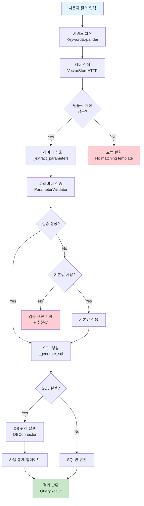

# Query Assistant 질의 처리 플로우

## 전체 처리 흐름

사용자가 자연어로 질의를 입력하면 다음과 같은 단계를 거쳐 처리됩니다:



## 상세 처리 단계

### 1. 키워드 확장 (KeywordExpander)
```python
expansion = self.keyword_expander.expand_query(user_query)
```
- **목적**: 사용자 질의에서 핵심 키워드 추출 및 확장
- **처리 내용**:
  - 한국어-영어 동의어 매핑
  - 도메인 특화 용어 인식
  - 키워드 신뢰도 점수 계산
- **출력**: `QueryExpansion` 객체
  - `original_keywords`: 원본 키워드
  - `expanded_keywords`: 확장된 키워드
  - `confidence_score`: 신뢰도 점수

### 2. 벡터 검색 (VectorStoreHTTP)
```python
search_results = self.vector_store.search(
    query=user_query,
    keywords=expansion.expanded_keywords,
    category=category,
    limit=5,
    score_threshold=0.3
)
```
- **목적**: Qdrant 벡터 DB에서 가장 유사한 쿼리 템플릿 찾기
- **처리 내용**:
  - OpenAI API로 질의 임베딩 생성
  - 벡터 유사도 검색
  - 키워드 매칭 점수 결합
  - 카테고리 필터링 (선택적)
- **출력**: `List[VectorSearchResult]` (유사도 순 정렬)

### 3. 파라미터 추출 (_extract_parameters)
```python
parameters = self._extract_parameters(
    user_query, 
    template,
    expansion
)
```
- **목적**: 자연어 질의에서 SQL 파라미터 추출
- **처리 내용**:
  - 정규식 패턴 매칭
  - 시간 표현 파싱 (일/주/월/년)
  - 조직명 인식
  - 상태값 매핑 (승인/반려/미결정)
  - 키워드 추출
- **출력**: `Dict[str, Any]` 파라미터 맵

### 4. 파라미터 검증 (ParameterValidator)
```python
validation_result = self.parameter_validator.validate_and_suggest(
    template=template,
    extracted_params=parameters,
    user_query=user_query
)
```
- **목적**: 필수 파라미터 확인 및 유효값 제안
- **처리 내용**:
  - 필수 파라미터 누락 검사
  - DB에서 유효한 값 조회
  - 사용자 친화적 메시지 생성
- **출력**: 검증 결과 딕셔너리
  - `is_valid`: 검증 성공 여부
  - `missing_params`: 누락된 파라미터
  - `suggestions`: 추천값
  - `clarification_message`: 사용자 안내 메시지

### 5. SQL 생성 및 실행
```python
# SQL 생성
sql = self._generate_sql(template.sql_template, parameters)

# SQL 실행 (선택적)
if execute:
    results = self._execute_sql(sql)
```
- **목적**: 최종 SQL 쿼리 생성 및 실행
- **처리 내용**:
  - 템플릿의 플레이스홀더 치환
  - 타입별 값 포맷팅
  - DB 연결 및 쿼리 실행
  - 결과 딕셔너리 변환
- **출력**: `List[Dict[str, Any]]` 쿼리 결과

## 폴백 처리 시나리오

### 1. 템플릿 매칭 실패
- **상황**: 벡터 검색에서 적합한 템플릿을 찾지 못함
- **처리**: 
  - 오류 메시지 반환
  - (향후) LLM 폴백으로 SQL 생성
  - `fallback_queries` 테이블에 기록

### 2. 파라미터 검증 실패
- **상황**: 필수 파라미터 누락 또는 잘못된 값
- **처리**:
  - `use_defaults=True`: 기본값 자동 적용
  - `use_defaults=False`: 추천값과 함께 오류 반환
  - 사용자에게 명확한 안내 메시지 제공

### 3. SQL 실행 오류
- **상황**: 생성된 SQL 실행 중 오류
- **처리**:
  - 오류 로깅
  - 사용자에게 오류 메시지 반환
  - (향후) 오류 패턴 분석 및 템플릿 개선

## 데이터베이스 활용

### 1. preprocessing_dataset 테이블
- **언제 사용**: 키워드 확장 단계
- **용도**: 동의어 매핑, 정규화 패턴 적용
- **예시**: "한국선급" → "KR", "최근" → "recent"

### 2. fallback_queries 테이블
- **언제 사용**: 템플릿 매칭 실패 또는 LLM 폴백 시
- **용도**: 
  - 실패한 쿼리 로그 저장
  - 패턴 분석으로 새 템플릿 후보 발견
  - LLM 생성 SQL 및 성공률 추적

### 3. Qdrant Vector DB
- **언제 사용**: 템플릿 검색 단계
- **저장 내용**: 
  - 쿼리 템플릿 벡터 임베딩
  - 메타데이터 (VectorPayloadSchema)
  - 사용 통계

## 성능 최적화 포인트

1. **벡터 검색 임계값**: `score_threshold=0.3`로 설정하여 유연한 매칭
2. **키워드 가중치**: 벡터 점수와 키워드 매칭 점수 결합
3. **템플릿 캐싱**: 자주 사용되는 템플릿 메모리 캐싱
4. **병렬 처리**: 여러 템플릿 후보에 대한 병렬 검증

## 확장 가능성

1. **LLM 통합**: 템플릿 매칭 실패 시 LLM으로 SQL 생성
2. **학습 기능**: 성공한 폴백 쿼리를 새 템플릿으로 등록
3. **다국어 지원**: 전처리 데이터셋 확장
4. **복합 쿼리**: 여러 템플릿을 조합한 복잡한 쿼리 생성