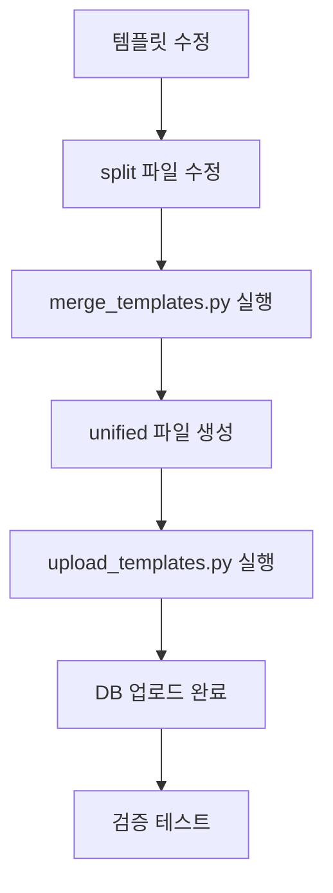

# 템플릿 관리 워크플로우 가이드

## 📋 개요
이 문서는 쿼리 템플릿을 업로드하고 검증하는 전체 워크플로우를 설명합니다.

## 🔍 템플릿 컬렉션 확인
```bash
# 템플릿 컬렉션 상태 확인
python modules/templates/scripts/check_collection.py

# 상세 정보 포함
python modules/templates/scripts/check_collection.py --detail
```

## ⚙️ 환경 설정

### Qdrant 컬렉션 이름 설정
환경변수로 Qdrant 컬렉션 이름을 커스터마이즈할 수 있습니다:

```bash
# .env 파일에 추가
QDRANT_COLLECTION_NAME=my_custom_collection

# 기본값: query_templates_unified
```

**주의사항**: 
- VectorUploader는 환경변수를 지원하지만, QueryAssistant와 QueryMatcher는 아직 하드코딩되어 있습니다
- 전체 시스템에서 동일한 컬렉션을 사용하려면 모든 관련 파일을 수정해야 합니다

## 🚀 빠른 시작 (Quick Start)

### 1. 템플릿 병합 및 업로드 (한 번에 실행)
```bash
cd /home/kimghw/IACSGRAPH

# 1단계: 템플릿 병합
cd modules/templates/data
python merge_templates.py

# 2단계: 벡터 DB에만 업로드 (빠른 테스트용)
cd /home/kimghw/IACSGRAPH
python -m modules.templates.upload_templates \
  --file /home/kimghw/IACSGRAPH/modules/templates/data/query_templates_unified.json \
  --vector-only \
  --recreate-vector

# 또는 SQL과 벡터 DB 모두 업로드
python -m modules.templates.upload_templates \
  --file /home/kimghw/IACSGRAPH/modules/templates/data/query_templates_unified.json \
  --recreate-vector
```

### 2. 템플릿 검증
```bash
# 100개 쿼리 테스트 실행
cd /home/kimghw/IACSGRAPH
PYTHONPATH=/home/kimghw/IACSGRAPH python modules/query_assistant/scripts/test_100_queries.py

# 개별 템플릿 그룹 검증
cd modules/templates/validators
python test_individual_reports.py
```

## 📁 디렉토리 구조 및 파일 설명

### 활성 파일 (Active Files)
```
modules/templates/
├── __init__.py                    # 모듈 초기화
├── upload_templates.py            # 메인 업로드 스크립트
├── data/
│   ├── query_templates_split/     # 분할된 템플릿 (현재 사용중)
│   │   ├── query_templates_group_001-009.json
│   │   ├── index.json            # 템플릿 인덱스
│   │   └── metadata.json         # 스키마 정보
│   ├── unified/                  # 통합 템플릿
│   │   └── query_templates_unified.json
│   └── merge_templates.py        # 템플릿 병합 스크립트
├── uploaders/                    # 업로더 모듈
│   ├── uploader.py              # 메인 업로더
│   ├── sql_uploader.py          # SQL DB 업로더
│   └── vector_uploader.py       # Qdrant 업로더
└── validators/                   # 검증 도구
    ├── template_validator.py     # 템플릿 구조 검증
    ├── parameter_validator.py    # 파라미터 검증
    └── test_individual_reports.py # 테스트 리포트 생성
```

### 미사용/삭제 대상 파일
```
- data/natural_inquiry             # 빈 파일, 참조 없음
- data/query_templates_unified.json # unified/ 폴더의 파일로 대체됨
- data/query_templates_split/backup_* # 오래된 백업 파일들
```

## 🔄 작업 플로우

### 1. 템플릿 수정 워크플로우


### 2. 신규 템플릿 추가 프로세스
1. **적절한 그룹 선택**: `query_templates_group_XXX.json` 중 관련 카테고리 파일 선택
2. **템플릿 추가**: JSON 형식으로 새 템플릿 추가
3. **병합**: `python merge_templates.py` 실행
4. **검증**: `template_validator.py`로 구조 검증
5. **업로드**: `upload_templates.py` 실행
6. **테스트**: 쿼리 테스트 실행

### 3. 템플릿 구조 예시
```json
{
  "template_id": "unique_template_id",
  "template_version": "1.0.0",
  "category": "agenda",
  "priority": 10,
  "natural_questions": [
    "최근 아젠다 목록 보여줘",
    "오늘 등록된 아젠다 조회"
  ],
  "sql_query": "SELECT * FROM agendas WHERE created_date >= DATEADD(day, -30, GETDATE())",
  "sql_query_with_parameters": "SELECT * FROM agendas WHERE created_date >= DATEADD(day, -{days}, GETDATE())",
  "parameters": [
    {
      "name": "days",
      "type": "number",
      "required": false,
      "default": 30,
      "description": "조회 기간 (일)"
    }
  ],
  "keywords": ["아젠다", "agenda", "목록"],
  "related_tables": ["agendas"],
  "complexity": "simple"
}
```

## 🛠️ 유용한 명령어

### 벡터 DB 상태 확인
```python
from qdrant_client import QdrantClient
import os

client = QdrantClient(url="localhost", port=6333)
collections = client.get_collections()
print([col.name for col in collections.collections])

# 환경변수에서 컬렉션 이름 가져오기
collection_name = os.getenv('QDRANT_COLLECTION_NAME', 'query_templates_unified')

# 특정 컬렉션 정보
info = client.get_collection(collection_name)
print(f"컬렉션 '{collection_name}' 벡터 수: {info.points_count}")
```

### 템플릿 컬렉션 초기화
```bash
# 벡터 DB 컬렉션 삭제 후 재생성
python -m modules.templates.upload_templates \
  --file /path/to/templates.json \
  --vector-only \
  --recreate-vector
```

### 디버깅 팁
1. **벡터 검색 문제**: 임베딩 생성 확인, 컬렉션 존재 여부 확인
2. **SQL 오류**: `template_validator.py`로 SQL 구문 검증
3. **파라미터 오류**: `parameter_validator.py`로 파라미터 타입 확인
4. **컬렉션 이름 문제**: 환경변수 `QDRANT_COLLECTION_NAME` 확인

## 📊 성능 최적화
- 벡터 업로드는 배치 단위(50개)로 처리
- 템플릿당 평균 6.5개 벡터 생성 (질문별 개별 임베딩)
- OpenAI text-embedding-3-large 모델 사용 (3072차원)

## 🔍 문제 해결
1. **ModuleNotFoundError**: `PYTHONPATH` 설정 확인
2. **Validation Error**: SQL 쿼리 필드 누락 확인
3. **Connection Error**: Qdrant 서버 실행 상태 확인