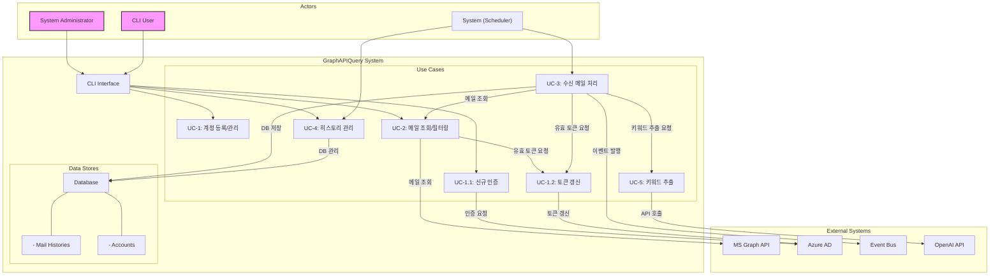

# 프로젝트 유즈케이스(Use Cases)

이 문서는 GraphAPIQuery 프로젝트의 핵심 유즈케이스(UC)를 국제 표준 서식에 맞춰 기술합니다. 각 유즈케이스는 시스템의 주요 기능과 액터(Actor)의 상호작용을 명확히 정의합니다.

---

## UC-1: 사용자 계정 등록 및 관리

| 항목 | 내용 |
| --- | --- |
| **유즈케이스 ID** | UC-1 |
| **유즈케이스명** | 사용자 계정 등록 및 관리 |
| **목적** | 시스템 사용자를 위한 Microsoft 365 계정을 `enrollment` 설정 파일로부터 등록, 조회, 수정, 삭제한다. |
| **범위** | GraphAPIQuery 시스템 |
| **수준** | 사용자 목표 |
| **주 액터** | System Administrator |
| **보조 액터** | 파일 시스템 |
| **이해관계자** | - System Administrator: 계정을 효율적으로 관리하고자 함 |
| **사전조건** | - `enrollment/*.yaml` 파일에 사용자 정보가 정의되어 있음 - 데이터베이스 스키마 초기화 완료 - 관리자 권한 보유 |
| **성공보장** | `enrollment` 파일의 계정 정보가 성공적으로 데이터베이스에 반영되고, 관리된다. |
| **주 성공 시나리오** | 1. 관리자가 계정 동기화 명령을 실행한다. 2. 시스템이 `enrollment/` 디렉터리의 모든 `.yaml` 파일을 읽어온다. 3. 각 파일의 정보를 파싱하여 데이터베이스의 `accounts` 테이블과 동기화한다.    - 파일에 있으나 DB에 없는 계정: 신규 추가 (상태: `INACTIVE`)    - 파일에 없으나 DB에 있는 계정: 논리적 삭제 (상태: `INACTIVE`) 또는 물리적 삭제    - 정보가 변경된 경우: DB에 업데이트 4. 동기화 결과를 로그로 기록한다. |
| **확장 시나리오** | 3a. 계정 상태 관리 &nbsp;&nbsp;&nbsp;&nbsp;3a1. `AccountStatus` (e.g., `ACTIVE`, `INACTIVE`, `LOCKED`, `REAUTH_REQUIRED`)를 활용하여 계정 상태를 명확하게 관리한다.  3b. 감사 로그 &nbsp;&nbsp;&nbsp;&nbsp;3b1. 계정 정보가 변경될 때마다 별도의 `audit_log` 테이블에 변경 이력을 기록하여 추적성을 확보한다. (e.g., `account_id`, `changed_field`, `old_value`, `new_value`, `timestamp`) |
| **특별 요구사항** | - 계정 정보는 `accounts` 테이블에서 통합 관리한다. - 계정의 Primary Key는 사용자 이메일 주소이다. |

---

## UC-1.1: 신규 인증 (Authorization Code Flow)

| 항목 | 내용 |
| --- | --- |
| **유즈케이스 ID** | UC-1.1 |
| **유즈케이스명** | 신규 인증 (Authorization Code Flow) |
| **목적** | 사용자가 Microsoft 365 계정에 대한 Graph API 접근 권한을 부여하고, 시스템이 인증 토큰을 발급받는다. |
| **범위** | GraphAPIQuery 시스템 |
| **수준** | 사용자 목표 |
| **주 액터** | System Administrator |
| **보조 액터** | Azure AD, 웹 브라우저 |
| **이해관계자** | - System Administrator: 시스템이 API를 호출할 수 있도록 안전하게 인증을 완료하고자 함 |
| **사전조건** | - UC-1을 통해 계정이 `accounts` 테이블에 등록되어 있음 (상태: `INACTIVE`) - Azure AD에 애플리케이션 등록 및 리디렉션 URI 설정 완료 |
| **성공보장** | 인증 성공 후, `access_token`과 `refresh_token`이 발급되어 `accounts` 테이블에 안전하게 저장되고 계정 상태가 `ACTIVE`로 변경된다. |
| **주 성공 시나리오** | 1. 관리자가 특정 계정 또는 전체 미인증 계정에 대해 인증 시작 명령을 실행한다. 2. 시스템은 인증 URL(Authorization Request)을 생성한다. 3. 시스템은 로컬 웹서버를 실행하고, 생성된 인증 URL로 사용자의 기본 웹 브라우저를 자동으로 실행한다. 4. 사용자는 브라우저에서 Microsoft 365 계정으로 로그인하고 권한 부여에 동의한다. 5. Azure AD는 인증 코드를 포함하여 지정된 리디렉션 URI로 사용자를 리디렉션한다. 6. 로컬 웹서버가 인증 코드를 수신한다. 7. 시스템은 수신한 인증 코드를 사용하여 Azure AD에 `access_token`과 `refresh_token`을 요청한다. 8. 발급받은 토큰을 `accounts` 테이블의 해당 계정 레코드에 저장하고, 계정 상태를 `ACTIVE`로, `last_authenticated_at`을 현재 시간으로 업데이트한다. |
| **확장 시나리오** | 7a. 토큰 발급 실패 &nbsp;&nbsp;&nbsp;&nbsp;7a1. 잘못된 인증 코드로 인한 오류 발생 시, 사용자에게 재시도를 안내한다.  8a. 사용자 경험 개선 &nbsp;&nbsp;&nbsp;&nbsp;8a1. 인증 성공 또는 실패 시, 브라우저에 명확한 결과 페이지를 표시하고 자동으로 닫는다. |
| **특별 요구사항** | - 인증 흐름은 OAuth 2.0 Authorization Code Flow를 준수한다. - 로컬 웹서버는 인증 과정에서만 임시로 실행되어야 한다. - 토큰 정보는 암호화하여 데이터베이스에 저장한다. |

---

## UC-1.2: 인증 토큰 갱신

| 항목 | 내용 |
| --- | --- |
| **유즈케이스 ID** | UC-1.2 |
| **유즈케이스명** | 인증 토큰 갱신 |
| **목적** | 만료된 `access_token`을 `refresh_token`을 사용하여 자동으로 갱신하여 API 호출 연속성을 보장한다. |
| **범위** | GraphAPIQuery 시스템 |
| **수준** | 시스템 목표 |
| **주 액터** | System (API Client) |
| **보조 액터** | Azure AD |
| **이해관계자** | - System: API 호출이 중단 없이 수행되기를 원함 |
| **사전조건** | - UC-1.1을 통해 유효한 `refresh_token`이 `accounts` 테이블에 저장되어 있음 |
| **성공보장** | 새로운 `access_token`이 성공적으로 발급되고 데이터베이스에 업데이트된다. |
| **주 성공 시나리오** | 1. 시스템이 Graph API 호출을 시도한다. 2. API 호출 전, `access_token`의 유효성을 사전에 검사하거나, API 호출 실패 시(e.g., 401 Unauthorized) 갱신 절차를 시작한다. 3. 시스템은 `accounts` 테이블에서 해당 계정의 `refresh_token`을 가져온다. 4. `refresh_token`을 사용하여 Azure AD에 새로운 `access_token`을 요청한다. 5. 새로운 `access_token`(과 경우에 따라 새로운 `refresh_token`)을 발급받는다. 6. 발급받은 새 토큰을 `accounts` 테이블에 업데이트하고, 발급 시간을 기록한다. 7. 새로 발급받은 `access_token`으로 원래의 API 호출을 재시도한다. |
| **확장 시나리오** | 4a. Refresh Token 만료 &nbsp;&nbsp;&nbsp;&nbsp;4a1. `refresh_token`마저 만료되어 토큰 갱신에 실패할 경우, 해당 계정의 상태를 `REAUTH_REQUIRED`로 변경한다. &nbsp;&nbsp;&nbsp;&nbsp;4a2. 관리자에게 해당 계정에 대한 재인증(UC-1.1)이 필요함을 알린다.  7a. 중앙화된 토큰 관리 &nbsp;&nbsp;&nbsp;&nbsp;7a1. `get_valid_token(account_id)`와 같은 중앙 관리 함수를 구현하여, API를 호출하는 모든 로직이 이 함수를 통해 유효한 토큰을 얻도록 강제한다. 이 함수는 내부적으로 토큰 유효성 검사 및 갱신을 처리한다. |
| **특별 요구사항** | - 토큰 갱신 로직은 API 호출부에 투명하게 통합되어야 한다. |

---

## UC-2: Graph API를 통한 메일 데이터 조회 및 필터링

| 항목 | 내용 |
| --- | --- |
| **유즈케이스 ID** | UC-2 |
| **유즈케이스명** | Graph API를 통한 메일 데이터 조회 및 필터링 |
| **목적** | 등록된 계정을 사용하여 Microsoft Graph API를 통해 실시간으로 메일 데이터를 조회하고, URL 빌드 시 필터를 적용한다. |
| **범위** | GraphAPIQuery 시스템 |
| **수준** | 사용자 목표 |
| **주 액터** | CLI User |
| **보조 액터** | Microsoft Graph API |
| **이해관계자** | - CLI User: 특정 조건의 메일을 빠르게 찾고자 함 - Data Analyst: 메일 데이터를 분석하고자 함 |
| **사전조건** | - UC-1.2를 통해 유효한 토큰을 획득할 수 있음 - Graph API 권한(Mail.Read) 부여됨 |
| **성공보장** | 사용자가 요청한 조건에 맞는 메일 목록이 정확하게 조회되고, 조회 이력이 기록된다. |
| **주 성공 시나리오** | 1. 사용자가 CLI를 통해 메일 조회 명령을 실행한다 (계정, 필터 옵션 포함). 2. 시스템은 UC-1.2를 통해 유효한 액세스 토큰을 확보한다. 3. 사용자가 제공한 필터 조건을 OData 필터 구문으로 변환하여 Graph API 요청 URL을 동적으로 빌드한다. 4. Graph API 클라이언트를 통해 Microsoft 365에 메일 데이터 조회를 요청한다 (페이징 적용). 5. 수신된 데이터를 파싱하여 필요한 형식으로 구조화한다. 6. 결과를 테이블 또는 JSON 형식으로 포맷하여 CLI에 출력한다. 7. 조회 활동을 로그 데이터베이스에 기록한다. |
| **확장 시나리오** | 2a. 토큰 갱신 실패 &nbsp;&nbsp;&nbsp;&nbsp;2a1. UC-1.2의 확장 시나리오에 따라 재인증을 요청한다.  3a. 고급 필터링 &nbsp;&nbsp;&nbsp;&nbsp;3a1. 날짜, 발신자, 제목 등 다양한 필드를 조합하여 OData 쿼리를 생성한다. &nbsp;&nbsp;&nbsp;&nbsp;3a2. `$select`, `$top`, `$orderby` 등 OData 파라미터를 적용한다. &nbsp;&nbsp;&nbsp;&nbsp;3a3. `Prefer: outlook.body-content-type="text"` 헤더를 적용하여 본문을 텍스트로 받는다.  4a. Graph API 요청 실패 &nbsp;&nbsp;&nbsp;&nbsp;4a1. 429 (Rate Limit) 오류 시, 지수 백오프(Exponential Backoff) 전략으로 재시도한다. &nbsp;&nbsp;&nbsp;&nbsp;4a2. 그 외 오류 발생 시, 상세 오류 정보를 사용자에게 제공한다.  4b. 대용량 데이터 처리 &nbsp;&nbsp;&nbsp;&nbsp;4b1. 한 번의 요청에 20건씩 페이징하여 순차적으로 요청한다.  6a. 다양한 출력 형식 &nbsp;&nbsp;&nbsp;&nbsp;6a1. 결과를 CSV 또는 Excel 파일로 내보내는 옵션을 제공한다. |
| **특별 요구사항** | - 응답 시간: 첫 결과 표시까지 3초 이내 - 동시 조회 요청 수: 계정당 최대 5개 - 필터 구문: OData v4.0 표준 준수 |
| **기술 및 데이터 변화** | - 조회 로그 테이블(query_logs)에 이력 기록 - 캐시 테이블(query_cache)에 임시 결과 저장 |
| **빈도** | 일 평균 500-1000회 |

---

## UC-3: 수신 메일 처리 및 이벤트 발행

| 항목 | 내용 |
| --- | --- |
| **유즈케이스 ID** | UC-3 |
| **유즈케이스명** | 수신 메일 처리 및 이벤트 발행 |
| **목적** | 스케줄러를 통해 주기적으로 새로운 메일을 조회하고, 로컬 DB에 저장하며, 관련 이벤트를 발행한다. |
| **범위** | GraphAPIQuery 시스템 |
| **수준** | 시스템 목표 |
| **주 액터** | System (Scheduler) |
| **보조 액터** | Microsoft Graph API, Event Bus, 로컬 데이터베이스 |
| **이해관계자** | - System Administrator: 메일 수신 처리 상태를 모니터링하고자 함 - Event Consumer: 메일 관련 이벤트를 구독하여 후속 조치를 하고자 함 |
| **사전조건** | - UC-2가 정상적으로 동작함 - 스케줄러 및 이벤트 버스 시스템 구성 완료 |
| **성공보장** | 새로운 메일이 중복 없이 로컬 DB에 저장되고, 전체 메일 데이터가 포함된 이벤트가 성공적으로 발행된다. |
| **주 성공 시나리오** | 1. 스케줄러가 주기적으로 메일 처리 작업을 시작한다. 2. UC-2를 호출하여 새로운 메일 데이터를 조회한다. 3. 수신된 각 메일에 대해 발신자 주소 기반으로 클라이언트 사이드 필터링을 적용한다. 4. 필터링을 통과한 메일의 HTML 본문에서 불필요한 개행 문자 등을 제거하여 정제한다. 5. 메일 ID와 발신자 주소를 기준으로 로컬 데이터베이스에 이미 존재하는지 확인한다. 6. 존재하지 않는 신규 메일인 경우: &nbsp;&nbsp;&nbsp;a. UC-5를 호출하여 메일 본문에서 키워드를 추출한다. &nbsp;&nbsp;&nbsp;b. `id`, `sender_address`, `sent_time`, `subject`, `preview`, `keywords` 필드를 포함하여 로컬 DB에 저장한다. &nbsp;&nbsp;&nbsp;c. 전체 메일 데이터를 포함한 `MailReceived` 이벤트를 이벤트 버스로 발행한다. 7. 처리 완료 후 통계 정보를 로깅한다. |
| **확장 시나리오** | 5a. 중복 검사 최적화 &nbsp;&nbsp;&nbsp;&nbsp;5a1. 메일 ID에 인덱스를 생성하여 조회 속도를 향상시킨다. &nbsp;&nbsp;&nbsp;&nbsp;5a2. 인메모리 캐시 또는 블룸 필터를 사용하여 DB 조회 전 빠른 중복 검사를 수행한다.  6a. 이벤트 발행 실패 처리 &nbsp;&nbsp;&nbsp;&nbsp;6a1. 이벤트 버스 연결 실패 시, 발행할 이벤트를 로컬 큐에 임시 저장 후 재시도한다. &nbsp;&nbsp;&nbsp;&nbsp;6a2. 반복적인 실패 시, 해당 이벤트를 Dead Letter Queue로 이동시켜 분석할 수 있도록 한다. |
| **특별 요구사항** | - 처리 주기: 5분 (설정 가능) - 중복 방지: 동일 메일에 대한 중복 이벤트 발행 방지 - 성능: 분당 1,000건 이상 처리 가능 |
| **기술 및 데이터 변화** | - 메일 히스토리 테이블(`mail_histories`)에 요약 정보 저장 - 이벤트 발행 로그 테이블(`event_logs`)에 발행 기록 |
| **빈도** | - 스케줄러: 5분마다 (설정 가능) - 일 평균 처리량: 5,000-10,000건 |

---

## UC-4: 메일 히스토리 데이터 관리

| 항목 | 내용 |
| --- | --- |
| **유즈케이스 ID** | UC-4 |
| **유즈케이스명** | 메일 히스토리 데이터 관리 |
| **목적** | 저장된 메일 히스토리 데이터를 조회, 검색, 분석하고 데이터 보존 정책에 따라 관리한다. |
| **범위** | GraphAPIQuery 시스템 |
| **수준** | 사용자 목표 |
| **주 액터** | CLI User, System Administrator |
| **보조 액터** | System (Cleanup Scheduler) |
| **이해관계자** | - CLI User: 메일 히스토리를 빠르게 검색하고 분석하고자 함 - System Administrator: 데이터베이스 용량을 효율적으로 관리하고자 함 |
| **사전조건** | - UC-3를 통해 메일 히스토리가 데이터베이스에 저장됨 - 데이터 관리 권한 보유 |
| **성공보장** | 사용자가 히스토리 데이터를 효율적으로 조회/분석하고, 데이터 보존 정책에 따라 데이터가 관리된다. |
| **주 성공 시나리오** | 1. 사용자가 CLI를 통해 히스토리 데이터 관리 명령(조회/검색/삭제/통계)을 실행한다. 2. **(조회/검색 시)** 검색 조건(계정, 기간, 키워드 등)을 파싱하여 DB 쿼리를 실행하고 결과를 출력한다. 3. **(삭제 시)** 삭제 대상을 확인하고, 사용자에게 재확인 후 트랜잭션 내에서 안전하게 삭제를 수행하며 로그를 기록한다. 4. **(통계 시)** 집계 쿼리를 실행하여 통계 결과를 계산하고 시각화하여 표시한다. |
| **확장 시나리오** | 2a. 고급 검색 기능 &nbsp;&nbsp;&nbsp;&nbsp;2a1. 정규표현식 패턴 검색 또는 본문 해시 기반 중복 검색을 지원한다.  3a. 자동 정리 스케줄 &nbsp;&nbsp;&nbsp;&nbsp;3a1. 관리자가 설정한 데이터 보존 기간(e.g., 90일)에 따라, 스케줄러가 오래된 데이터를 주기적으로 자동 삭제한다.  4a. 다양한 통계 분석 &nbsp;&nbsp;&nbsp;&nbsp;4a1. 시간대별, 발신자별, 키워드별 통계 등 다양한 분석 리포트를 제공한다.  4b. 데이터 내보내기 &nbsp;&nbsp;&nbsp;&nbsp;4b1. 조회된 결과를 CSV/JSON 형식으로 내보내는 기능을 제공한다. |
| **특별 요구사항** | - 조회 성능: 100만 건 기준 2초 이내 응답 - 삭제 안전성: 실수 방지를 위한 2단계 확인 - 감사 추적: 모든 삭제 작업은 로그로 기록 |
| **기술 및 데이터 변화** | - `mail_histories` 테이블 데이터 조회/삭제 - `deletion_logs` 테이블에 삭제 기록 |
| **빈도** | - 조회/검색: 일 평균 1,000-2,000회 - 자동 정리: 일 1회 (설정에 따라) |

---

## UC-5: 메일 키워드 자동 추출

| 항목 | 내용 |
| --- | --- |
| **유즈케이스 ID** | UC-5 |
| **유즈케이스명** | 메일 키워드 자동 추출 |
| **목적** | 메일 본문에서 주요 키워드를 자동으로 추출하여 검색, 분류, 태깅의 정확성을 높인다. |
| **범위** | GraphAPIQuery 시스템 + OpenAI API 연동 |
| **수준** | 시스템 목표 |
| **주 액터** | System |
| **보조 액터** | OpenAI API |
| **이해관계자** | - CLI User: 메일 내용을 요약하거나 검색 효율성을 높이고자 함 - System Administrator: 키워드 기반 인덱싱 및 분류 시스템을 구현하고자 함 |
| **사전조건** | - UC-3에서 처리할 메일 본문 텍스트를 확보함 - OpenAI API 토큰 및 사용 권한 보유 |
| **성공보장** | 메일 본문에서 핵심 의미를 담은 키워드 5개가 정확하게 추출되어 반환된다. |
| **주 성공 시나리오** | 1. 시스템이 메일 본문 텍스트를 OpenAI API에 전달할 프롬프트에 삽입한다.    *(프롬프트 예: "다음 이메일 본문에서 가장 중요한 키워드 5개를 한국어로 추출해줘: {본문 텍스트}")* 2. OpenAI API에 키워드 추출을 요청한다. 3. API 응답으로부터 상위 5개의 키워드를 파싱하여 추출한다. 4. 추출된 키워드 리스트를 호출한 쪽(UC-3)으로 반환한다. |
| **확장 시나리오** | 2a. 배치 처리 &nbsp;&nbsp;&nbsp;&nbsp;2a1. 여러 메일을 한 번의 API 호출로 처리하여 효율성을 높인다.  2b. 다국어 처리 &nbsp;&nbsp;&nbsp;&nbsp;2b1. 메일 본문의 언어를 감지하고, 해당 언어에 맞는 키워드 추출을 요청한다.  3a. 신뢰도 점수 &nbsp;&nbsp;&nbsp;&nbsp;3a1. API가 지원하는 경우, 각 키워드의 신뢰도 점수를 함께 반환하여 활용한다. |
| **예외 시나리오** | - API 연결 실패 또는 오류 발생 시, 사용자에게 오류 메시지를 로깅하고 키워드 없이 처리를 계속한다. - 본문이 지나치게 짧거나 비어있는 경우, "키워드 없음"으로 처리한다. |

---

## 시스템 상호작용 다이어그램

---

## 유즈케이스 우선순위 및 의존성

| 우선순위 | 유즈케이스 | 의존성 | 구현 순서 |
| --- | --- | --- | --- |
| P0 (필수) | UC-1: 계정 등록 및 관리 | 없음 | 1 |
| P0 (필수) | UC-1.1: 신규 인증 | UC-1 | 2 |
| P0 (필수) | UC-1.2: 인증 토큰 갱신 | UC-1.1 | 3 |
| P0 (필수) | UC-2: 메일 조회 (URL 필터) | UC-1.2 | 4 |
| P0 (필수) | UC-5: 메일 키워드 자동 추출 | OpenAI API | 5 |
| P0 (필수) | UC-3: 메일 수신 처리 (발신자 필터) | UC-2, UC-5 | 6 |
| P1 (중요) | UC-4: 히스토리 데이터 관리 | UC-3 | 7 |

---

## 비기능적 요구사항

### 성능 요구사항
- **응답 시간**: CLI 명령 실행 후 3초 이내 첫 응답
- **처리량**: 분당 1,000건 이상 메일 처리
- **확장성**: 수평적 확장 가능한 아키텍처

### 보안 요구사항
- **인증**: OAuth 2.0 기반 인증
- **암호화**: 데이터베이스에 저장되는 모든 민감 정보(토큰 등)는 AES-256으로 암호화
- **감사**: 모든 데이터 생성, 수정, 삭제 작업에 대한 감사 로그 기록

### 가용성 요구사항
- **시스템 가용성**: 99.5% (월간)
- **복구 시간 목표(RTO)**: 1시간
- **복구 시점 목표(RPO)**: 15분

### 데이터 관리 요구사항
- **히스토리 저장**: 메일의 요약 정보만 저장 (`id`, `subject`, `sender`, `sent_time`, `preview`, `keywords`)
- **이벤트 발행**: 전체 메일 데이터를 이벤트 버스로 발행
- **중복 방지**: 동일한 메일 ID에 대해서는 중복 저장 및 이벤트 발행 방지
- **데이터 보존**: 기본 보존 기간은 90일이며, 관리자가 정책을 변경할 수 있음

---

## 용어 정의

| 용어 | 정의 |
| --- | --- |
| **Graph API** | Microsoft의 RESTful API로, Microsoft 365 서비스의 데이터에 접근하는 통합 엔드포인트 |
| **히스토리** | 메일의 요약 정보를 저장한 로컬 데이터베이스 레코드 |
| **이벤트 버스** | 메일 수신 이벤트를 발행하고 구독하는 메시징 시스템 |
| **OData 필터** | Graph API 조회 시 사용되는 표준화된 쿼리 언어 |
| **액세스 토큰** | OAuth 2.0 인증으로 획득한 단기 API 접근 권한 토큰 |
| **리프레시 토큰** | 액세스 토큰 갱신을 위한 장기 유효 토큰 |

---

## 향후 확장 고려사항

1. **멀티 테넌트 지원**: 여러 조직의 Microsoft 365 계정을 관리하고 테넌트별로 데이터를 격리.
2. **고급 필터링**: 자연어 처리(NLP) 기반 검색 또는 머신러닝을 통한 스팸 필터링 도입.
3. **실시간 처리**: Microsoft Graph의 웹훅(Webhook)을 구독하여 메일 수신 시 실시간으로 처리.
4. **분석 기능 강화**: 데이터 시각화 대시보드(UI)를 제공하여 트렌드 리포트 등 분석 기능 강화.
5. **통합 확장**: Gmail 등 다른 메일 서비스 지원 또는 외부 시스템과의 연동을 위한 API 제공.

## graph api 수신 데이터 포맷
{
  "@odata.context": "https://graph.microsoft.com/v1.0/$metadata#users('..._...%40...com')/messages",
  "value": [
    {
      "@odata.etag": "W/\"...\"",
      "id": "...",
      "createdDateTime": "2025-06-14T14:30:00Z",
      "lastModifiedDateTime": "2025-06-14T14:30:00Z",
      "changeKey": "...",
      "categories": [],
      "receivedDateTime": "2025-06-14T14:30:00Z",
      "sentDateTime": "2025-06-14T14:29:58Z",
      "hasAttachments": false,
      "internetMessageId": "<...>",
      "subject": "메일 제목",
      "bodyPreview": "메일 본문 미리보기...",
      "importance": "normal",
      "parentFolderId": "...",
      "conversationId": "...",
      "conversationIndex": "...",
      "isDeliveryReceiptRequested": null,
      "isReadReceiptRequested": false,
      "isRead": false,
      "isDraft": false,
      "webLink": "https://outlook.office365.com/owa/...",
      "inferenceClassification": "focused",
      "body": {
        "contentType": "html", // 또는 "text"
        "content": "<html>...</html>"
      },
      "sender": {
        "emailAddress": {
          "name": "보낸 사람 이름",
          "address": "sender@example.com"
        }
      },
      "from": {
        "emailAddress": {
          "name": "보낸 사람 이름",
          "address": "sender@example.com"
        }
      },
      "toRecipients": [
        {
          "emailAddress": {
            "name": "받는 사람 이름",
            "address": "recipient@example.com"
          }
        }
      ],
      "ccRecipients": [],
      "bccRecipients": [],
      "replyTo": [],
      "flag": {
        "flagStatus": "notFlagged"
      }
    }
  ],
  "@odata.nextLink": "https://graph.microsoft.com/v1.0/me/messages?$skip=10"
}

## 데이터베이스 스키마-accounts

id:uuid
email:character varying
name:character varying
tenant_id:uuid
client_id:uuid
client_secret:text
status:character varying
access_token:text
refresh_token:text
token_expires_at:timestamp without time zone
last_sync_at:timestamp without time zone
error_message:text
created_at:timestamp without time zone
updated_at:timestamp without time zone
redirect_uri:text
authentication_method:character varying
